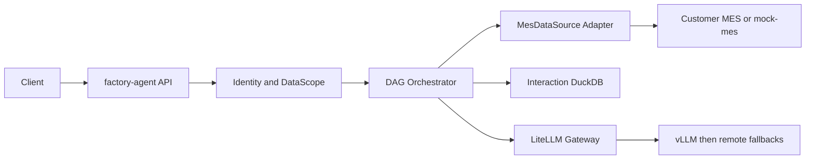

# Architecture

## System Boundary

`factory-agent` is a read-only API orchestration service. It authorizes a user, obtains an
effective `DataScope`, calls MES APIs through a typed adapter, validates responses, performs
bounded local processing, and composes grounded results.



## Dependency Direction

```text
api -> application -> domain
          |             ^
          v             |
   ports/protocols -----+
          ^
          |
data_api / repository / llm / observability
```

The domain owns vocabulary and invariants. Infrastructure implements protocols. Framework,
database, HTTP, and provider types do not cross into domain code.

## Repository Shape

The root builds `src/factory_agent`. `mock-mes/` is a separately runnable uv workspace member
with its own package, tests, Dockerfile, migrations, and configuration. The packages communicate
only through the Canonical HTTP contract and can be split into separate repositories later.

## Request Invariants

1. Resolve identity and authorized scope.
2. Classify intent and collect missing slots.
3. Select a reviewed L1 capability or a bounded L2 plan.
4. Execute only scope-intersected API calls within budgets.
5. Validate responses and load isolated in-memory tables.
6. Compute a `ResultTable`, then compose a grounded response and audit record.
7. Destroy interaction-local detail data.

Irreversible choices and boundary changes are recorded under `docs/adr/`.
