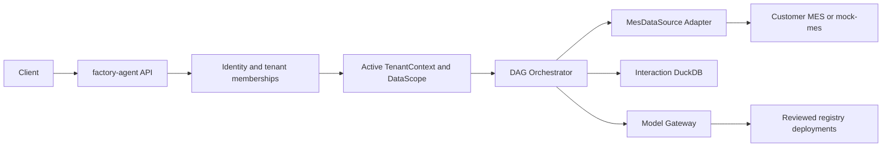

# Architecture

## System Boundary

`factory-agent` is a multi-tenant, read-only API orchestration service. One deployment serves users
from many companies and factories. For each MES business interaction it authorizes the user, resolves
one active `TenantContext`, obtains an effective tenant-local `DataScope`, calls MES APIs through a
typed adapter, validates responses, performs bounded local processing, and composes grounded results.
Platform usage operations use a separate `PlatformScope` and do not enter the MES execution path.



## Dependency Direction

```text
api -> application -> domain
          |             ^
          v             |
   ports/protocols -----+
          ^
          |
data_api / repository / llm / observability
```

The domain owns vocabulary and invariants. Infrastructure implements protocols. Framework,
database, HTTP, and provider types do not cross into domain code.

## Technology Baseline

The baseline below follows the accepted ADRs under `docs/adr/` (`0002` for runtime, storage, and
migrations; `0004` for logging and configuration; `0006` for model access). Customer-specific
authentication, API fields, deployment platform, object-storage endpoint, model provider, and
business formulas remain replaceable configuration or Adapter concerns.

| Concern | Choice | Boundary |
| :--- | :--- | :--- |
| Runtime and API | Python 3.12, FastAPI, Uvicorn, Pydantic v2 | HTTP and framework types stop at `api/` |
| Package and quality | uv workspace, Hatchling, Ruff, Pyright strict, pytest, Bandit, pip-audit | One lockfile; root, Mock, and usage-admin remain separate packages |
| MES integration | HTTPX async client, OpenAPI 3.1, JSON Schema | Only `data_api/` knows URLs, auth transport, or customer payloads |
| Durable application data | PostgreSQL 16, Psycopg 3, Alembic | Sessions, messages, interactions, audit metadata, favorites, and artifact metadata only |
| Mock MES data | Separate PostgreSQL database, Psycopg 3, Alembic, deterministic seed | Never a production dependency and never shares application tables |
| Interaction processing | One in-memory DuckDB connection per interaction | Validated authorized rows only; no persistence or external/file access |
| Model access | LiteLLM Router SDK with a reviewed deployment registry (ADR-0006) | Business code only names logical aliases; keys live in the environment; fallback/retry/cooldown are owned by the Router |
| Cache | TTL-based application cache; Redis optional and added only if measurements justify it | Optional optimization; PostgreSQL/MES remain authoritative |
| Export | XlsxWriter from `ResultTable`; delivery follows the customer-confirmed no-server-retention policy | XLSX only in the first release; external text is always written as text |
| Artifact storage | Filesystem fake for unit tests; S3-compatible port with SeaweedFS as the Apache-2.0 reference implementation | PostgreSQL stores metadata, never file contents; application code uses no vendor API, and the production endpoint waits for deployment review |
| Observability | Structured JSON logs and OpenTelemetry-compatible traces/metrics | Sensitive fields and raw prompts are filtered before emission |
| Delivery | OCI images and Docker Compose for development/integration | Production orchestrator and managed services remain deployment decisions |

Dependencies are added when the code that needs them is implemented. PostgreSQL is a separate
runtime service; Redis and object storage are added only when measurements justify them. The model
gateway embeds the LiteLLM Router SDK behind a port (ADR-0006) and never leaks into domain or
application code.

## Target Package Skeleton

```text
src/factory_agent/
    api/              # HTTP/SSE request and response boundary
    application/      # use cases, conversation and capability orchestration
    domain/           # immutable identity, scope, result and metric values
    ports/            # identity, MES, model, repository and artifact protocols
    data_api/         # customer MES HTTP adapter, credentials and envelope handling
    execution/        # reviewed DAG, pagination and interaction DuckDB
    persistence/      # PostgreSQL repositories and Alembic integration
    llm/              # LiteLLM adapter and structured output validation
    export/           # ResultTable card and XLSX renderers
    observability/    # redacted audit, logs, traces and metrics
```

The boundaries, configuration objects, test doubles, and application wiring are implemented, as are
the security and observability infrastructure and the first complete business path through every
layer. Later capabilities register as recipes on the single reviewed execution path rather than as
new parallel architectures. Remaining alignment and release work is tracked in the numbered Stories
under `.github/story/`.

## Repository Shape

The root builds `src/factory_agent`. `mock-mes/` is a separately runnable uv workspace member
used only for development and tests. `usage-admin/` is a separately built production uv workspace
member for authorized multi-tenant usage aggregation, operational APIs, and reports. Each service
owns its package, tests, Dockerfile, migrations, and configuration. No service imports another;
metering facts are written by factory-agent directly into the shared PostgreSQL in a separate
transaction after its business commit, and usage-admin reads them — there
is no HTTP usage-event contract between the services, and either could be split into separate
repositories later. Every shared table has
exactly one owner: usage-admin owns and writes `tenant_registry` (which factory-agent reads
read-only to resolve the AppKey for MES calls, ADR-0003 §4.3), `admin_audit`,
`platform_principal`, and `usage_export`; factory-agent owns and writes all business and metering
tables that usage-admin only reads.

## Request Invariants

1. Resolve identity and authorized tenant memberships.
2. Resolve one trusted active `TenantContext` and tenant-local `DataScope` for an MES interaction;
    platform aggregation instead resolves a separately authorized `PlatformScope`.
3. Classify intent and collect missing slots.
4. Select a reviewed L1 capability or a bounded L2 plan.
5. Execute only scope-intersected API calls within budgets.
6. Validate responses and load isolated in-memory tables.
7. Compute a `ResultTable`, then compose a grounded response and audit record.
8. Destroy interaction-local detail data.

Irreversible choices and boundary changes are recorded under `docs/adr/`.

## report-agent Migration Boundary

`/home/admin2/proj/report-agent` was the read-only migration source for proven behavior; the
migration is complete and the repository never depends on it at runtime. The boundary rewrites it
forced are now standing invariants:

- identity comes from trusted credential resolution, never from request-body `user_id`/`tenant_id`;
  there is no allow-all production default (scope is `DataScope`/`PlatformScope`);
- MES data is reachable only through `MesDataSource` and reviewed local recipes — Vanna,
  Text-to-SQL production execution, and direct business-database queries are rejected;
- XLSX is the only initial artifact renderer (DOCX/PDF renderers and flight templates do not
  migrate);
- durable event replay and trusted identity are native implementations, not claimed reuse (the
  source used process-local SSE subscribers and request-body identity).

Pure state-transition, bounded-context, typed-model-response, error-category, and renderer-
separation behavior was ported through characterization tests.
