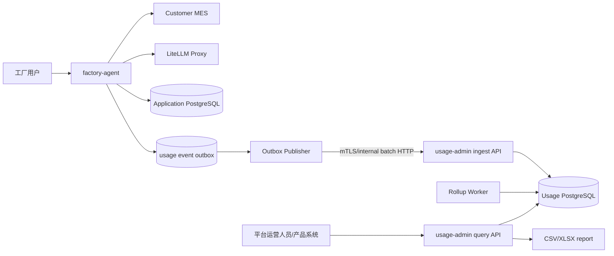

# ADR-0003：多租户使用计量与运营管理服务

- 状态：Proposed
- 日期：2026-08-21
- 所有者：项目维护者、产品与商业负责人

## 1. 背景与目标

平台服务同时承载多个公司和工厂租户，每个租户以稳定 `tenant_id` 标识；用户可以拥有一个或
多个租户成员关系，每个成员关系具有租户内员工、管理或老板角色。平台方需要按获准租户集合
了解使用情况，为客户成功、容量规划、产品分析、报表和后续收费提供依据。

首期需要回答：

- 每个工厂有多少已使用用户、每日活跃用户和活跃趋势；
- 每日提问数、成功数、失败数及 capability 分布；
- 一次用户提问触发多少次 LLM 逻辑调用和供应商物理尝试；
- 一个用户 query 的端到端耗时、LLM 耗时、MES 耗时及 p50/p95/p99；
- token、模型、fallback、错误、导出等可用于成本核算和收费的维度；
- 平台运营人员如何通过 API 查询、下载汇总报表，并在未来接入独立管理前端。

本文只设计平台使用计量和运营分析，不确认最终价格、套餐、账单法律效力或客户可见范围。
首期及当前规划不统计实时在线用户，不设计 heartbeat/presence 链路；用户活跃仅以已接受的
问答 interaction 计算使用用户数和 DAU。

## 2. 决策

新增独立的 `usage-admin` 服务，暂时作为本仓库的 uv workspace 子项目，组织方式类似
`mock-mes`，但它是未来生产拓扑的一部分：

```text
factory-agent/
  src/factory_agent/         # 多租户服务与计量事件生产者
  usage-admin/               # 跨租户计量、汇总、运营查询与报表
    src/usage_admin/
    migrations/
    tests/
    Dockerfile
  contracts/usage-events/    # 版本化计量事件 JSON Schema
```

`usage-admin` 不做进 `factory-agent` 主应用，原因如下：

1. `factory-agent` 同时服务多个租户；MES 业务交互使用活动 `TenantContext` 和租户内
  `DataScope`，平台运营请求使用独立的多租户 `PlatformScope`。
2. 工厂的老板只是该租户内的全厂角色，不是平台运营管理员。
3. 计量写入或管理查询故障不能阻塞工厂问答主链路。
4. 使用明细的保留、汇总、导出和未来计费有独立生命周期与扩容方式。
5. 服务将来可独立仓库、独立发布或替换分析存储，而不改变 MES 业务执行边界。

两个应用禁止互相 import，通过版本化计量事件契约和内部 HTTP API 通信。`usage-admin` 永远
不调用客户 MES，不读取 `ResultTable`、工资明细、问题原文或回答正文。

## 3. 系统架构



### 3.1 写入链路

`factory-agent` 在业务状态落库的同一 PostgreSQL 事务中写入计量 outbox。独立 publisher 按批次
发送到 `usage-admin` 内部 ingest API，成功后标记已发布。该设计保证：

- 主请求不等待统计服务，`usage-admin` 不可用时问答仍能完成；
- 事件至少一次投递，接收方以 `event_id` 幂等去重；
- interaction 完成、失败或取消后都能形成可核对的最终事件；
- 可以监控 outbox 积压，并在恢复后补发。

MVP 不引入 Kafka。出现持续高吞吐、多消费者、跨区域或 PostgreSQL outbox 成为瓶颈的测量证据
后，再评估 Kafka/Redpanda；事件契约不因传输方式变化。

### 3.2 查询链路

`usage-admin` 保存不可变原始计量事件，并生成小时/日粒度汇总。运营 API 默认查询汇总表，
仅受控诊断端点可查询事件元数据。产品前端或内部报表工具只调用 `usage-admin` API，不直连库。

## 4. 租户和权限模型

### 4.1 公司与工厂租户

- 每个独立授权和计费边界对应一个稳定 `tenant_id`，可以代表公司或工厂；公司与下属工厂的
  关系使用租户元数据表达，不通过猜测 ID 层级推导。
- 一个服务部署承载多个租户，一个用户可以拥有多个有效 `TenantMembership`。
- 每次 MES 业务交互从可信身份中选择并验证一个活动 `TenantContext`，随后计算该租户内
  `DataScope`；员工、管理、老板都是租户内角色，老板看到活动租户全厂。
- 切换活动租户必须重新鉴权、重算 `DataScope` 并隔离会话、缓存、artifact 和审计上下文。
- 用户文本、普通业务参数和 LLM 输出不能声明租户成员关系或扩大活动租户范围。

### 4.2 平台运营权限

平台运营是独立身份域，通过 `PlatformScope.tenant_ids` 表达获准访问的租户集合，不复用公司或
工厂角色。建议首期角色：

| 平台角色 | 权限 |
| :--- | :--- |
| `platform_usage_viewer` | 查看所有租户的聚合指标，不查看用户级明细 |
| `platform_usage_analyst` | 查看伪名化用户级计量和导出受控报表 |
| `platform_billing_admin` | 管理价格表/账期并生成未来账单；首期只预留，不启用收费 |
| `tenant_usage_viewer` | 仅查看一个明确租户的聚合使用量，是否开放给客户需产品确认 |

每个管理请求必须记录操作者、目的、租户过滤、指标、时间范围和导出标识。跨租户查询和用户级
导出使用更高权限并接受单独审计。任何新角色或数据范围都需要安全评审。

## 5. 计量事件契约

事件使用版本化 JSON Schema。公共信封字段：

| 字段 | 说明 |
| :--- | :--- |
| `event_id` | 全局唯一、幂等键 |
| `schema_version` | 事件契约版本 |
| `occurred_at` | UTC 事件时间 |
| `received_at` | `usage-admin` 接收时间 |
| `tenant_id` | 稳定工厂租户 ID |
| `user_subject_id` | 由平台密钥 HMAC 生成的稳定伪名，不是姓名/工号 |
| `session_id` | 伪名化或内部不透明 ID |
| `interaction_id` | 一次用户提问的稳定关联 ID |
| `trace_id` | 与可观测性系统关联，不包含业务数据 |
| `event_type` | 事件类型 |

首期事件类型：

| 事件 | 关键字段 |
| :--- | :--- |
| `interaction_started` | capability（可空）、入口、用户租户内角色类别 |
| `interaction_completed` | 状态、端到端耗时、MES/LLM/本地处理耗时、结果行数分桶 |
| `llm_call_completed` | 逻辑调用 ID、阶段、模型别名、实际模型、尝试序号、token、耗时、状态、fallback 原因 |
| `mes_call_completed` | Canonical operation ID、页数、行数分桶、耗时、状态；不含 URL 和业务参数值 |
| `artifact_generated` | 格式、大小分桶、状态 |
| `artifact_downloaded` | artifact ID、状态；不含文件名中的业务文字 |

禁止进入事件：问题原文、回答正文、prompt、模型原始响应、员工姓名/工号、工资/产量/订单值、
MES URL、鉴权头、token、API key、`DataScope` ID 列表和导出文件内容。

## 6. 指标定义

所有指标必须有稳定 `metric_id`、口径版本和生效时间。修改口径时创建新版本，不能静默重算
已用于对账的数据。

| 指标 | 首期定义 |
| :--- | :--- |
| 使用用户数 | 时间范围内至少产生一次已接受 interaction 的去重 `user_subject_id` 数 |
| DAU | 租户自然日内至少产生一次已接受 interaction 的去重用户数 |
| 提问数 | 已创建且通过基础身份校验的去重 `interaction_id` 数 |
| 有效提问数 | 到达 capability 解析阶段的 interaction 数；健康检查和重连不计入 |
| 成功率 | `completed / terminal interactions`；取消、拒绝和系统失败分别展示 |
| LLM 逻辑调用/提问 | 每个 interaction 中应用计划的 LLM 阶段调用数之和 / 提问数 |
| LLM 物理尝试/提问 | 包含 retry 和 fallback 的供应商请求尝试数之和 / 提问数 |
| Query 端到端耗时 | 从 interaction 接收到终态持久化的 wall-clock 时间 |
| LLM wall time | interaction 内 LLM 阶段在关键路径上的耗时；并行调用不能简单相加 |
| LLM 累计耗时 | interaction 内所有物理 LLM 尝试耗时之和，用于资源和成本分析 |
| 平均耗时 | 仅作概览，同时必须提供 count、p50、p95、p99，避免均值掩盖长尾 |
| Token 使用量 | prompt/completion/cached/reasoning token，按实际网关返回能力记录 |
| 估算成本 | `token × 生效价格版本` 的 Decimal 结果；与正式账单分开标识 |

维度首期包括：租户、日期/小时、capability、租户内角色类别、入口、状态、模型逻辑别名、
实际模型、是否 fallback、错误类别和 artifact 类型。禁止把 prompt 内容或自由文本变成分析维度。

## 7. 存储模型

MVP 使用独立 PostgreSQL 16 数据库：

| 表 | 用途 |
| :--- | :--- |
| `usage_event_receipt` | 非分区幂等收件表，`event_id` 主键，记录事件时间和 payload digest |
| `usage_event` | 按 `occurred_at` 月分区的不可变事件，以 `(event_id, occurred_at)` 定位 |
| `interaction_fact` | 每次提问一行，保存终态、阶段耗时和调用计数 |
| `llm_call_fact` | 每次物理尝试一行，关联 interaction 和逻辑调用 |
| `tenant_usage_hourly` | 租户小时汇总，用于近实时看板 |
| `tenant_usage_daily` | 租户日汇总，用于趋势、报表和未来账单输入 |
| `metric_definition` | 指标 ID、版本、公式说明和生效时间 |
| `model_price_version` | 模型价格及币种、生效区间；仅用于估算成本 |
| `admin_audit` | 平台管理查询和导出审计 |

Ingest 在同一事务中先插入 `usage_event_receipt`，再写对应月份分区；重复 `event_id` 且 digest
相同视为幂等重投，digest 不同则拒绝并告警。收件表保留期不得短于允许重放的最长窗口。
Rollup 使用幂等 checkpoint 和可重放窗口处理迟到事件。汇总值可重建，原始事件是计量事实
来源。当事件规模或多维分析经测量超过 PostgreSQL 能力时，可将 ClickHouse 作为分析副本；
首期不因预估规模提前增加双存储复杂度。

## 8. API 边界

### 8.1 内部写入 API

```text
POST /internal/v1/usage-events:batch
```

- 仅允许 `factory-agent` 服务身份通过 mTLS 或部署平台 workload identity 调用；
- 单批有事件数和字节上限；逐事件返回 accepted/duplicate/rejected；
- schema 不支持或字段非法时进入受限 dead-letter 元数据，不记录原始敏感 payload；
- ingest API 不接受浏览器和工厂用户 token。

### 8.2 运营查询 API

```text
GET  /admin/v1/tenants
GET  /admin/v1/usage/summary
GET  /admin/v1/usage/timeseries
GET  /admin/v1/usage/dimensions
GET  /admin/v1/usage/users
POST /admin/v1/exports
GET  /admin/v1/exports/{export_id}
```

所有查询要求明确时间范围、粒度和租户过滤，并有最大跨度、分页、行数和导出大小限制。API
返回指标版本、数据新鲜度、时区和不完整状态。首期提供 API 与 CSV/XLSX，不在本仓库实现
管理前端；未来前端作为独立部署的静态应用调用这些 API。

## 9. 技术选型

| 关注点 | 首期选择 | 原因 |
| :--- | :--- | :--- |
| 服务运行时 | Python 3.12、FastAPI、Pydantic v2、Uvicorn | 与主仓库一致，复用工程和类型检查方式 |
| 数据访问 | Psycopg 3 + Alembic，不引入 ORM | 事件写入、分区、rollup 和幂等 SQL 需要显式可审查 |
| 主存储 | 独立 PostgreSQL 16 | 当前指标规模未知，足以支撑事件和汇总 MVP |
| 异步投递 | Transactional outbox + 内部批量 HTTP | 不把统计可用性耦合到问答，不提前引入消息集群 |
| 汇总任务 | 服务内独立 worker 进程 + PostgreSQL advisory lock | 保持部署简单且可水平安全运行 |
| 报表 | CSV + XlsxWriter | 便于产品拉取和人工对账 |
| 身份 | 独立平台 OIDC/OAuth2 audience + RBAC | 与工厂租户身份域隔离 |
| 可观测性 | OpenTelemetry、结构化 JSON 日志 | 与主应用关联 trace，但不复制敏感数据 |
| 可选演进 | Kafka/Redpanda、ClickHouse、对象存储 | 仅在吞吐、消费者或报表规模有测量证据后引入 |

不使用 Prometheus 作为计费事实库。Prometheus/OpenTelemetry metrics 适合运维监控，会采样、
聚合和过期；商业计量必须来自可去重、可重放、带版本的业务事件。

## 10. 安全、隐私和保留

- 计量事件在 `factory-agent` 内先按 allowlist 构造，禁止发送任意日志字典。
- `user_subject_id = HMAC(platform_usage_key, tenant_id || stable_user_id)`；密钥由 secret store 管理
  并支持带版本轮换。不同租户不能通过该值关联同一自然人。
- 管理 API 默认只返回租户聚合；用户级查询和导出需要更高权限。
- 原始计量事件、汇总、管理审计和未来账单输入使用不同保留策略；具体期限需隐私、合同和财务
  负责人批准，本文不沿用 MES 查询审计的 180 天作为默认计费保留期。
- 删除或匿名化要求必须保留聚合可用性，同时移除可关联的用户伪名；正式策略需法律评审。
- 价格表、账单冻结、补记、退款、税务和发票不在首期范围，不能把估算成本展示为应付金额。
- 平台运营导出使用短期下载链接、重新鉴权和完整审计，禁止通过公共对象 URL 下载。

## 11. 可靠性和对账

- `factory-agent` 业务成功不依赖计量实时送达，但 outbox 持续积压必须告警。
- 接收端以 `event_id` 去重；interaction、逻辑 LLM 调用和物理尝试使用不同稳定 ID。
- 每日记录 produced、accepted、duplicate、rejected、rolled-up 数量守恒检查。
- 按租户和日期提供事件数、事实表数、汇总提问数的对账报告。
- 迟到事件触发滚动重算；已冻结账期只能生成调整记录，不能原地覆盖。账期冻结属于后续计费 Story。
- 客户侧或平台侧时区只影响展示和日界线分组；事件时间统一存 UTC，租户时区需有版本化配置。

## 12. 交付阶段

### 阶段 A：骨架与契约

- 在同仓库创建独立 workspace 包、镜像、健康检查、配置、迁移入口和包边界测试；
- 定义 usage event v1 JSON Schema、outbox port、ingest port 和 fake；
- 固定上述指标词汇，但不实现价格和正式账单。

### 阶段 B：可观测计量

- `factory-agent` 产生 interaction、LLM、MES 和 artifact allowlist 事件；
- 实现 outbox publisher、幂等 ingest、事件表、事实表和小时/日汇总；
- 验证统计故障不影响问答，且不泄漏 prompt、工资或业务 ID。

### 阶段 C：运营 API 与报表

- 实现平台 RBAC、租户列表、summary、timeseries、dimension、用户活跃和导出 API；
- 提供 CSV/XLSX、指标版本和数据新鲜度；
- 建立对账、迟到事件、重放和管理审计测试。

### 阶段 D：商业化

- 产品确认收费单位、免费额度、套餐、账期、价格版本和客户可见范围；
- 经财务、合同、隐私和安全评审后再增加不可变账单 ledger；
- 用真实负载决定是否引入 Kafka/Redpanda、ClickHouse 和对象存储。

阶段 A 可并入当前全局骨架工作；阶段 B 依赖 interaction 与 LLM 调用生命周期稳定；阶段 C
可在核心 L1 能力形成后并行；阶段 D 不应被当前客户 API 缺失阻塞，也不能在商业规则确认前实现。

## 13. 待确认事项

1. 平台运营身份由哪个 OIDC 提供方签发，哪些人员可跨租户查询和导出。
2. 客户是否可查看自己的用量；可见指标是否与平台内部成本指标不同。
3. 最终收费单位是提问、有效提问、token、模型档位、导出、席位还是组合套餐。
4. 免费重试、模型 fallback、失败请求、拒绝请求和取消请求是否计费。
5. 租户时区、账期时区、账期冻结、补记和争议处理规则。
6. 用户级计量、原始事件、汇总和账单数据的保留与删除期限。
7. 预计工厂数、DAU、峰值 QPS、每次提问 LLM/MES 调用分布和报表最大跨度。

## 14. 影响

- `factory-agent` 同时服务多个公司/工厂租户并产生最小脱敏计量事实；MES 业务查询走活动
  `TenantContext`，跨租户运营查询由 `usage-admin` 按 `PlatformScope` 执行。
- `usage-admin` 是生产服务，与仅开发/测试使用的 `mock-mes` 在生命周期上不同。
- 平台运营权限与工厂员工/管理/老板权限彻底分离。
- MVP 保持一个仓库和一个 lockfile，降低骨架阶段维护成本；服务边界允许未来拆仓。
- 正式计费仍需要新的业务规则和不可变账单模型，本 ADR 只为其提供可审计的计量基础。

## 15. 重新评审条件

当真实吞吐证明 PostgreSQL 不足、需要多个实时消费者、需要客户自助用量门户、正式收费规则
获批、平台身份系统确定，或隐私/合同要求改变用户级计量时，重新评审本决策。
