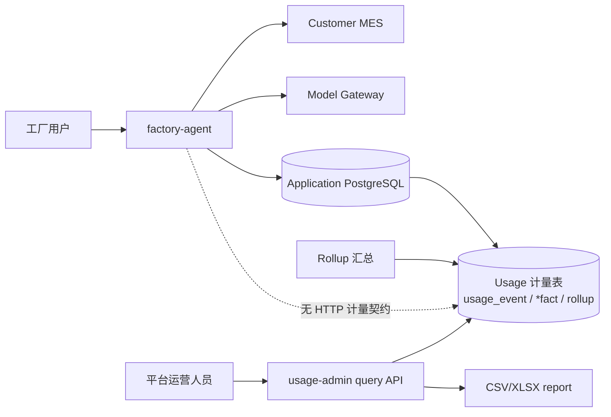

# ADR-0003：多租户使用计量与运营管理服务

- 状态：Proposed
- 日期：2026-08-21
- 所有者：项目维护者、产品与商业负责人

## 1. 背景与目标

平台服务同时承载多个公司和工厂租户，每个租户以稳定 `tenant_id` 标识；用户可以拥有一个或
多个租户成员关系，每个成员关系具有租户内员工、管理或老板角色。平台方需要按获准租户集合
了解使用情况，为客户成功、容量规划、产品分析、报表和后续收费提供依据。

首期需要回答：

- 每个工厂有多少已使用用户、每日活跃用户和活跃趋势；
- 每日提问数、成功数、失败数及 capability 分布；
- 一次用户提问触发多少次 LLM 逻辑调用和供应商物理尝试；
- 一个用户 query 的端到端耗时、LLM 耗时、MES 耗时及 p50/p95/p99；
- token、模型、fallback、错误、导出等可用于成本核算和收费的维度；
- 平台运营人员如何通过 API 查询、下载汇总报表，并在未来接入独立管理前端。

本文只设计平台使用计量和运营分析，不确认最终价格、套餐、账单法律效力或客户可见范围。
首期及当前规划不统计实时在线用户，不设计 heartbeat/presence 链路；用户活跃仅以已接受的
问答 interaction 计算使用用户数和 DAU。

## 2. 决策

新增独立的 `usage-admin` 服务，作为本仓库的 uv workspace 子项目，组织方式类似
`mock-mes`，且是生产拓扑的一部分：

```text
factory-agent/
  src/factory_agent/         # 多租户服务与计量直写生产者
  usage-admin/               # 跨租户计量查询、报表与运营管理
    src/usage_admin/
    migrations/
    tests/
    Dockerfile
```

`usage-admin` 不做进 `factory-agent` 主应用，原因如下：

1. `factory-agent` 同时服务多个租户；MES 业务交互使用活动 `TenantContext` 和租户内
  `DataScope`，平台运营请求使用独立的多租户 `PlatformScope`。
2. 工厂的老板只是该租户内的全厂角色，不是平台运营管理员。
3. 计量写入或管理查询故障不能阻塞工厂问答主链路。
4. 使用明细的保留、汇总、导出和未来计费有独立生命周期与扩容方式。
5. 服务将来可独立仓库、独立发布或替换分析存储，而不改变 MES 业务执行边界。

两个应用禁止互相 import。计量数据由 factory-agent **同库直写**（业务提交后的独立事务 +
失败隔离，见 §3.1），usage-admin 只读查询，两者之间不存在 HTTP 计量契约。`usage-admin` 永远
不调用客户 MES，不读取 `ResultTable`、工资明细、问题原文或回答正文。

## 3. 系统架构



### 3.1 写入链路

两服务共用一个 PostgreSQL。`factory-agent` 的业务数据（会话、消息等）先提交，随后在
**独立事务**中直接写计量表
（`usage_event`、三类 `*_fact`），不存在 outbox 或 HTTP 计量间接层。
该设计保证：

- 计量写入失败只告警、不回滚业务——「计量故障不影响问答」由独立事务天然保证，无事件积压 /
  投递失败运维面；`usage_event` 与其 `*_fact` 在同一计量事务内原子写入，无半截账；
- 以 `event_id` 主键 + `ON CONFLICT DO NOTHING` 幂等去重；
- **计量写入失败不影响问答**：写入封装在持久化层，异常被捕获转为告警，不影响已提交的
  业务数据；
- interaction 完成、失败或取消后都能形成可核对的最终记录。

MVP 不引入 Kafka。出现持续高吞吐、多消费者、跨区域或单库直写成为瓶颈的测量证据后，再评估
Kafka/Redpanda 或独立分析库；届时重新引入传输层，存档 payload 格式仍由 factory-agent 本地
维护。

### 3.2 查询链路

`factory-agent` 直写不可变原始计量事件与事实表，并在本服务内生成小时/日粒度汇总
（rollup 归 factory-agent，它拥有 `tenant_usage_*` 表）。`usage-admin` 只读事实表与汇总表，
运营 API 默认查询汇总表，仅受控诊断端点可查询事件元数据。产品前端或内部报表工具只调用
`usage-admin` API，不直连库。

## 4. 租户和权限模型

### 4.1 公司与工厂租户

- 每个独立授权和计费边界对应一个稳定 `tenant_id`，可以代表公司或工厂；公司与下属工厂的
  关系使用租户元数据表达，不通过猜测 ID 层级推导。
- 一个服务部署承载多个租户，一个用户可以拥有多个有效 `TenantMembership`。
- 每次 MES 业务交互从可信身份中选择并验证一个活动 `TenantContext`，随后计算该租户内
  `DataScope`；员工、管理、老板都是租户内角色，老板看到活动租户全厂。
- 切换活动租户必须重新鉴权、重算 `DataScope` 并隔离会话、缓存、artifact 和审计上下文。
- 用户文本、普通业务参数和 LLM 输出不能声明租户成员关系或扩大活动租户范围。

### 4.2 平台运营权限与账号体系

平台运营是独立身份域，通过 `PlatformScope` 表达获准访问的租户集合与角色，不复用公司或
工厂角色。账号体系为**本服务自建**（D15：本期不引入 OIDC，后续接入公司统一身份源见 §13）：

- 新增 `platform_principal` 表（`username`、`password_hash`、`role`、`tenant_scope`、
  `status`），提供注册 / 登录接口，登录签发 Bearer token；
- 鉴权双通道：`Authorization: Bearer <token>`（**优先**）与「可信网关注入三 header」
  （开发 / 测试直连通道）；前端使用平台下发的 `USAGE_ADMIN_API_TOKEN`（D16），
  不实现前端注册登录；
- 角色三档（D14）：

| 平台角色 | 权限 |
| :--- | :--- |
| `viewer` | 查看所有租户的聚合指标，不查看用户级明细，不可导出 |
| `analyst` | 查看伪名化用户级计量、导出受控报表 |
| `admin` | 在 analyst 之上，管理工厂账户（`tenant_registry` CRUD）与运营账号 |

`platform_billing_admin`（价格表 / 账期 / 生成账单）与 `tenant_usage_viewer`
（客户自助查看用量）不在本期范围，待产品确认，见 §13。

每个管理请求必须记录操作者、目的、租户过滤、指标、时间范围和导出标识（`admin_audit`）。
跨租户查询和用户级导出使用更高权限并接受单独审计。任何新角色或数据范围都需要安全评审。

### 4.3 租户主数据与 AppKey

因按工厂计费，平台必须持久化每个工厂对应的客户 MES AppKey。决策：

- 新增**租户主数据表 `tenant_registry`**，直接以 `app_key` 为主键（客户契约 M4「一厂一
  Key」，AppKey 本身即租户标识；`tenant_id` 与 `app_key` 同值，见下），字段含
  `tenant_name`、`status`（active/disabled）、`created_at`、`updated_at`。不引入独立的
  自增/UUID 租户 ID：AppKey 全局唯一且由客户 MES 分配，已是租户标识，独立 ID 不增加信息；
  事件流中的 `tenant_id` 即 AppKey，与本表主键直接对应，无需映射与迁移。
- **职责划分**：usage-admin 拥有该表的 schema、迁移与全部写入（账户管理接口：列表、详情、
  新增、编辑、停用、启用）；factory-agent **只读**，在凭证建链与刷新时从中解析 AppKey。
- **删除即停用**：不做物理删除，历史用量与事件全部保留，保证计费可对账。
- **停用即拒绝**：factory-agent 在发起 MES 调用前校验账户状态，`disabled` 即拒绝调用。
- **两条存储边界**：AppKey 只存于本表（明文，见 §10）；usage 事件流继续**只携带
  `tenant_id`（即 AppKey），绝不携带 sign/accessToken 等其他凭证**（§5 的红线不变）。按
  AppKey 筛选统计时，服务端直接以其为租户过滤条件。
- **factory-agent 使用 AppKey 的时机**：
  1. 凭证建链与刷新——调客户 `/api/system/token` 需携带 AppKey
     （`src/factory_agent/data_api/hongzhao.py` `_refresh_bundle()`）；
  2. 每个 MES 业务请求的公共参数注入（同文件 `_build_body()`，取自内存 bundle）；
  3. `tenant_id` 解析——`tenant_id` 直接等于 `app_key`
     （`src/factory_agent/data_api/credentials.py`），二者同值，无独立 ID 映射。
  只有时机 1、新租户首次接入以及停用状态校验依赖 `tenant_registry`；时机 2、3 使用内存
  bundle 中已有的 AppKey，该表不可用不影响运行中的交互。共享表降级方案（本地缓存 + 预热 +
  告警）列为后续优化项。
- **表归属与迁移**：两服务共库，一张表只归一方——**本服务拥有并写入**：`tenant_registry`、
  `admin_audit`（管理操作审计）、`platform_principal`（运营账号）、`usage_export`（导出任务
  记录）；**factory-agent 拥有并写入**：业务表 `agent_*` 与计量表 `usage_event`（按月分区）/
  `*_fact` / `mes_operation_category` / `tenant_usage_*`。本服务对 factory-agent 的表
  **只读**，factory-agent 对本服务的表**只读**；因此本服务的迁移目录只放
  `tenant_registry`、`admin_audit`、`platform_principal`、`usage_export`，其余表的迁移写在
  factory-agent 侧，同一张表不得两边都建。
- **Alembic 版本表隔离**：两服务各自使用独立版本表——本服务 `alembic_version_usage_admin`，
  factory-agent 使用默认 `alembic_version`。共用同一个版本表会因两组互不相关的 revision 链而
  互相报 `Can't locate revision identified by ...`。`tenant_registry` 的 schema 变更需两服务
  同步评审。

## 5. 计量事件契约

两服务之间不存在计量传输契约；下表是 `usage_event` **存档 payload** 的公共信封字段，由
factory-agent 本地维护（`application/usage.py` 的 `SCHEMA_VERSION`），写入前校验：

| 字段 | 说明 |
| :--- | :--- |
| `event_id` | 全局唯一、幂等键 |
| `schema_version` | 存档 payload 格式版本 |
| `occurred_at` | UTC 事件时间 |
| `received_at` | factory-agent 落库时写入的接收时间 |
| `tenant_id` | 稳定工厂租户 ID |
| `user_subject_id` | 由平台密钥 HMAC 生成的稳定伪名，不是姓名/工号 |
| `session_id` | 伪名化或内部不透明 ID |
| `interaction_id` | 一次用户提问的稳定关联 ID |
| `trace_id` | 与可观测性系统关联，不包含业务数据 |
| `event_type` | 事件类型 |

首期事件类型：

| 事件 | 关键字段 |
| :--- | :--- |
| `interaction_started` | capability（可空）、入口、用户租户内角色类别 |
| `interaction_completed` | 状态、端到端耗时、MES/LLM/本地处理耗时、结果行数分桶 |
| `llm_call_completed` | 逻辑调用 ID、阶段、模型别名、实际模型、尝试序号、token、耗时、状态、fallback 原因 |
| `mes_call_completed` | Canonical operation ID、页数、行数分桶、耗时、状态；不含 URL 和业务参数值 |
| `artifact_generated` | 格式、大小分桶、状态 |
| `artifact_downloaded` | artifact ID、状态；不含文件名中的业务文字 |

禁止进入事件：问题原文、回答正文、prompt、模型原始响应、员工姓名/工号、工资/产量/订单值、
MES URL、鉴权头、token、API key、`DataScope` ID 列表和导出文件内容。

**MES 接口调用统计口径**：统计对象是客户 MES API 的调用次数，按 API 业务
分类（产量查询 / 工资查询 / 订单进度 / 其他），不是智能体能力分类——同一次查询按能力计与按
API 分类计结果不同（例：能力 `fr001_personal_output` 个人产量统计调用的是工资类
`GongziMxQuery`）。约定：

- 统计单位为请求次数，`page_count` 仅作辅助指标，不重复计入调用次数；
- 成功与失败分别聚合，失败统计走独立接口，不混入成功口径；
- 分类映射不写入事件：事件只带 `operation_id`，分类由 `mes_operation_category` 表
  （`operation_id` → `category`，带生效版本）在 factory-agent 的 rollup 聚合时换算（分类源头
  为 `configs/knowledge/apis.yaml` 的结构化 `usage_category` 字段），usage-admin 只读结果；
  调整口径无需重发历史事件。

## 6. 指标定义

所有指标必须有稳定 `metric_id`、口径版本和生效时间。修改口径时创建新版本，不能静默重算
已用于对账的数据。

| 指标 | 首期定义 |
| :--- | :--- |
| 使用用户数 | 时间范围内至少产生一次已接受 interaction 的去重 `user_subject_id` 数 |
| DAU | 租户自然日内至少产生一次已接受 interaction 的去重用户数 |
| 提问数 | 已创建且通过基础身份校验的去重 `interaction_id` 数 |
| 有效提问数 | 到达 capability 解析阶段的 interaction 数；健康检查和重连不计入 |
| 成功率 | `completed / terminal interactions`；取消、拒绝和系统失败分别展示 |
| LLM 逻辑调用/提问 | 每个 interaction 中应用计划的 LLM 阶段调用数之和 / 提问数 |
| LLM 物理尝试/提问 | 包含 retry 和 fallback 的供应商请求尝试数之和 / 提问数 |
| Query 端到端耗时 | 从 interaction 接收到终态持久化的 wall-clock 时间 |
| LLM wall time | interaction 内 LLM 阶段在关键路径上的耗时；并行调用不能简单相加 |
| LLM 累计耗时 | interaction 内所有物理 LLM 尝试耗时之和，用于资源和成本分析 |
| 平均耗时 | 仅作概览，同时必须提供 count、p50、p95、p99，避免均值掩盖长尾 |
| Token 使用量 | prompt/completion/cached/reasoning token，按实际网关返回能力记录 |
| 估算成本 | `token × 生效价格版本` 的 Decimal 结果；与正式账单分开标识 |

维度首期包括：租户、日期/小时、capability、租户内角色类别、入口、状态、模型逻辑别名、
实际模型、是否 fallback、错误类别和 artifact 类型。禁止把 prompt 内容或自由文本变成分析维度。

## 7. 存储模型

factory-agent 与本服务共享**同一个逻辑数据库**（开发拓扑库名 `factory_agent`；与 ADR-0002 存储
基线一致）：各自用独立用户（`factory_agent` / `usage_admin`）连接并跑迁移，版本表互不相同
（`alembic_version` / `alembic_version_usage_admin`），可在同一库内以任意顺序执行；mock-mes
使用独立数据库。**一张表只归一方**（§4.3）：本服务拥有 `tenant_registry`、
`platform_principal`、`admin_audit`、`usage_export`，其余表均由 factory-agent 拥有并写入，
本服务只读查询：

| 表 | 归属 | 用途 |
| :--- | :--- | :--- |
| `tenant_registry` | **本服务**（DDL + CRUD） | 租户主数据：`app_key`（主键，即租户标识）、工厂名称、账户状态；factory-agent 只读以解析 MES 调用凭证并校验停用状态 |
| `platform_principal` | **本服务**（DDL + CRUD） | 平台运营账号：`username`（唯一）、`password_hash`、`role`（viewer/analyst/admin）、`tenant_scope`、`status`；仅平台内部使用（D15） |
| `admin_audit` | **本服务** | 平台管理查询、导出与账号操作审计 |
| `usage_export` | **本服务** | 导出任务记录：`export_id`、操作者、租户过滤（脱敏）、格式、指标版本、artifact key、有效期 |
| `usage_event` | factory-agent | 按 `occurred_at` 月分区的不可变事件，以 `(event_id, occurred_at)` 定位 |
| `interaction_fact` | factory-agent | 每次提问一行，保存终态、阶段耗时和调用计数 |
| `llm_call_fact` | factory-agent | 每次物理尝试一行，关联 interaction 和逻辑调用 |
| `mes_call_fact` | factory-agent | **每次 MES 请求一行**：`operation_id`、页数、行数分桶、耗时、成功/失败、错误类别 |
| `mes_operation_category` | factory-agent | MES API 分类映射：`operation_id` → 产量/工资/订单/其他，带生效版本 |
| `tenant_usage_hourly` | factory-agent | 租户小时汇总，用于近实时看板 |
| `tenant_usage_daily` | factory-agent | 租户日汇总，用于趋势、报表和未来账单输入 |
| `metric_definition` | factory-agent | 指标 ID、版本、公式说明和生效时间（规划中） |
| `model_price_version` | factory-agent | 模型价格及币种、生效区间；仅用于估算成本（规划中） |

factory-agent 在业务提交后的独立事务中先写 `usage_event`（对应月份分区，`ON CONFLICT DO NOTHING`），再写
`*_fact`；重复 `event_id` 直接幂等去重。rollup 使用幂等 checkpoint 和可重放窗口
处理迟到事件。汇总值可重建，原始事件是计量事实来源。当事件规模或多维分析经测量超过
PostgreSQL 能力时，可将 ClickHouse 作为分析副本；不因预估规模提前增加双存储复杂度。

## 8. API 边界

### 8.1 内部写入 API

usage-admin **不提供任何计量写入接口**。计量由 factory-agent 在业务提交后的独立事务中
直接写库（§3.1）；事件校验与幂等由写入前的本地 payload 格式校验与 `event_id` 主键承担。

### 8.2 运营查询 API

```text
GET  /admin/v1/tenants
GET  /admin/v1/usage/summary
GET  /admin/v1/usage/timeseries
GET  /admin/v1/usage/dimensions
GET  /admin/v1/usage/users
POST /admin/v1/exports
GET  /admin/v1/exports/{export_id}
GET  /admin/v1/exports/{export_id}/download
```

产品后台需求新增（完整清单见本文档 §8.2）：

```text
# 工厂账户管理（tenant_registry，写操作仅 admin 角色，全部落 admin_audit）
GET    /admin/v1/tenants/registry                 # 列表（AppKey 出参脱敏：前 6 位 + ***）
GET    /admin/v1/tenants/registry/{tenant_id}     # 详情
POST   /admin/v1/tenants/registry                 # 新增
PATCH  /admin/v1/tenants/registry/{tenant_id}     # 编辑（名称、状态）
DELETE /admin/v1/tenants/registry/{tenant_id}     # 停用（非物理删除）
POST   /admin/v1/tenants/registry/{tenant_id}/enable

# MES 接口调用统计与工厂明细
GET    /admin/v1/usage/by-tenant                  # 按工厂分组的用量明细 + 分页
GET    /admin/v1/usage/mes-categories             # 成功调用，按产量/工资/订单/其他分类
GET    /admin/v1/usage/mes-failures               # 失败调用统计（独立口径）
GET    /admin/v1/usage/mes-operations             # 按 operation_id 的调用明细
```

所有查询要求明确时间范围、粒度和租户过滤，并有最大跨度、分页、行数和导出大小限制。API
返回指标版本、数据新鲜度、时区和不完整状态。首期提供 API 与 CSV/XLSX，不在本仓库实现
管理前端；前端由独立团队按上述接口开发并独立部署。

## 9. 技术选型

| 关注点 | 首期选择 | 原因 |
| :--- | :--- | :--- |
| 服务运行时 | Python 3.12、FastAPI、Pydantic v2、Uvicorn | 与主仓库一致，复用工程和类型检查方式 |
| 数据访问 | Psycopg 3 + Alembic，不引入 ORM | 事件写入、分区、rollup 和幂等 SQL 需要显式可审查 |
| 主存储 | PostgreSQL 16（与应用共享同一数据库，各服务独立迁移历史与版本表，见 §7） | 当前指标规模未知，足以支撑事件和汇总 MVP |
| 计量写入 | **同库直写**（factory-agent 业务提交后独立事务直写计量表） | 两服务共库，直写无需传输层；计量失败以异常隔离保证不影响问答（见 §3.1） |
| 汇总任务 | factory-agent 内独立 worker 进程 + PostgreSQL advisory lock | rollup 归拥有 `tenant_usage_*` 表的 factory-agent，usage-admin 只读 |
| 报表 | CSV + XlsxWriter | 便于产品拉取和人工对账 |
| 身份 | 本服务自建平台账号（`platform_principal`，token 优先；D15），公司 OIDC/SSO 接入待评估（§13） | 与工厂租户身份域隔离 |
| 可观测性 | OpenTelemetry、结构化 JSON 日志 | 与主应用关联 trace，但不复制敏感数据 |
| 可选演进 | Kafka/Redpanda、ClickHouse、对象存储 | 仅在吞吐、消费者或报表规模有测量证据后引入 |

不使用 Prometheus 作为计费事实库。Prometheus/OpenTelemetry metrics 适合运维监控，会采样、
聚合和过期；商业计量必须来自可去重、可重放、带版本的业务事件。

## 10. 安全、隐私和保留

- 计量事件在 `factory-agent` 内先按 allowlist 构造，禁止发送任意日志字典。
- **AppKey 存储**：AppKey **明文存储于
  `tenant_registry`**（按工厂计费与 MES 调用所必需），但：所有 API 出参一律脱敏为
  **前 6 位 + `***`**；AppKey 绝不进入 usage 事件、日志、trace、错误消息、导出文件与测试
  快照（与 §5 禁止清单一致）；可读该表的服务账号范围、备份快照处理需安全评审。
- `user_subject_id = HMAC(platform_usage_key, tenant_id || stable_user_id)`；密钥由 secret store 管理
  并支持带版本轮换。不同租户不能通过该值关联同一自然人。
- **平台运营账号安全（D15/D16）**：`platform_principal` 的密码哈希存储（argon2/bcrypt），
  token 签名密钥来自环境变量；登录失败与账号变更写 `admin_audit`；token 有过期时间；
  前端 `USAGE_ADMIN_API_TOKEN` 支持轮换；密码与密钥不落日志。
- 管理 API 默认只返回租户聚合；用户级查询和导出需要更高权限。
- 原始计量事件、汇总、管理审计和未来账单输入使用不同保留策略；具体期限需隐私、合同和财务
  负责人批准，本文不沿用 MES 查询审计的 180 天作为默认计费保留期。
- 删除或匿名化要求必须保留聚合可用性，同时移除可关联的用户伪名；正式策略需法律评审。
- 价格表、账单冻结、补记、退款、税务和发票不在首期范围，不能把估算成本展示为应付金额。
- 平台运营导出使用短期下载链接、重新鉴权和完整审计，禁止通过公共对象 URL 下载。

## 11. 可靠性和对账

- `factory-agent` 业务成功不依赖计量实时送达，但**计量直写失败必须告警**（异常隔离，见
  §3.1）；连续失败需有人工可发现的通道。
- 以 `event_id` 主键幂等去重；interaction、逻辑 LLM 调用和物理尝试使用不同稳定 ID。
- 每日记录 written、duplicate、rolled-up 数量守恒检查。
- 按租户和日期提供事件数、事实表数、汇总提问数的对账报告。
- 迟到事件触发滚动重算；已冻结账期只能生成调整记录，不能原地覆盖。账期冻结属于后续计费阶段。
- 客户侧或平台侧时区只影响展示和日界线分组；事件时间统一存 UTC，租户时区需有版本化配置。

## 12. 实施状态

已完成：

- 独立 workspace 服务骨架：包、镜像、健康检查、配置、迁移入口与包边界测试；指标词汇已固定，不实现价格与正式账单。
- `factory-agent` 产生 interaction、LLM、MES 与 artifact 的 allowlist 事件，在业务提交后的独立事务中同库直写计量表（事件表与事实表同一计量事务原子写入、`event_id` 幂等去重、小时/日汇总）；验证统计故障不影响问答且不泄漏 prompt、工资或业务 ID。
- 平台 RBAC、租户列表、summary、timeseries、dimension、用户活跃、导出与 MES 分类统计 API；CSV/XLSX、指标版本、数据新鲜度；对账、迟到事件、重放与管理审计测试。

未实施（依赖产品确认与测量证据）：

- 正式计费：收费单位、免费额度、套餐、账期、价格版本与客户可见范围（§13）；不可变账单 ledger 需经财务、合同、隐私与安全评审；不因当前客户 API 缺失而阻塞，也不在商业规则确认前实现。
- Kafka/Redpanda、ClickHouse 与对象存储：仅在真实负载或报表规模产生测量证据后引入。

## 13. 待确认事项

1. 平台运营账号本期由本服务自建（`platform_principal` 注册/登录，D15）；**后续是否接入公司
   统一 OIDC/SSO** 待评估，接入时鉴权通道不变（usage-admin 只认 token/header，换身份源是
   登录侧的事）。
2. 客户是否可查看自己的用量；可见指标是否与平台内部成本指标不同。
3. 最终收费单位是提问、有效提问、token、模型档位、导出、席位还是组合套餐。
4. 免费重试、模型 fallback、失败请求、拒绝请求和取消请求是否计费。
5. 租户时区、账期时区、账期冻结、补记和争议处理规则。
6. 用户级计量、原始事件、汇总和账单数据的保留与删除期限。
7. 预计工厂数、DAU、峰值 QPS、每次提问 LLM/MES 调用分布和报表最大跨度。

## 14. 影响

- `factory-agent` 同时服务多个公司/工厂租户并产生最小脱敏计量事实；MES 业务查询走活动
  `TenantContext`，跨租户运营查询由 `usage-admin` 按 `PlatformScope` 执行。
- `usage-admin` 是生产服务，与仅开发/测试使用的 `mock-mes` 在生命周期上不同。
- 平台运营权限与工厂员工/管理/老板权限彻底分离。
- MVP 保持一个仓库和一个 lockfile，降低骨架阶段维护成本；服务边界允许未来拆仓。
- 本服务是租户主数据的唯一写入方；`tenant_registry` 与计量表是两服务的共享对象——本服务
  写入 `tenant_registry`、`admin_audit`、`platform_principal`、`usage_export`，factory-agent
  写入计量表，双方对对方的表只读；schema 变更需同步评审发版，存储基线与 ADR-0002 一致。
- 正式计费仍需要新的业务规则和不可变账单模型，本 ADR 只为其提供可审计的计量基础。

## 15. 重新评审条件

当真实吞吐证明 PostgreSQL 不足、需要多个实时消费者、需要客户自助用量门户、正式收费规则
获批、平台身份系统确定，隐私/合同要求改变用户级计量，或共享的 `tenant_registry` 表引发
可用性、安全或部署问题（如 factory-agent 因该表不可用而无法建链）时，重新评审本决策。
