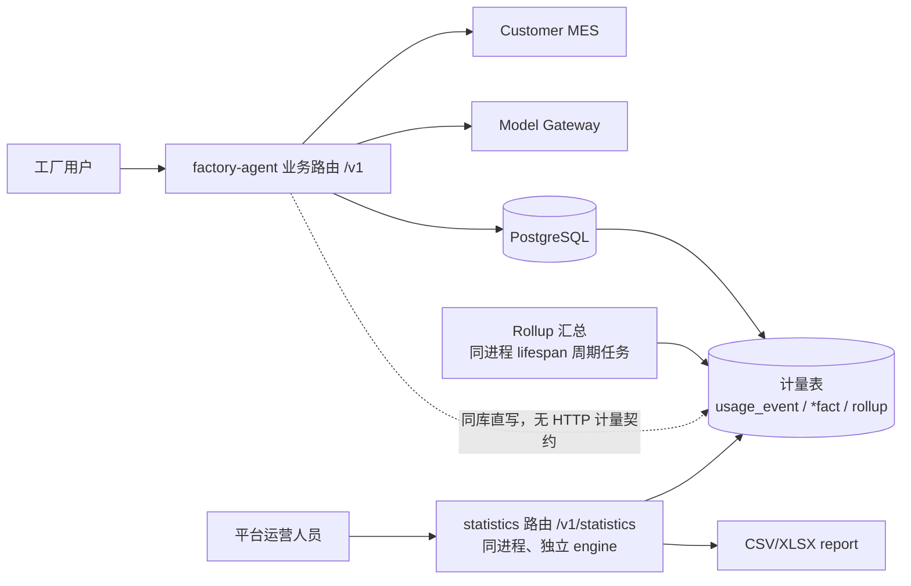

# ADR-0003：多租户使用计量与运营统计（内嵌 `statistics` 模块）

- 状态：Proposed
- 日期：2026-08-21
- 2026-09-17 改写：由独立生产服务合并为本服务内的 `statistics` 子包（原 §2 决策作废）
- 所有者：项目维护者、产品与商业负责人

## 1. 背景与目标

平台服务同时承载多个公司和工厂租户，每个租户以稳定 `tenant_id` 标识；用户可以拥有一个或
多个租户成员关系，每个成员关系具有租户内员工、管理或老板角色。平台方需要按获准租户集合
了解使用情况，为客户成功、容量规划、产品分析、报表和后续收费提供依据。

首期需要回答：

- 每个工厂有多少已使用用户、每日活跃用户和活跃趋势；
- 每日提问数、成功数、失败数及 capability 分布；
- 一次用户提问触发多少次 LLM 逻辑调用和供应商物理尝试；
- 一个用户 query 的端到端耗时、LLM 耗时、MES 耗时及 p50/p95/p99；
- token、模型、fallback、错误、导出等可用于成本核算和收费的维度；
- 平台运营人员如何通过 API 查询、下载汇总报表，并在未来接入独立管理前端。

本文只设计平台使用计量和运营分析，不确认最终价格、套餐、账单法律效力或客户可见范围。
首期及当前规划不统计实时在线用户，不设计 heartbeat/presence 链路；用户活跃仅以已接受的
问答 interaction 计算使用用户数和 DAU。

## 2. 决策

**计量写入与运营统计同属本服务**，统计面收敛在 `src/factory_agent/statistics/` 内，对外以
HTTP 前缀 `/v1/statistics` 暴露，并由本服务自己的数据库访问层提供读写：

```text
factory-agent/
  src/factory_agent/         # 多租户业务服务 + 计量直写生产者 + 平台统计面
    statistics/              # 跨租户计量查询、租户生命周期、报表与运营管理
  migrations/                # 单一 Alembic 基线，一次 upgrade 建成整个库
```

原决策（曾新增独立的 `usage-admin` workspace 子项目与独立镜像）作废。为什么改回来：

1. 计量写入早已是**同库直写**（§3.1），两者本来就共享同一个数据库、同一套故障域与备份
   策略，「独立服务」在存储层并未真正隔离；
2. 开发期维护两个服务（两个镜像、两套迁移历史、两条启动链路、两个健康检查面）的成本
   明显大于它此刻带来的隔离收益；
3. 隔离收益保留在**代码边界**上：`statistics` 不依赖业务域，业务域也不反向依赖它，两者
   之间的唯一通道是端口（`src/factory_agent/ports/tenant_registry.py`），并由包边界测试
   守住。将来若确有拆分需要，仍可整体抽出。

`statistics` 永远不调用客户 MES，不读取 `ResultTable`、工资明细、问题原文或回答正文。它不
与承载问答的会话管道共用 engine 或连接池（§7、§9）。

## 3. 系统架构



### 3.1 写入链路

业务数据（会话、消息等）先提交，随后在**独立事务**中直接写计量表
（`usage_event`、三类 `*_fact`），不存在 outbox 或 HTTP 计量间接层。
该设计保证：

- 计量写入失败只告警、不回滚业务——「计量故障不影响问答」由独立事务天然保证，无事件积压 /
  投递失败运维面；`usage_event` 与其 `*_fact` 在同一计量事务内原子写入，无半截账；
- 以 `event_id` 主键 + `ON CONFLICT DO NOTHING` 幂等去重；
- **计量写入失败不影响问答**：写入封装在持久化层，异常被捕获转为告警，不影响已提交的
  业务数据；
- interaction 完成、失败或取消后都能形成可核对的最终记录。

`usage_event` 按 `occurred_at` 月分区，写入必须落在一个已存在的子表里。分区补建由本服务
负责：迁移基线按执行时刻种子「当月 + 下月」，运行期再以 lifespan 周期任务持续保证同一窗口
（§9），失败告警、绝不静默。

MVP 不引入 Kafka。出现持续高吞吐、多消费者、跨区域或单库直写成为瓶颈的测量证据后，再评估
Kafka/Redpanda 或独立分析库；届时重新引入传输层，存档 payload 格式仍由本服务本地维护。

### 3.2 查询链路

本服务直写不可变原始计量事件与事实表，并在业务侧生成小时/日粒度汇总
（rollup 归业务侧，它拥有 `tenant_usage_*` 表）。`statistics` 只读事实表与汇总表，
运营 API 默认查询汇总表，仅受控诊断端点可查询事件元数据。产品前端或内部报表工具只调用
`/v1/statistics` API，不直连库。

## 4. 租户和权限模型

### 4.1 公司与工厂租户

- 每个独立授权和计费边界对应一个稳定 `tenant_id`，可以代表公司或工厂；公司与下属工厂的
  关系使用租户元数据表达，不通过猜测 ID 层级推导。
- 一个服务部署承载多个租户，一个用户可以拥有多个有效 `TenantMembership`。
- 每次 MES 业务交互从可信身份中选择并验证一个活动 `TenantContext`，随后计算该租户内
  `DataScope`；员工、管理、老板都是租户内角色，老板看到活动租户全厂。
- 切换活动租户必须重新鉴权、重算 `DataScope` 并隔离会话、缓存、artifact 和审计上下文。
- 用户文本、普通业务参数和 LLM 输出不能声明租户成员关系或扩大活动租户范围。

### 4.2 平台运营权限与账号体系

平台运营是独立身份域，通过 `PlatformScope` 表达获准访问的租户集合与角色，不复用公司或
工厂角色。账号体系为**本服务自建**（D15：本期不引入 OIDC，后续接入公司统一身份源见 §13）：

- `platform_principal` 表（`username`、`password_hash`、`role`、`tenant_scope`、
  `status`），提供注册 / 登录接口，登录签发 Bearer token；
- **统计面的唯一鉴权通道是 `Authorization: Bearer <token>`**，前缀 `/v1/statistics`。token
  由 `/v1/statistics/auth/login` 签发（HMAC 签名，携带 principal_id / role / tenant_scope /
  过期时间），或来自平台下发的静态 `FACTORY_AGENT_STATISTICS_API_TOKEN`（映射到 `admin`
  角色，供前端使用，D16）。该静态 token 同时是清库后引导首个运营账号的唯一通道。
  原「可信网关注入三 header」的直连通道**已删除**（D-2）：业务面本就存在一个仅在未配置
  MES 网关时生效的降级 header 通道，同一个进程里再保留第二个始终生效的身份后门，安全评审
  成本高于收益。测试与运维改用上述 API token。
- 两个身份域**互不越权**，并由测试守住：平台 Bearer token 无法调用 `/v1/*` 业务路由；
  工厂凭证（`X-Factory-Credential`）无法调用 `/v1/statistics/*`。实现上由各 router 自己的
  依赖注入提供身份，任何 handler 都不得从「任意一种凭证」推断身份。
- 角色三档（D14）：

| 平台角色 | 权限 |
| :--- | :--- |
| `viewer` | 查看所有租户的聚合指标，不查看用户级明细，不可导出 |
| `analyst` | 查看伪名化用户级计量、导出受控报表 |
| `admin` | 在 analyst 之上，管理工厂账户（`tenant_registry` CRUD）与运营账号 |

`platform_billing_admin`（价格表 / 账期 / 生成账单）与 `tenant_usage_viewer`
（客户自助查看用量）不在本期范围，待产品确认，见 §13。

每个管理请求必须记录操作者、目的、租户过滤、指标、时间范围和导出标识（`admin_audit`）。
跨租户查询和用户级导出使用更高权限并接受单独审计。任何新角色或数据范围都需要安全评审。

### 4.3 租户主数据与 AppKey

因按工厂计费，平台必须持久化每个工厂对应的客户 MES AppKey。决策：

- 新增**租户主数据表 `tenant_registry`**，直接以 `app_key` 为主键（客户契约：按工厂
  计费、一厂一 AppKey，见 `docs/product/需求及方案整理.md`「客户确认结论」；AppKey 本身即
  租户标识，`tenant_id` 与 `app_key` 同值，见下），字段含
  `tenant_ref`（非密唯一句柄）、`tenant_name`、`status`（active/disabled）、
  `created_at`、`updated_at`。不引入独立的租户代理主键：AppKey 全局唯一且由客户 MES 分配，
  已是租户标识；事件流中的 `tenant_id` 即 AppKey，与本表主键直接对应，无需映射与迁移。
  `tenant_ref` 不是替代标识，只是对外可引用的**非密句柄**。
- **职责划分**：`statistics` 模块拥有该表的 schema、迁移与全部写入（首见自动登记 + 账户
  管理接口：列表、详情、新增、编辑、停用、启用）；业务侧**只读**，在凭证建链与刷新时从中
  解析 AppKey，并在 API 边界与 MES 调用前校验停用状态。
- **首见自动登记**：客户 MES 凭证交换成功（`api/identity.py`）即视为「第一次见到这个
  AppKey」，此时同步做一次轻量幂等 upsert
  （`INSERT ... ON CONFLICT (app_key) DO NOTHING`，重复见面零成本），并**在此生成
  `tenant_ref`**——运营从未「创建」过这个租户，ref 是它唯一的对外句柄。占位名用
  `未命名工厂-<tenant_ref 前 6 位>`，由运营在管理端改名；**绝不用 AppKey 片段命名**（那等于
  把密钥片段写进主数据、列表和审计），也不用 MES 返回的用户名 / 厂名自动命名（用户姓名是
  个人数据，不进租户主数据）。
- **登记失败必须 fail-open 且告警**：登记失败不得影响问答。MES 凭证交换才是权威（AppKey
  必须对客户 MES 有效才能换到 token），本地账本写失败只是「少记一笔」，与计量写入策略一致。
- **未知 AppKey 的判定（D-3 = `auto`）**：未知 AppKey 放行并自动登记；`disabled` 一律拒绝。
  已预留开关 `FACTORY_AGENT_STATISTICS_TENANT_REGISTRATION_MODE=auto|allowlist`，本期只实现
  `auto` 分支，`allowlist`（未知即 403、须先人工登记）留测试位不实现。
- **删除即停用**：不做物理删除，历史用量与事件全部保留，保证计费可对账（D10）。
- **停用即拒绝（D13 扩展语义）**：从「拒绝 MES 调用」升级为「拒绝智能体问答」。拦截点前移
  到业务路由依赖（`/v1/*` 全部：sessions、exports、personal、push），`disabled` 返回
  `403` 且 `detail` 为稳定标识 `tenant_disabled`；MES 适配器内的兜底守卫保留（纵深防御）。
  被停用租户的请求**不产生任何 LLM 或 MES 调用**，也不写会话。`registry` 读失败时
  fail-open + 告警（禁止 fail-closed：库抖动会让整个工厂不可用）。已在跑的 interaction 允许
  跑完。**统计接口不受停用影响**——平台运营必须能继续查看被停用租户的历史用量与审计。
  停用不产生新的计量事件；历史用量、会话、导出全部保留且可查询。
- **两条存储边界**：AppKey 只存于本表（明文，见 §10）；usage 事件流继续**只携带
  `tenant_id`（即 AppKey），绝不携带 sign/accessToken 等其他凭证**（§5 的红线不变）。按
  AppKey 筛选统计时，服务端直接以其为租户过滤条件。
- **对外寻址一律用 `tenant_ref`（D-4 = B）**：列表 / 详情出参返回 `tenant_ref`，`app_key`
  保持脱敏（前 6 位 + `***`，D9 不变）；租户管理端点的路径参数是 `{tenant_ref}`
  （get / patch / delete / enable 四处）；`admin_audit.target` 记 `tenant_ref`。原因：
  ① 自动登记出来的租户没有 create 响应可取明文，运营**看不到 AppKey 明文**；
  ② 用脱敏值寻址在实现上不可行（有损截断，无法还原明文）；
  ③ 脱敏值会把同前缀租户撞成同一个值，使 `admin_audit.target` 不可追溯——`tenant_ref` 同时
  修掉这个审计缺陷。创建响应仍一次性返回明文 AppKey（D9 保留），并同时返回 `tenant_ref`。
- **业务侧使用 AppKey 的时机**：
  1. 凭证建链与刷新——调客户 `/api/system/token` 需携带 AppKey
     （`src/factory_agent/data_api/hongzhao.py` `_refresh_bundle()`）；
  2. 每个 MES 业务请求的公共参数注入（同文件 `_build_body()`，取自内存 bundle）；
  3. `tenant_id` 解析——`tenant_id` 直接等于 `app_key`
     （`src/factory_agent/data_api/credentials.py`），二者同值，无独立 ID 映射。
  只有时机 1、新租户首次接入以及停用状态校验依赖 `tenant_registry`；时机 2、3 使用内存
  bundle 中已有的 AppKey，该表不可用不影响运行中的交互。本地缓存 + 预热列为后续优化项。
- **表归属**：整个库只有唯一的写入方（本服务），但按模块划分**逻辑**归属——
  `statistics` 模块拥有并写入 `tenant_registry`、`admin_audit`、`platform_principal`、
  `usage_export`；业务侧拥有并写入 `agent_*` 与计量表（`usage_event`（按月分区）/ `*_fact` /
  `mes_operation_category` / `tenant_usage_*`）。业务代码对前四张表只读，且只经由
  `SqlTenantRegistryReader` 一个入口。`tenant_registry` 的 schema 变更需同时评审两侧读取方。

## 5. 计量事件契约

本服务内部不存在计量传输契约；下表是 `usage_event` **存档 payload** 的公共信封字段，
本地维护（`application/usage.py` 的 `SCHEMA_VERSION`），写入前校验：

| 字段 | 说明 |
| :--- | :--- |
| `event_id` | 全局唯一、幂等键 |
| `schema_version` | 存档 payload 格式版本 |
| `occurred_at` | UTC 事件时间 |
| `received_at` | 落库时写入的接收时间 |
| `tenant_id` | 稳定工厂租户 ID |
| `user_subject_id` | 由平台密钥 HMAC 生成的稳定伪名，不是姓名/工号 |
| `session_id` | 伪名化或内部不透明 ID |
| `interaction_id` | 一次用户提问的稳定关联 ID |
| `trace_id` | 与可观测性系统关联，不包含业务数据 |
| `event_type` | 事件类型 |

首期事件类型：

| 事件 | 关键字段 |
| :--- | :--- |
| `interaction_started` | 入口、用户租户内角色类别 |
| `interaction_routed` | capability（可空：非空 = 解析出的能力，空 = 已进入路由但未命中任何能力） |
| `interaction_completed` | 状态、端到端耗时、MES/LLM/本地处理耗时、结果行数分桶 |
| `llm_call_completed` | 逻辑调用 ID、阶段、模型别名、实际模型、尝试序号、token、耗时、状态、fallback 原因 |
| `mes_call_completed` | Canonical operation ID、页数、行数分桶、耗时、状态；不含 URL 和业务参数值 |
| `artifact_generated` | 格式、大小分桶、状态 |
| `artifact_downloaded` | artifact ID、状态；不含文件名中的业务文字 |

`capability` 之所以独立成 `interaction_routed` 而非并入 `interaction_started`：能力在 LLM 解析
调用之后才知道，而 `interaction_started` 在解析之前写入（它同时是提问数的来源，必须能在解析
失败或进程崩溃时保留）。把 capability 并入任一终态事件都会污染其语义——并入 started 会写出
已知为空的字段，并入 completed 则会把「路由」混进「终态」。独立事件的另一个好处是
`capability = null` 与「从未路由」严格可区分：前者是已解析但未命中能力，后者根本没有这条事件。

禁止进入事件：问题原文、回答正文、prompt、模型原始响应、员工姓名/工号、工资/产量/订单值、
MES URL、鉴权头、token、API key、`DataScope` ID 列表和导出文件内容。

**MES 接口调用统计口径**：统计对象是客户 MES API 的调用次数，按 API 业务
分类（产量查询 / 工资查询 / 订单进度 / 其他），不是智能体能力分类——同一次查询按能力计与按
API 分类计结果不同（例：能力 `fr001_personal_output` 个人产量统计调用的是工资类
`GongziMxQuery`）。约定：

- 统计单位为请求次数，`page_count` 仅作辅助指标，不重复计入调用次数；
- 成功与失败分别聚合，失败统计走独立接口，不混入成功口径；
- 分类映射不写入事件：事件只带 `operation_id`，分类由 `mes_operation_category` 表
  （`operation_id` → `category`，带生效版本）在 rollup 聚合时换算（分类源头为
  `configs/knowledge/apis.yaml` 的结构化 `usage_category` 字段），统计面只读结果；
  调整口径无需重发历史事件。

## 6. 指标定义

所有指标必须有稳定 `metric_id`、口径版本和生效时间。修改口径时创建新版本，不能静默重算
已用于对账的数据。

| 指标 | 首期定义 |
| :--- | :--- |
| 使用用户数 | 时间范围内至少产生一次已接受 interaction 的去重 `user_subject_id` 数 |
| DAU | 租户自然日内至少产生一次已接受 interaction 的去重用户数 |
| 提问数 | 已创建且通过基础身份校验的去重 `interaction_id` 数 |
| 有效提问数 | 已解析出 capability 的 interaction 数（`interaction_routed` 且 capability 非空）；健康检查和重连不计入 |
| 识别率 | `有效提问数 / 提问数`；对外文案不使用「完成率」，避免与成功率混淆 |
| 成功率 | `completed / terminal interactions`；取消、拒绝和系统失败分别展示 |
| LLM 逻辑调用/提问 | 每个 interaction 中应用计划的 LLM 阶段调用数之和 / 提问数 |
| LLM 物理尝试/提问 | 包含 retry 和 fallback 的供应商请求尝试数之和 / 提问数 |
| Query 端到端耗时 | 从 interaction 接收到终态持久化的 wall-clock 时间 |
| LLM wall time | interaction 内 LLM 阶段在关键路径上的耗时；并行调用不能简单相加 |
| LLM 累计耗时 | interaction 内所有物理 LLM 尝试耗时之和，用于资源和成本分析 |
| 平均耗时 | 仅作概览，同时必须提供 count、p50、p95、p99，避免均值掩盖长尾 |
| Token 使用量 | prompt/completion/cached/reasoning token，按实际网关返回能力记录 |
| 估算成本 | `token × 生效价格版本` 的 Decimal 结果；与正式账单分开标识 |

维度首期包括：租户、日期/小时、capability、租户内角色类别、入口、状态、模型逻辑别名、
实际模型、是否 fallback、错误类别和 artifact 类型。禁止把 prompt 内容或自由文本变成分析维度。

## 7. 存储模型

整个库是**同一个逻辑数据库、同一个库用户**（`FACTORY_AGENT_POSTGRES_URL`，用户
`factory_agent`；开发拓扑库名 `factory_agent`，与 ADR-0002 存储基线一致），由**单一
Alembic 基线**一次 `upgrade head` 建成，版本表只有默认的 `alembic_version` 单表单值——不再
存在第二个版本表，也不再有「两个迁移历史可任意顺序执行」的问题。
**一张表只有一个写入方**（§4.3）：

| 表 | 归属 | 用途 |
| :--- | :--- | :--- |
| `tenant_registry` | **`statistics` 模块**（DDL + CRUD） | 租户主数据：`app_key`（主键，即租户标识）、`tenant_ref`（非密唯一句柄）、工厂名称、账户状态；业务侧只读以解析 MES 调用凭证并校验停用状态 |
| `platform_principal` | **`statistics` 模块**（DDL + CRUD） | 平台运营账号：`username`（唯一）、`password_hash`、`role`（viewer/analyst/admin）、`tenant_scope`、`status`；仅平台内部使用（D15） |
| `admin_audit` | **`statistics` 模块** | 平台管理查询、导出与账号操作审计；`target` 记 `tenant_ref` |
| `usage_export` | **`statistics` 模块** | 导出任务记录：`export_id`、操作者、租户过滤（脱敏）、格式、指标版本、artifact key、有效期 |
| `usage_event` | 业务侧 | 按 `occurred_at` 月分区的不可变事件，以 `(event_id, occurred_at)` 定位 |
| `interaction_fact` | 业务侧 | 每次提问一行，保存终态、阶段耗时和调用计数 |
| `llm_call_fact` | 业务侧 | 每次物理尝试一行，关联 interaction 和逻辑调用 |
| `mes_call_fact` | 业务侧 | **每次 MES 请求一行**：`operation_id`、页数、行数分桶、耗时、成功/失败、错误类别 |
| `mes_operation_category` | 业务侧 | MES API 分类映射：`operation_id` → 产量/工资/订单/其他，带生效版本 |
| `tenant_usage_hourly` | 业务侧 | 租户小时汇总，用于近实时看板 |
| `tenant_usage_daily` | 业务侧 | 租户日汇总，用于趋势、报表和未来账单输入 |
| `metric_definition` | 业务侧 | 指标 ID、版本、公式说明和生效时间（规划中） |
| `model_price_version` | 业务侧 | 模型价格及币种、生效区间；仅用于估算成本（规划中） |

业务侧在业务提交后的独立事务中先写 `usage_event`（对应月份分区，
`ON CONFLICT DO NOTHING`），再写 `*_fact`；重复 `event_id` 直接幂等去重。rollup 使用幂等
checkpoint 和可重放窗口处理迟到事件。汇总值可重建，原始事件是计量事实来源。当事件规模或
多维分析经测量超过 PostgreSQL 能力时，可将 ClickHouse 作为分析副本；不因预估规模提前增加
双存储复杂度。

**统计面的数据库访问**：不复用会话管道的 engine 或连接池，而是独立建立短连接（独立池
配置），并统一施加 `statement_timeout`（默认 30s）与只读事务语义；一次大跨度聚合查询不得
拖垮业务连接池。这是合并后最要紧的工程细节，见 §9。

**`usage_event` 分区运维由本服务负责**：任何时刻都必须保证「当月 + 下月」两个分区存在，
跨月不需要人工干预、不需要重启。建子表的函数
`factory_agent_create_partition(target_month DATE)` 本身幂等（内部为
`CREATE TABLE IF NOT EXISTS ... PARTITION OF`）；多 worker 并发执行可能撞
`duplicate_table` 竞态（SQLSTATE `42P07`），捕获忽略即可。补建失败必须告警并带上目标月份与
分区名（便于人工立刻 `SELECT factory_agent_create_partition(DATE 'YYYY-MM-01');` 补救）；
静默正是本缺陷的本质，绝不允许。归档 / 删除超出保留期的旧分区不在本期范围。

## 8. API 边界

### 8.1 内部写入 API

不存在任何跨服务计量写入接口。计量由业务侧在业务提交后的独立事务中直接写库（§3.1）；
事件校验与幂等由写入前的本地 payload 格式校验与 `event_id` 主键承担。

### 8.2 运营查询与管理 API

统计面全部端点在 `/v1/statistics` 前缀下（原 `/admin/v1` 一次性切换，**不保留旧路径别名**）：

```text
# 平台运营账号
POST   /v1/statistics/auth/login
POST   /v1/statistics/auth/register

# 跨租户聚合
GET    /v1/statistics/tenants
GET    /v1/statistics/usage/summary
GET    /v1/statistics/usage/timeseries
GET    /v1/statistics/usage/dimensions
GET    /v1/statistics/usage/users
GET    /v1/statistics/usage/capabilities
GET    /v1/statistics/usage/errors
GET    /v1/statistics/usage/models

# 工厂账户管理（tenant_registry，写操作仅 admin 角色，全部落 admin_audit）
# 列表（出参：tenant_ref 明文可用；app_key 脱敏为前 6 位 + ***）
GET    /v1/statistics/tenants/registry
POST   /v1/statistics/tenants/registry
GET    /v1/statistics/tenants/registry/{tenant_ref}
PATCH  /v1/statistics/tenants/registry/{tenant_ref}
DELETE /v1/statistics/tenants/registry/{tenant_ref}      # 停用（非物理删除）
POST   /v1/statistics/tenants/registry/{tenant_ref}/enable

# MES 接口调用统计与工厂明细
GET    /v1/statistics/usage/by-tenant
GET    /v1/statistics/usage/mes-categories
GET    /v1/statistics/usage/mes-failures
GET    /v1/statistics/usage/mes-operations

# 导出
POST   /v1/statistics/exports
GET    /v1/statistics/exports/{export_id}
GET    /v1/statistics/exports/{export_id}/download
```

服务健康端点统一用业务侧的 `/health/live` 与 `/health/ready`（readiness 内含统计库状态），
统计面不再单独暴露 `/health/*`。

所有查询要求明确时间范围、粒度和租户过滤，并有最大跨度、分页、行数和导出大小限制。API
返回指标版本、数据新鲜度、时区和不完整状态。本期提供 API 与 CSV/XLSX，不在本仓库实现
管理前端；前端由独立团队按上述接口开发并独立部署。

租户管理端点的路径参数是 `{tenant_ref}` 而非 `{app_key}`：AppKey 是密钥且列表只回脱敏值，
无法用于寻址（§4.3）。这是相对合并前的一次**破坏性字段变更**，与前缀变更合并通知前端。

**游标口径**：`TenantRegistryService.list` 的 `next_cursor` 按「已扫描行数」
（`offset + len(records)`）推进，与 `total` 对齐；存在 `PlatformScope` 过滤时不再用可见行数
推算，避免分页重复或跳行。

## 9. 技术选型

| 关注点 | 选择 | 原因 |
| :--- | :--- | :--- |
| 服务运行时 | Python 3.12、FastAPI、Pydantic v2、Uvicorn，**单一服务** | 统计面作为同进程内的独立路由，复用同一套工程与类型检查方式 |
| 数据访问 | Psycopg 3 + Alembic，不引入 ORM | 事件写入、分区、rollup 和幂等 SQL 需要显式可审查 |
| 主存储 | PostgreSQL 16（单库单用户、单一 Alembic 版本表，见 §7） | 当前指标规模未知，足以支撑事件和汇总 MVP |
| 计量写入 | **同库直写**（业务提交后独立事务直写计量表） | 无需传输层；计量失败以异常隔离保证不影响问答（见 §3.1） |
| **统计 DB 访问** | **独立 engine + 独立连接池 + `statement_timeout`（默认 30s）+ 读路径只读事务** | 平台级聚合不得占用或拖垮业务连接池 |
| 汇总任务 | **同进程 lifespan 周期任务**（启动先跑一次 + 周期增量重算，默认每 300s；`0` = 只跑启动一次），另提供 `factory-agent-rollup` 一次性补跑命令 | rollup 归拥有 `tenant_usage_*` 表的业务侧，统计面只读；同进程挂载省掉一个部署单元与 advisory lock 运维，单实例假设与分区任务相同（§7） |
| **`usage_event` 分区运维** | lifespan 周期任务（启动先跑一次 + 周期补建「当月 + 下月」，默认每 86400s；`0` = 只跑启动一次） | 只在迁移里种子会让跨月静默丢账（§7） |
| 报表 | CSV + XlsxWriter；独立桶 `factory-agent-statistics-exports` | 便于产品拉取和人工对账；与业务 artifact 导出分开配置 |
| 身份 | 自建平台账号（`platform_principal`，**仅 Bearer**；D15），公司 OIDC/SSO 接入待评估（§13） | 与工厂租户身份域隔离 |
| 可观测性 | OpenTelemetry、结构化 JSON 日志（走 `observability.logging_adapter`） | 与主应用关联 trace，但不复制敏感数据 |
| 可选演进 | Kafka/Redpanda、ClickHouse、对象存储 | 仅在吞吐、消费者或报表规模有测量证据后引入 |

不使用 Prometheus 作为计费事实库。Prometheus/OpenTelemetry metrics 适合运维监控，会采样、
聚合和过期；商业计量必须来自可去重、可重放、带版本的业务事件。

## 10. 安全、隐私和保留

- 计量事件在业务侧先按 allowlist 构造，禁止发送任意日志字典。
- **AppKey 存储与寻址**：AppKey **明文存储于 `tenant_registry`**（按工厂计费与 MES 调用所
  必需），但：所有 API 出参一律脱敏为**前 6 位 + `***`**；AppKey 绝不进入 usage 事件、日志、
  trace、错误消息、导出文件与测试快照（与 §5 禁止清单一致）。管理与审计**一律以非密
  `tenant_ref` 寻址**（§4.3）：ref 由随机字节生成、不可从 AppKey 推导，也不含密钥片段。
  可读该表的服务账号范围、备份快照处理需安全评审。
- `user_subject_id = HMAC(platform_usage_key, tenant_id || stable_user_id)`；密钥由 secret store 管理
  并支持带版本轮换。不同租户不能通过该值关联同一自然人。
- **平台运营账号安全（D15/D16）**：`platform_principal` 的密码哈希存储（bcrypt），
  token 签名密钥来自环境变量；登录失败与账号变更写 `admin_audit`；token 有过期时间；
  `FACTORY_AGENT_STATISTICS_API_TOKEN` 支持轮换且单独保管；密码与密钥不落日志。
- 统计路由的性能隔离是安全要求的一部分：独立连接池与 `statement_timeout` 必须有，否则
  平台侧的宽区间聚合会变成业务侧的事实拒绝服务面。
- 管理 API 默认只返回租户聚合；用户级查询和导出需要更高权限。
- 原始计量事件、汇总、管理审计和未来账单输入使用不同保留策略；具体期限需隐私、合同和财务
  负责人批准，本文不沿用 MES 查询审计的 180 天作为默认计费保留期。
- 删除或匿名化要求必须保留聚合可用性，同时移除可关联的用户伪名；正式策略需法律评审。
- 价格表、账单冻结、补记、退款、税务和发票不在本期范围，不能把估算成本展示为应付金额。
- 平台运营导出使用短期下载链接、重新鉴权和完整审计，禁止通过公共对象 URL 下载。

## 11. 可靠性和对账

- 业务成功不依赖计量实时送达，但**计量直写失败必须告警**（异常隔离，见 §3.1）；连续失败
  需有人工可发现的通道。
- **分区维护是丢账的判据**：`usage_event` 分区补建失败必须记日志（含目标月份与分区名）并
  产生告警，与计量写入告警同一条通道。缺分区 = 写入失败 = 少记一笔，靠告警而非沉默发现。
- 以 `event_id` 主键幂等去重；interaction、逻辑 LLM 调用和物理尝试使用不同稳定 ID。
- 每日记录 written、duplicate、rolled-up 数量守恒检查。
- 按租户和日期提供事件数、事实表数、汇总提问数的对账报告。
- 迟到事件触发滚动重算；已冻结账期只能生成调整记录，不能原地覆盖。账期冻结属于后续计费阶段。
- 客户侧或平台侧时区只影响展示和日界线分组；事件时间统一存 UTC，租户时区需有版本化配置。

## 12. 实施状态

已完成：

- 计量写入链路：业务侧产生 interaction、LLM、MES 与 artifact 的 allowlist 事件，在业务提交
  后的独立事务中同库直写计量表（事件表与事实表同一计量事务原子写入、`event_id` 幂等去重、
  小时/日汇总）；验证统计故障不影响问答且不泄漏 prompt、工资或业务 ID。
- 平台 RBAC、租户列表、summary、timeseries、dimension、用户活跃、导出与 MES 分类统计 API；
  CSV/XLSX、指标版本、数据新鲜度；对账、迟到事件、重放与管理审计测试。
- **合并落地（2026-09-17）**：统计面迁入 `src/factory_agent/statistics/`，统一前缀
  `/v1/statistics`；删除独立服务的镜像、迁移目录与构建入口；迁移历史合并为单一基线
  （`20260917_0001_init`，含平台四表）；删可信网关三 header 通道，鉴权收敛为仅 Bearer；
  首见自动登记 + `tenant_ref` 寻址 + 停用拦截点上移（`403 tenant_disabled`）；
  `usage_event` 分区按执行时刻种子并在 lifespan 周期补建；统计面独立连接与
  `statement_timeout`。
- **汇总任务落地（2026-09-18）**：`RollupWorker` 作为第 4 个 lifespan 周期任务挂载（启动先跑
  一次 + 默认每 300s 增量重算，窗口默认 24h），此前它只存在于测试里——这是看板 KPI 全零的
  根因；租户列表改由事实表发现，新登记工厂自动纳入；失败经 `statistics.alerts` 告警；
  补跑用一次性命令 `factory-agent-rollup --hours N`（同进程挂载，不再单起 worker 进程）。
- **口径修正（2026-09-18，`rollup-v3`）**：capability 改由新的 `interaction_routed` 事件携带
  （详见 §5），修掉「`capability_id` 恒为 NULL → 能力分布与有效提问数结构性为空」；
  `valid_questions` 口径改为「已解析出 capability」（原「到达解析阶段」在实现里等价于提问数）；
  `incomplete` 由「逐桶覆盖检查」（恒为真的空窗口误判）改为「汇总落后于原始事实」判定
  （`max(rolled_up_at) < 事实新鲜度 − 容差`，容差 = max(2×重算周期, 5min)，活跃 worker 每轮
  重戳时间戳即自愈）；两侧判定在 `summary` 与 `timeseries` 统一。跃版本号后旧窗口需重算，
  由一次性 `factory-agent-rollup` 回填。

未实施（依赖产品确认与测量证据）：

- `registration_mode=allowlist` 分支（只留开关读取与测试位）。
- `usage_event` 旧分区的归档 / 删除（数据保留策略，另开 Story）。
- 正式计费：收费单位、免费额度、套餐、账期、价格版本与客户可见范围（§13）；不可变账单
  ledger 需经财务、合同、隐私与安全评审；不因当前客户 API 缺失而阻塞，也不在商业规则
  确认前实现。
- Kafka/Redpanda、ClickHouse 与对象存储：仅在真实负载或报表规模产生测量证据后引入。

## 13. 待确认事项

1. 平台运营账号本期自建（`platform_principal` 注册/登录，D15）；**后续是否接入公司
   统一 OIDC/SSO** 待评估，接入时鉴权通道不变（统计面只认 Bearer，换身份源是登录侧的事）。
2. 客户是否可查看自己的用量；可见指标是否与平台内部成本指标不同。
3. 最终收费单位是提问、有效提问、token、模型档位、导出、席位还是组合套餐。
4. 免费重试、模型 fallback、失败请求、拒绝请求和取消请求是否计费。
5. 租户时区、账期时区、账期冻结、补记和争议处理规则。
6. 用户级计量、原始事件、汇总和账单数据的保留与删除期限。
7. 预计工厂数、DAU、峰值 QPS、每次提问 LLM/MES 调用分布和报表最大跨度。
8. `usage_event` 旧分区的保留与归档责任归属（本期只做补建，不做回收）。

## 14. 影响

- 仍是**一个仓库、一个 lockfile、一个可安装包、一个服务进程**；平台运营查询与工厂问答
  由同一进程的不同路由承载，但走各自的鉴权依赖与数据库连接池。
- 已知代价：**统计面代码的改动需要重启承载问答的进程**。这是合并换来的直接结果——原先
  统计服务可以独立滚动升级。
- MES 业务查询走活动 `TenantContext` 与租户内 `DataScope`；跨租户运营查询按
  `PlatformScope` 执行。平台运营权限与工厂员工/管理/老板权限彻底分离。
- 平台统计面是租户主数据的唯一写入方；业务侧对 `tenant_registry` 只读（只经一个 reader
  端口），对 `admin_audit` / `platform_principal` / `usage_export` 完全不接触。
- `statistics` 与业务域之间由包边界测试守住依赖方向，将来仍可拆回独立服务。
- 正式计费仍需要新的业务规则和不可变账单模型，本 ADR 只为其提供可审计的计量基础。

## 15. 重新评审条件

当真实吞吐证明 PostgreSQL 不足、需要多个实时消费者、需要客户自助用量门户、正式收费规则
获批、平台身份系统确定，隐私/合同要求改变用户级计量，**或统计并发 / 库负载出现测量证据
（例如平台聚合开始影响业务问答的延迟或连接池可用性）**时，重新评审本决策——后者是判断
「是否拆回独立服务」的触发条件。
