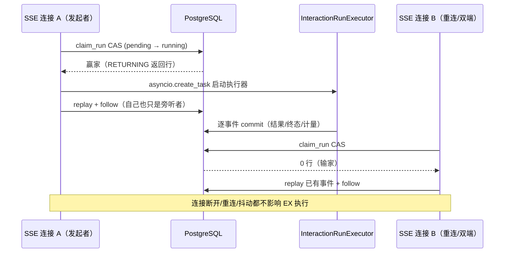
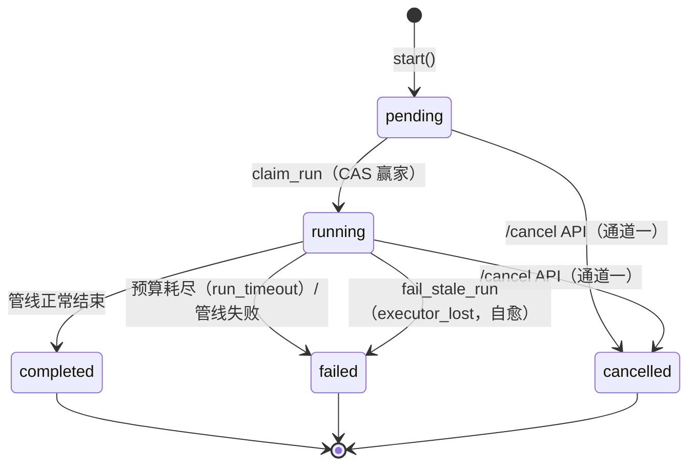

# 交互执行架构：连接之外的生命周期

> **一句话**：一次交互的执行生命周期绑定在**交互本身**，而不是任何一条 SSE 连接——用一次数据库 CAS 决出唯一执行器，用双通道取消与协作式停止点快速收束，用分层超时与启动扫尾兜住每一次进程死亡。

这份笔记梳理会话执行层（`src/factory_agent/application/session/`）的七个核心机制，重点是每个机制背后的“为什么”。

## 背景：断连为什么是致命的

旧架构里，管线寄生在 SSE 响应生成器内，由此带来三类系统性问题：

1. **连接一断，执行即死**：uvicorn 取消响应任务，`CancelledError` 打断管线，结果永不落库，交互永久卡在 `running`；
2. **多端与重连，重复执行**：发起端、重连端、另一台设备可能各自触发同一次交互的管线，带来重复的业务调用与重复计量；
3. **进程一死，状态成谜**：`--reload`、崩溃、容器重建留下的 `running` 行，没有任何人负责收敛。

新架构围绕一句话重构：**执行是交互的属性，不是连接的属性**。连接退化为纯粹的“订阅者”，上面三个问题随之消失。

## 1. CAS（Compare-And-Set，比较并设置）

**通用概念**：CAS 是一种原子操作——“只有当当前值等于我期望的旧值时，才把它写成新值，并告诉你有没有成功”。CPU 层面是单条原子指令；在数据库层面，它的等价形式就是**带条件的 UPDATE**，用来实现乐观并发控制（乐观 = 先干活不锁行，冲突了让数据库裁决谁赢）。

本仓库的实现就在 `queries.py` 的 `claim_interaction_run`：

```sql
UPDATE interaction
SET status = 'running', updated_at = :now
WHERE tenant_id = :t AND user_id = :u
  AND interaction_id = :id
  AND status = 'pending'      -- ← 期望的旧值
RETURNING *
```

语义拆解：

- **赢家**：数据库行锁把并发的 UPDATE 串行化。第一个执行时 `status` 还是 `pending`，条件命中，更新成功并 `RETURNING` 返回整行 → 这个连接成为 claim 赢家，负责启动后台执行器（`_spawn_executor`）并重建本会话的多轮上下文。
- **输家**：第二个执行时 `status` 已变成 `running`，WHERE 不匹配 → **0 行** → 输家，转去 replay + 旁听，绝不再跑一遍管线（避免重复业务调用、重复计量）。

为什么不用进程内锁？因为要防的是 **uvicorn 多 worker、多进程、重启**——进程内锁在这些场景下形同虚设，而 PostgreSQL 是所有进程唯一的共享仲裁点。`fail_stale_run(s)` 用的也是同一招：`WHERE status='running' AND updated_at < stale_before`，谁先 UPDATE 成功，谁获得“处理这个孤儿”的独占权。**CAS 天然幂等**——重复执行第二次必然 0 行，所以多 worker 同时执行启动 sweep 也安全。

## 2. 执行器与连接分离

claim 赢家拿到行之后并不亲自跑管线，而是把执行交给后台任务 `InteractionRunExecutor`（`application/session/executor.py`），自己退回成一名普通旁听者：



分离带来三个直接结果：

- **断开无害**：连接断开只结束一条“订阅”，执行器照常把管线推向终态；
- **重连续播**：重连请求携带 `Last-Event-ID`，从既有事件序列继续 replay；
- **多端一致**：多端各看各的流，共用同一份已落库的事实。

跟随机制不是纯轮询：每个交互有一个进程内 `asyncio.Event`（`base.py` 的 `_notifications`），执行器每次 commit 后 set，旁听连接立即醒来；无通知时才按 `heartbeat_seconds`（默认 15s）发出一次心跳。正常路径的延迟因此与旧实现同量级。

## 3. 双通道取消

- **通道一（权威、跨进程、重启安全）**：cancel API 把 `cancelled` 终态、终态事件、计量 completion 一次性落库。这是任何进程、重启后都能看到的真相。
- **通道二（低延迟、进程内）**：cancel API 落库后 set 执行器的 `asyncio.Event`，执行器在停止点感知，快速退出。

两条缺一不可：进程内事件延迟低，但随进程死亡消失；DB 状态跨进程，但执行器无法“实时收到通知”。组合起来的效果是：活着的执行器秒停，死掉的执行器由僵死检测兜底。

## 4. 协作式停止点（cooperative stop points）

执行器不会被从任意位置“砍断”，它只在三个检查点醒来核对三件事（`executor.py` 的 `interrupted()`）：

1. 进程内取消事件是否 set；
2. wall-clock 预算是否到；
3. DB 中的终态是否已被抢先写入（cancel API 或其他进程）。

停止点的位置：parse 前、业务取数（`runner.run`）前、compose 前。命中停止条件就**静默退出**（`_stop_here`）：不产事件、不花预算、不覆盖终态（防双重终态）。采用协作式而非强占式的原因有二：不能在单次 MES 调用中途撕断；终态的所有权必须唯一。

## 5. 超时分层：三种时间尺度，各管一段

| 机制 | 管什么 | 依据 |
|---|---|---|
| 单调用超时（LLM 30s / MES 超时） | 卡住的**单次调用** | 请求级 deadline |
| `session_run_timeout_seconds`（默认 300s） | 活着但整体**拖太长**的运行 | 停止点检查 wall-clock 预算 → `failed/run_timeout` |
| `session_stale_running_seconds`（默认 600s，由 `fail_stale_run` 执行） | **已经死掉的**孤儿 | `updated_at` 长期停滞 |

关键约束：**`run_timeout < stale_running`**（300 < 600）。保证“活着但慢”的交互先被自己的预算正常终结，不会被旁听连接误判为孤儿。

连接层还有一道自己的护栏：单条跟随流的 `session_follow_timeout_seconds`（默认 600s）。等不到进度时，它只给这条**流**发一个仅线上（wire-only）的 `failed/follow_timeout` 终态事件后收线，**不改动数据库行**——run 的真正终态只由执行器或自愈路径写入。流的生命周期与 run 的生命周期在这里同样保持分离。

## 6. 孤儿自愈与恢复闭环

- **单条自愈（旁听连接触发）**：带 owner 谓词的 `fail_stale_run` 发现 stale `running` 时就地治愈，落库 `failed/executor_lost`；CAS 的同时把 `last_event_sequence + 1`“预约”为终态事件序号，再由调用方补写事件、系统消息与计量。
- **启动 sweep（进程级）**：`create_app` 的 FastAPI lifespan 启动钩子做批量 CAS，清扫所有遗留 `running`。这是唯一能覆盖“进程已死”的恢复点——后台任务随进程死亡，`--reload`、崩溃、容器重建都靠它。
- **停机 bounded drain（收尾）**：lifespan 关闭时给在跑执行器最多 10s（`SessionService.shutdown`）跑完；超时直接取消，剩下的 `running` 交给下次启动 sweep 兜底。

一次 run 的完整状态迁移：



所有恢复动作共享同一条底线：**终态最多被写一次**，任何写入者都必须先赢得 CAS 裁决。整体收敛时间 ≈ 部署周期 + 启动即修。

## 7. ContextVar 复制语义

`asyncio.create_task` 会**拷贝当前 context**，所以执行器任务内 `set_usage_context(...)` / `bind_for(...)` 的写入只落在任务自己的 context 副本里：不污染发起的 handler，也不串其他并发交互。MES adapter 在 `runner.run` 内被同一个任务 await，读到的是同一份 context——这正是“计量归属与凭据绑定天然隔离、无需显式传参重构”的依据（ADR-0007 §2.6）。

## 小结：五条设计原则

1. **唯一终态所有权**：一次 run 的终态最多被写一次，且写入者必须先赢得 CAS。
2. **数据库是唯一的跨进程仲裁者**：进程内锁只做加速，从不承担正确性。
3. **一切等待都有界**：follow 有预算、run 有预算、drain 有预算、stale 有阈值。
4. **连接与执行解耦**：SSE 流只是订阅者，它的断开不影响任何业务事实。
5. **context 随任务隔离**：并发交互之间天然不串账、不串凭据。

## 附：参数速查

| 配置 / 机制 | 默认值 | 作用 |
|---|---|---|
| `session_heartbeat_seconds` | 15s | 旁听流无进度时的心跳间隔 |
| `session_follow_timeout_seconds` | 600s | 单条跟随流的预算；到期只发线上 `follow_timeout` 终态，不改 DB |
| `session_run_timeout_seconds` | 300s | 执行器 wall-clock 预算；到期落库 `failed/run_timeout` |
| `session_stale_running_seconds` | 600s | 孤儿判定阈值；超期落库 `failed/executor_lost` |
| 停机 drain（`SessionService.shutdown`） | 10s | 停机时给在跑执行器的收尾窗口 |


