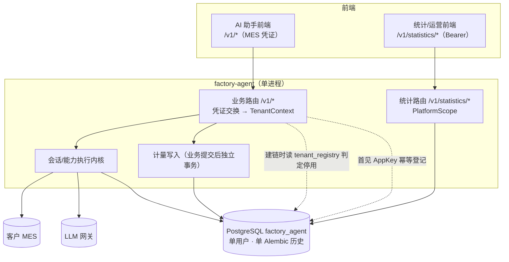

# usage-admin 并入 factory-agent 与租户生命周期方案

- 状态：**评审通过（Approved，2026-09-17）**。D-1 ~ D-9 **全部已拍板**（台账见 §5）：
  **D-1 = `/v1/statistics/...`**、**D-2 = 删除三 header 后门（只留 Bearer）**、**D-3 = auto**、
  **D-4 = B 加非密 `tenant_ref` 唯一列**、**D-5 = 不保留 `USAGE_ADMIN_*`**、
  **D-6 = 挂 fa cli 子命令**、**D-7 = 直接改写 ADR-0003（不新增 ADR-0010）**、
  **D-8 = 直接删卷重建**、**D-9 = 本次一并实现按月自动补分区**。
  下一步 = §6 阶段 1（代码搬迁）
- 日期：2026-09-17
- 关联：ADR-0003（**本方案直接改写它**，见 §10）、ADR-0002（存储基线）、
  `docs/product/需求及方案整理.md`（一厂一 AppKey 的客户确认结论）

---

## 0. 结论摘要

| 你的想法 | 判断 | 说明 / 证据 |
| :--- | :--- | :--- |
| ua 合入 fa，共库变单服务 | **可行，推荐** | 两者已共用同一逻辑库 `factory_agent`，合并只是把「两个进程 + 两个 DB 用户 + 两套 Alembic 历史」收敛成一套。代价是失去 ADR-0003 §2 的故障域隔离，需按 §4 缓解 |
| api 加前缀 | **已拍板：`/v1/statistics/...`** | 把原 `/admin/v1` 整段替换为 `/v1/statistics`，即 `/admin/v1/usage/summary` → `/v1/statistics/usage/summary`。逐条映射表见 §3.2；前端改动 = 1 个基地址常量 + 1 次 `/admin/v1` → `/v1/statistics` 全局替换 |
| ua 接口统一走 Bearer token header | **已经具备，只需收口** | ua 现为 token-first：`Authorization: Bearer` 优先，否则回落「可信网关三 header」直连通道（`api/security.py:24-39`）。Token 由 `/auth/login`（bcrypt + HMAC）签发，或静态 `USAGE_ADMIN_API_TOKEN`（D16）。**已拍板（D-2）：只留 Bearer**，三 header 后门删除，理由见 §0.1 ② |
| 后续改成账号密码 | **已实现，零开发** | `platform_principal` 表 + `/admin/v1/auth/login` 已存在（`auth.py:151-160`，bcrypt 校验，失败写 `admin_audit`）。前端切过去即可 |
| ua 前端不用改 | **基本成立，但有一处必须改** | 只用改 API 基地址（以及 demo 代理的上游端口）。路径结构建议保持原样就是为了这一点 |
| 一厂一 app_key，见一个存一个 | **可行，但要加三件事**（**已拍板 D-3 = auto**） | 当前是「人工预登记」，没有任何自动登记路径；需要：①首见自动登记（幂等、失败不阻断问答）；②命名占位（用 `tenant_ref`，不用 AppKey 片段）；③明确未知 AppKey 仍放行。设计见 §3.7 R1/R2 |
| 已有记录 = 已认定租户 | **成立** | 但语义要从「授权名单」理解为「已见账本」——因为本次不切 allowlist（D-3 = auto），见 §3.7 R2 |
| 开放租户 CRUD 接口 | **保留现有即可** | 6 个端点已齐（list/get/create/patch/delete=停用/enable），换前缀 + **寻址改 `tenant_ref`**（D-4=B） |
| 启用/停用，停用不许智能体问答 | **需求对，但当前实现有缺口** | 停用守卫今天只在 **MES 调用前**触发（`data_api/hongzhao.py:226 → :290`），被停用租户仍能走完意图解析、拿到闲聊回答。需要把拦截点上移到 API 边界（§3.7 R3） |
| 默认开启 | **已满足** | `RegistryCreateRequest.status` 默认 `"active"`（`api/tenants.py:47`） |
| 数据库以后只有 fa 用 | **已拍板：重写迁移历史 + 直接删卷** | 不做桥接迁移：fa 现有 4 个 revision + ua 的 1 个 revision 全部删除，重写为**单次 `init` 基线**（含全部业务表、计量表、原 ua 四表），一次 `upgrade head` 建完整个库。存量库**不做数据搬迁，直接删卷重建**（本机 + 远程，开发期）。操作步骤见 §9 |

**一句话**：需求方向没问题，是你这个阶段（还不该维护两个服务）的正确取舍；真正需要设计的不是「怎么搬」，
而是四件事——**故障域怎么补**、**停用拦截点放哪**、**自动登记后租户表的语义变成什么**、
**对外用什么句柄寻址（以及审计怎么可追溯）**。

**顺带发现的既有缺陷（重写迁移时会正好改到这几行，已决定一并修，见 §3.4 B）**：
`usage_event` 是按月分区表，但 `factory_agent_create_partition()` 在 `src/` 里**没有任何调用者**，
分区只由迁移种子了写死的 `2026-08 / 09 / 10` 三个月 —— 2026-11 起计量写入会因无分区失败，
而按「计量失败只告警不回滚」的设计，这会表现为**静默丢账**。**D-9 已拍板：动态种子 + 按月自动补分区
本次一并实现**（设计见 §3.7 R6），不留待办。

---

## 0.1 先澄清四个术语（D-2 / D-4 / D-6 / D-9）

### ① 分区（D-9）

PostgreSQL 的「分区表」= **一张逻辑表，数据物理上分散在多个子表里**；写入时按某个列的值
（这里是 `occurred_at`）路由到对应子表。`usage_event` 是计量原始事件表（每次提问、每次 LLM
调用、每次 MES 调用都写一行），ADR-0003 §7 已经定成「按 `occurred_at` **月**分区」，
所以它**现在就是**分区表。

```text
写 occurred_at = 2026-11-05 的事件
              │
              ▼
   ┌──────────────────────────────────┐
   │ usage_event（分区父表，自己不存数据）│   ← 只做路由
   └──────────────────────────────────┘
        │            │            │            │
        ▼            ▼            ▼            ▼
   usage_event_  usage_event_  usage_event_  usage_event_
    202608        202609        202610        202611
    已建 ✓        已建 ✓        已建 ✓        ✗ 不存在
                                              → INSERT 报
                                     no partition of relation
                                        found for row
```

- **为什么要分区**：①查 9 月只需扫描 `usage_event_202609`，不用扫全表；②删旧数据用
  `DROP TABLE usage_event_202609` 一次性回收空间，不用 `DELETE`（不产生大量死元组、不触发 vacuum）
  —— 计量表是只增不改的流水，这两点收益很直接。
- **前提**：**新月份的子表必须先存在**，否则写入直接失败（报错文案见上图）。
- **现在的问题**：迁移只建了 `2026-08 / 09 / 10` 三个子表，而负责建子表的函数
  `factory_agent_create_partition()` 在整个 `src/` 里**没有任何调用者**
  → 2026-11 起写入失败 → 又因为计量失败只告警不回滚，表现为**静默丢账**。
- **D-9 已拍板：按月自动补子表本次一起做**。做法是在 **lifespan 里加一个周期任务**，保证
  「当月 + 下月」分区始终存在（复用 `sweep_forever` / `probe_forever` 同构模式），
  并把迁移里的写死种子改成按执行时刻动态取。**只改种子不改运行时**，就仍然会在跨月那一刻丢账。
  实现要点见 §3.7 R6。

### ② 可信网关三 header（D-2）

ua 现在的鉴权有两条通道（`usage_admin/platform.py:68-95`）：

| 通道 | 形式 | 谁在用 | 是否校验 |
| :--- | :--- | :--- | :--- |
| Bearer（**首选**） | `Authorization: Bearer <token>` | 前端、内部运营 | 校验（HMAC 签名 + 有效期，或比对配置里的 API token） |
| 三 header | `X-Platform-Principal` + `X-Platform-Role` + `X-Platform-Tenants` | 开发 / 测试直连 | **不校验**：谁发这三个头，谁就自称是他的身份和角色 |

「可信网关」是个**假设**：假设前面有一个网关会挡掉外部流量、只放行可信调用并注入这三个头。
所以这本质是一条「免校验的身份后门」，带上 `X-Platform-Role: admin` 就是管理员。

风险在于合并后 fa 进程里会同时存在两个这类入口：fa 自己的降级通道
（`X-Factory-Tenant-Id` / `X-Factory-User-Id`，只在**没配** MES 网关时生效，生产不生效）
与 ua 这三头（**只要没带 Bearer 就尝试生效**）。
**D-2 = 已拍板：删掉这三头通道，只留 Bearer。** 测试与运维改用它的 API token
（`FACTORY_AGENT_STATISTICS_API_TOKEN`）。注意这个 token **删不得**：清库后引导第一个运营账号
只能走它（§9.5），它同时是「机器通道」和「引导通道」。

### ③ retention（D-6）

不是「要清理什么代码」，而是一个**定时清理任务**：`usage-admin-retention` 命令，跑一次就把
`admin_audit`（记录谁在什么时候改了哪个租户 / 哪个运营账号的审计表）里**超过 180 天**的行删掉
（`usage_admin/retention.py`，43 行，`AUDIT_RETENTION_DAYS = 180`）。它**没有自动调度**
（没有 cron、没有内置定时器），现在靠人工敲命令。

**D-6 = 已拍板：挂成 fa 的 cli 子命令**（`python -m factory_agent.cli retention`），
不再单独保留 `usage-admin-retention` 这个 console script —— 合并的意义之一就是少一个入口。

顺带一个发现：它的 docstring 里写着「`usage_event` 的分区维护是 factory-agent 的责任」，
但 fa 侧**从来没有实现**。这正是上面 ① 那个 bug 的成因：**职责被写在注释里，两边都没落地**。

### ④ AppKey：存储明文、出参脱敏；但**你该用一个 ID 去寻址，而不是明文**（D-4）

你的要求（明文存、不加密、只在返回展示时脱敏）**就是现状，不需要改**：

- **存储**：`tenant_registry.app_key` 存**明文**。AppKey 既是租户 ID、又是调客户 MES 的凭证，
  必须能原样取出使用；没有加密、没有哈希。
- **出参**：返回给前端的 AppKey 一律脱敏成「前 6 位 + `***`」（`mask_app_key`），
  唯一例外是**创建时**那一次响应返回明文，方便当场留存。

**你问的「删除 / 停用时为什么不能用 ID，一定要用 AppKey 完全明文」——答案分三层。**

**第一层：现在没有 ID 可以给你。** `tenant_registry` 表**没有 `id` 列**，主键就是 `app_key`
（`usage-admin/migrations/versions/20260827_0001_usage.py:57`：
`sa.Column("app_key", sa.Text, primary_key=True)`），记录结构也一共 5 个字段
（`usage_admin/store.py:58-71`）。所以**列表接口没法返回一个 ID** —— 不是不让你用，是没有。

**第二层：不是「删除才要明文」，而是全系统内部标识本来就是 AppKey 明文。**
脱敏**只发生在「给前端看的出参」这一层**，内部全链路一直是明文：

| 位置 | 事实 | 证据 |
| :--- | :--- | :--- |
| 域模型 | `tenant_id` 就是 app_key 明文 | `src/factory_agent/domain/identity.py:97`：「tenant_id is the plaintext app_key」 |
| 迁移注释 | AppKey 全局唯一、**本身即租户标识**，所以事件流的 `tenant_id` **零映射**地等于主键 | `20260827_0001_usage.py:49-54` |
| 计量与业务表 | `usage_event` / `*_fact` / `agent_interaction` 等的 `tenant_id` 一列全是它 | `persistence/tables.py` |

所以「删除接口要用明文」不是特例，而是这条既有设计的必然结果。

**第三层（关键）：你的直觉是对的，而且现在就该按你说的加一个 ID。**
原来的方案 A（给 admin 返回明文）**被 D-3=auto 直接证伪了**：

> A 的全部依据是「admin 本来就能在 create 响应里看到明文」。可是**自动登记根本没有 create 响应** ——
> 运营从未「创建」过这个租户，就永远看不到它的明文；而列表只回 `fac-01***`。
> 结论：**自动登记出来的租户永远无法被停用**。这不是体验问题，是功能缺口。

顺带查出第二个必须一起修的问题：**审计日志今天是不可用的。**
`admin_audit.target` 只写脱敏值（`usage_admin/tenants.py:197-199`，docstring 原话
"Audit targets carry the masked key only"），而脱敏规则是「前 6 位 + `***`」（`masking.py:27`，
`fac-0123456789` → `fac-01***`）。同一个 6 位前缀的租户**脱敏后完全一样**，
于是审计表回答不了「谁在什么时候停了哪个租户」。

| 方案 | 做法 | 结论 |
| :--- | :--- | :--- |
| A | 列表 / 详情对 `admin` 返回**明文** AppKey，按明文寻址 | 零 schema 变更，但 ① 对自动登记的租户不可用（见上）；② 明文会进浏览器历史与前端内存，与「出参脱敏」的取向相反；③ 审计仍不可用。**不采用** |
| **B（采用）** | 加一列**非密** `tenant_ref`（短随机串 + 唯一索引），**它才是对外暴露的租户句柄**：列表 / 详情返回 ref，`/registry/{ref}` 停用 / 启用 / 编辑按 ref 寻址，`admin_audit.target` 记 ref，AppKey 永远脱敏 | 要加列 + 改迁移。**但本次正好是「删卷重建 + 迁移历史重写成单次 init」—— 加列不用写增量迁移、不用回填历史行，成本 ≈ 0**；且 D-3=auto 的自动登记路径**必须**能生成 ref，所以这是 D-3 的必要前置，不是可选项。**采用** |

**结论（已拍板 2026-09-17）：D-4 = B（加非密 `tenant_ref` 唯一列）。** 这一列同时解决三件事：
管理端可寻址、自动登记租户可管理、审计可追溯。落地清单见 §3.7 R4。

---

## 1. 现状（证据基线）

### 1.1 两个服务

| 项 | factory-agent | usage-admin |
| :--- | :--- | :--- |
| 入口 | `src/factory_agent/api/server.py:120` | `usage-admin/src/usage_admin/api/server.py:50` |
| 端口 | 8000 | 8020 |
| 路由前缀 | `/health`、`/v1`（sessions/exports/personal）、`/v1/push` | `/health`、`/admin/v1/auth`、`/admin/v1/tenants`、`/admin/v1/...`（共 25 个端点） |
| 鉴权 | MES 凭证：`X-Factory-Credential` → 客户 `/api/system/token` 换取 `ResolvedPrincipal`；降级通道 `X-Factory-Tenant-Id` / `X-Factory-User-Id`（`api/identity.py`） | Bearer token 优先，否则网关注入三 header（`api/security.py`） |
| 代码量 | `src/factory_agent` 115 个 .py | `src/usage_admin` **4,916 行**，测试 16 文件 **2,541 行**，迁移 170 行 |
| 配置前缀 | `FACTORY_AGENT_` | `USAGE_ADMIN_` |
| 日志 | `observability/logging_adapter.py`（loguru 被封装，业务代码禁止直接 import） | `usage_admin/logging.py`（**直接** 持有 loguru logger） |
| 镜像 | 根 `Dockerfile`（uid 10001，read-only rootfs） | `usage-admin/Dockerfile` |

### 1.2 共库与表归属

同一个逻辑库 `factory_agent`，两个 DB 用户，两套 Alembic 版本表：

| 表 | 归属 | 说明 |
| :--- | :--- | :--- |
| `tenant_registry` | ua（DDL + CRUD） | `app_key` 主键即租户 ID；fa 只读（`persistence/tenant_registry.py`） |
| `admin_audit` / `platform_principal` / `usage_export` | ua | 审计 / 运营账号 / 导出任务 |
| `agent_*` + `usage_event` / `*_fact` / `mes_operation_category` / `tenant_usage_*` | fa | 业务 + 全部计量（fa 业务提交后独立事务直写） |

- 版本表：`alembic_version`（fa，4 个 revision，链头 `20260903_0004_push`）／
  `alembic_version_usage_admin`（ua，1 个合并基线 `20260827_0001_usage`）。
- **已有先例**：fa 的迁移历史在 2026-09-02 已经做过一次「迭代链合并成单一基线」
  （`20260824_0001_session.py` 的 docstring 记录了该次合并），本方案的迁移重写沿用同一做法，
  只是这次把 ua 的四张表一并吸收进来。
- 授权脚本：`deploy/compose/postgres/init-databases.sql` 为 `usage_admin` 授 `CREATE ON SCHEMA public`
  并做双向 `ALTER DEFAULT PRIVILEGES ... GRANT SELECT`。
- 边界测试：`tests/security/test_package_boundaries.py:80-98` 断言两包**互不 import**；
  `:131` 断言 fa 各包依赖白名单（`statistics` 若新增需登记）。

### 1.3 迁移历史重写要动的文件（已核准清单）

| 类别 | 文件 | 处理 |
| :--- | :--- | :--- |
| 删除 | `migrations/versions/20260824_0001_session.py`（434 行） | 内容被新基线吸收 |
| 删除 | `migrations/versions/20260903_0002_scope_violation.py`（57 行） | 同上（`agent_scope_violation`） |
| 删除 | `migrations/versions/20260903_0003_drop_artifact.py`（48 行） | 净效果是「表不存在」，新基线里本来就没有 |
| 删除 | `migrations/versions/20260903_0004_push.py`（66 行） | 同上（`agent_user_preference` / `agent_push_delivery`） |
| 删除 | `usage-admin/migrations/**`（`env.py` + `20260827_0001_usage.py` 170 行） | 四张表 DDL 被新基线吸收 |
| 删除 | `usage-admin/alembic.ini` | 只保留根 `alembic.ini` |
| 新增 | `migrations/versions/20260917_0001_init.py` | 唯一 revision，`down_revision = None`；**`tenant_registry` 在这里直接带上非密 `tenant_ref` 唯一列**（D-4=B，因为是重写而不是增量迁移，加列零成本） |
| 改 | `migrations/env.py` | 删掉「usage-admin 独立版本表」的注释；`version_table` 用默认值 |
| 改 | `src/factory_agent/persistence/tables.py` | 四张表进 `METADATA`；重写表归属 docstring |
| 改 | `Makefile` | `migrate` 去掉 ua 分支；`migrate-status` 只看一个版本表；`pg-grants` 简化 |
| 改 | `tests/unit/data_api/test_mes_operation_categories.py:20` | `MIGRATION` 常量指向新基线文件 |
| 改 | `tests/integration/test_session_migration.py:49-52` | 只 drop `alembic_version` |
| 删 | `tests/integration/test_metering_postgres.py` 的 `test_migration_coexistence_both_orders`（含 `usage_admin_alembic_config()` 辅助函数） | 合并后不存在两条迁移链，「两种顺序共存」失去意义 |
| 删 | `usage-admin/tests/unit/test_migrations.py` | 全篇断言两个版本表隔离，能力随合并消失 |

### 1.4 部署与构建接入点

`usage-admin` 出现在这些位置，合并时都要处理：

| 位置 | 内容 |
| :--- | :--- |
| `deploy/compose/compose.yaml` | 独立 service `usage-admin`（构建 `usage-admin/Dockerfile`，8020，`read_only`，自带 healthcheck） |
| `Makefile` | `bootstrap`(uv workspace)、`test-unit`/`test-integration`(含 `usage-admin/tests`)、`security`(bandit 递归 `usage-admin/src`)、`migrate`、`migrate-usage-admin`、`migrate-status`、`dev-usage-admin` |
| `pyproject.toml` | `[tool.uv.workspace] members`、`[tool.pyright] include` / `extraPaths` |
| 根 `Dockerfile` | 仅为满足 workspace lock 而 `COPY usage-admin/pyproject.toml`（不拷源码） |
| `scripts/verify_images.sh` | 校验 ua 容器 uid=10001 与 8020 健康检查 |
| `deploy/compose/check.sh` / `start.sh` / `README.md` | 端口、DSN、服务清单 |

### 1.5 前端接入

- 真正的 ua 前端由独立团队开发（ADR-0003 §8.2），只调 `/admin/v1/...`。
- 仓库内的 `tools/usage_admin_demo/server.py` 是**开发用反代**：静态页在 8082，其余路由代理到
  `UA_DEMO_UPSTREAM`（默认 `http://127.0.0.1:8020`）并注入 Bearer token；`static/app.js` 里
  25 处 `/admin/v1/...` 硬编码路径。
- 该 demo 还维护一个 keyring hack：因为列表接口只回脱敏 AppKey（D9），它把 create 响应里的明文
  key 记到本地文件，再把按 key 的请求还原成明文（`工具 docstring` 已说明）。

---

## 2. 目标形态



要点：**一个进程、一个端口、一个 DB 用户、一套迁移历史**；两个身份域（MES 工厂身份 / 平台运营身份）
在同一个应用内**并列且互不授权**；统计接口读计量表，业务接口写计量表。
另有一个 lifespan 周期任务常驻，保证 `usage_event` 的「当月 + 下月」分区始终存在（D-9，§3.7 R6）——
它和上面的会话清扫、LLM 健康探针是同一类东西。

---

## 3. 方案

### 3.1 代码归位与包边界

新增 `src/factory_agent/statistics/`，ua 现有模块平移改名：

| 现在 | 现在行数 | 目标 |
| :--- | ---: | :--- |
| `usage_admin/store.py` | 1072 | `statistics/store.py` |
| `usage_admin/ops.py` | 918 | `statistics/ops.py` |
| `usage_admin/exports.py` + `export_store.py` | 323 + 273 | `statistics/exports.py` + `statistics/export_store.py` |
| `usage_admin/auth.py` | 283 | `statistics/platform_auth.py`（避免与 `api/identity.py` 语义混淆） |
| `usage_admin/tenants.py` | 210 | `statistics/tenants.py` |
| `usage_admin/platform.py` | 106 | `statistics/platform.py`（`PlatformScope`） |
| `usage_admin/api/{server,security,auth,tenants,ops}.py` | 1038 | `statistics/api/*`（`server.py` 的 `create_app` 不再需要，改为 `router.py` 导出 `statistics_router`） |
| `usage_admin/{container,config,logging,masking,alerts,events,retention,mes_categories,migrations,cli,__main__}.py` | — | 分别入 `statistics/`、合并进 `config.py`、或删除（见下） |
| `usage-admin/tests/`（16 文件 2541 行） | — | `tests/statistics/{unit,integration}/` |
| `usage-admin/migrations/versions/20260827_0001_usage.py` | 170 | DDL 内容并入新的单次 `init` 基线，原文件与整个 `usage-admin/migrations/` 删除（§3.4） |

**必须改写而不是平移的部分：**

1. **日志**（硬性）：ua 的 `logging.py` 直接持有 loguru logger，与仓库规则「业务代码只走
   `observability.logging_adapter.get_logger`」冲突。全部 `get_logger` 调用改为从
   `factory_agent.observability.logging_adapter` 导入；ua 的 `configure_logging(level)` 直接删除，
   沿用 fa 的 `configure_logging(settings)`（顺带获得脱敏 sink）。
2. **配置**：新建 `StatisticsSettings`，`env_prefix="FACTORY_AGENT_STATISTICS_"`，挂进
   `FactoryAgentSettings` 或独立实例；删除 `UsageAdminSettings`。
3. **生命周期**：`__main__.py` / `cli.py` 的 `usage-admin`、`usage-admin-migrate`、
   `usage-admin-retention` 三个 console script 删除（迁移入口收敛到
   `factory_agent.persistence.migrations`；retention 若还要保留，挂成 fa 的 cli 子命令）。
4. **包边界**（`tests/security/test_package_boundaries.py`）：
   - 删除 `test_usage_admin_does_not_import_product` 与 `test_product_does_not_import_usage_admin`；
   - `ALLOWED_PRODUCT_DEPENDENCIES` 新增 `"statistics"`，白名单建议
     `{"config", "observability", "persistence"}`——**故意不含 `application` / `domain` / `data_api` / `ports`**，
     保证统计上下文不反向渗透进业务域，将来若要拆出去也还拆得动；
   - 新增两条守护测试：①统计包不得 import `data_api`（统计永不碰 MES）；
     ②`statistics` 不得被 `application`/`domain` import。
5. **表定义**：`tenant_registry` / `admin_audit` / `platform_principal` / `usage_export` 从「ua 拥有、
   fa 只读」变为 **fa 自有**，因此要进 `persistence/tables.py` 的 `METADATA`（当前故意不含它们，
   注释见 `persistence/tables.py:10-13`），测试用临时 schema 才能建这四张表。
   `persistence/tenant_registry.py` 的「read-only / owned by usage-admin」注释同步重写。

### 3.2 API 前缀（已拍板：`/v1/statistics/...`）

替换规则很简单：**原 `/admin/v1` 整段 → `/v1/statistics`**。`statistics_router` 的
`prefix` 直接设成 `/v1/statistics`（挂载方式不变，仍是
`app.include_router(statistics_router)`）。

逐条映射（前端与 demo 按此表机械替换即可）：

| 现在 | 合并后 |
| :--- | :--- |
| `POST /admin/v1/auth/login` | `POST /v1/statistics/auth/login` |
| `POST /admin/v1/auth/register` | `POST /v1/statistics/auth/register` |
| `GET /admin/v1/tenants` | `GET /v1/statistics/tenants`（**出参由明文 AppKey 列表改为 `[{tenant_ref, tenant_name}]`**） |
| `GET /admin/v1/tenants/registry` | `GET /v1/statistics/tenants/registry` |
| `GET/POST /admin/v1/tenants/registry` | `GET/POST /v1/statistics/tenants/registry` |
| `GET/PATCH/DELETE /admin/v1/tenants/registry/{app_key}` | `…/v1/statistics/tenants/registry/{tenant_ref}`（**路径参数改名**，见 §3.7 R4） |
| `POST /admin/v1/tenants/registry/{app_key}/enable` | `…/v1/statistics/tenants/registry/{tenant_ref}/enable`（**同理改名**） |
| `GET /admin/v1/usage/{summary,timeseries,dimensions,users,by-tenant}` | `GET /v1/statistics/usage/{同左}`（**均新增可选 `tenant_ref` 工厂过滤**；`by-tenant` 的旧 `app_key` 参数任何取值 422） |
| `GET /admin/v1/usage/{mes-categories,mes-failures,mes-operations,models,capabilities,errors}` | `GET /v1/statistics/usage/{同左}`（**同样新增可选 `tenant_ref`**） |
| `POST /admin/v1/exports`、`GET /admin/v1/exports/{export_id}[…/download]` | `…/v1/statistics/exports…` |
| `GET /health/live`、`/health/ready`（ua 的） | **删除**，统一用 fa 的 `/health/*`（readiness 里补统计库状态） |

两条约束：

- **不做旧路径兼容别名**：唯一消费者是前端（独立团队）与仓库内 demo，都在本次改动范围内；
  留别名会让 OpenAPI 出现双份路径、后续无法收敛。
- **不与业务路径冲突**：fa 现有 `/v1/*` 路由里没有任何单段通配（最深的形如
  `/v1/interactions/{interaction_id}/stream`、`/v1/artifacts/{artifact_id}/download`），
  所以 `/v1/statistics/...` 不会被子路由吞掉。合并后建议加一条路由表快照测试，
  锁住 `/v1/statistics` 下的端点集合（防止将来有人加 `/v1/{something}` 把它劫走）。

### 3.3 鉴权

- **保留**：`Authorization: Bearer <token>` → `PlatformScope`（token 或静态 API token）。
- **删除**：可信网关三 header 直连通道（`platform.py:73-95`，定义见 §0.1 ②，**D-2 已拍板 = 删除**）。
  理由：合并后业务面已有一个「降级 header」后门（`api/identity.py:32-34` 的 `X-Factory-Tenant-Id`，
  且只在未配 MES 网关时生效），同一个进程里再留第二个一直生效的身份后门，安全评审成本高于收益；
  测试与运维改用 API token（`FACTORY_AGENT_STATISTICS_API_TOKEN`，同时是清库后的引导通道）。
- **两个身份域互不越权**（必须落成测试）：
  - Bearer token（平台）**不能**调用 `/v1/*` 业务路由；
  - `X-Factory-Credential`（工厂）**不能**调用 `/v1/statistics/*`；
  - 实现上由各 router 自己的依赖注入提供身份，禁止任何 handler 从「任意一种凭证」推断身份。
- 「后续改账号密码」不需要新开发：`/v1/statistics/auth/login` 已在，前端接入即可。
  唯一建议：把 `platform_principal` 的 `tenant_scope` 语义（空 = 全平台）写进对外文档，避免前端误解。

### 3.4 数据层

**A. 单用户**：合并后统一用 `FACTORY_AGENT_POSTGRES_URL`（`factory_agent` 用户）。
`init-databases.sql` 删除 `CREATE USER usage_admin`、`GRANT CREATE ON SCHEMA public`、
两条 `ALTER DEFAULT PRIVILEGES`；`make pg-grants` 同步简化。

**B. 单次 `init` 基线（重写，不做桥接）**

删除现有 5 个 revision（fa 4 个 + ua 1 个），新建 `migrations/versions/20260917_0001_init.py`
（`revision = "20260917_0001_init"`，`down_revision = None`）。此后整个库由**一次**
`python -m factory_agent.persistence.migrations upgrade head` 建成，`alembic_version`
只有一个值。要动的文件清单见 §1.3。

基线必须包含的净 schema（= 删掉的 5 个 revision 叠加后的终态，已逐个核对）：

| 分组 | 表 |
| :--- | :--- |
| 会话 | `agent_interaction` / `agent_message`（含 `agent_message_sequence_key` 唯一约束） / `agent_interaction_event` |
| 个性化 | `agent_user_mapping` / `agent_query_history` / `agent_favorite` |
| 治理 | `agent_scope_violation`（原 0002） |
| 推送 | `agent_user_preference` / `agent_push_delivery`（原 0004） |
| 计量 | `usage_event`（**按月 RANGE 分区** + `factory_agent_create_partition()` 函数）、`interaction_fact` / `llm_call_fact` / `mes_call_fact`、`mes_operation_category`（30 行种子）、`tenant_usage_hourly` / `tenant_usage_daily` |
| 原 ua 四表 | `tenant_registry`（`app_key` 主键 + **非密 `tenant_ref` 唯一列**，D-4=B） / `admin_audit` / `platform_principal` / `usage_export` |
| **不存在** | `agent_artifact`（0001 建、0003 删——重写后直接不出现，这就是重写省掉的一坨历史） |

三条必须在重写时一并修掉的既有缺陷（都正好落在被重写的代码行上）：

| 缺陷 | 证据 | 处理 |
| :--- | :--- | :--- |
| 分区种子**写死三个月** | `20260824_0001_session.py:243-245` 只有 `2026-08 / 09 / 10`，而 `factory_agent_create_partition()` 在整个 `src/` 里**没有任何调用者** | **两处一起改（D-9 已拍板本次一并做）**：① 新基线按迁移执行时刻动态种子（`date_trunc('month', now())` 与下月）；② 新增运行时周期任务，保证「当月 + 下月」分区始终存在（设计见 §3.7 R6）。**只做 ① 不改运行时**，跨月那一刻（尤其容器在月末停机）仍会写不进去——而按计量失败隔离设计只是告警，等于**静默丢账** |
| `mes_operation_category` 种子行数注释自相矛盾 | 同文件 docstring 写「27 行」、内联注释写「The 26 rows below」、实际 INSERT **30 行** | 统一为 30（与 `configs/knowledge/apis.yaml` 的 30 条一致，`test_mes_operation_categories.py` 守卫） |
| `20260903_0003_drop_artifact.py` 的 `downgrade()` 会**重建**已废弃的 `agent_artifact` | 该文件 `downgrade()` 全文 | 重写后该文件消失，`agent_artifact` 只存在于 git 历史，不再有「降级复活死表」的路径 |

存量库处置（**已拍板 = 直接删卷重建，不做数据搬迁**；操作步骤见 §9）：

| 方案 | 做法 | 结论 |
| :--- | :--- | :--- |
| **重置（采用）** | 删掉数据卷重建；`alembic_version_usage_admin` 随之消失 | 本机与远程服务器都按此执行（开发期，数据可弃） |
| 保留数据 | `pg_dump` → 清 schema → `upgrade head` → 导回；或 `alembic stamp` 新基线 | **不采用**，仅作记录 |

为什么不做桥接：桥接（`has_table` 判断 + 跳过）会永久留下「旧库靠 bridge 跳过、新库靠 init 建全」两条路径，
而旧 revision 仍留在 `versions/` 里继续被 CI 和新人阅读——等于把两套历史都留着，只是让 `head` 能跑通。
既然还没上线，重写的净收益（少 5 个文件、少一条并存路径、顺带修掉上面三条缺陷）大于桥接的省事。

**C. 统计独立引擎**：统计路由**不要**复用会话管道的 engine。新建一个专用
`create_session_engine` 实例（独立连接池大小），并设 `statement_timeout`（建议 30s）与
只读事务语义，防止一次大跨度聚合查询拖垮业务连接池。这是合并后最要紧的工程细节。

**D. 导出后端命名**：fa 已有 artifacts 导出（`FACTORY_AGENT_EXPORT_STORE_DIR` /
`FACTORY_AGENT_S3_*`，bucket `factory-agent-exports`）。统计报表是另一套
（CSV/XLSX，`ExportFileStore`），配置键必须区分：
`FACTORY_AGENT_STATISTICS_EXPORT_STORE_DIR`、`..._S3_BUCKET`（默认
`factory-agent-statistics-exports`）。**不要复用 fa 的 S3 前缀变量名**，否则两套导出会互相覆盖配置。

### 3.5 配置与环境变量

| 现在 | 目标 |
| :--- | :--- |
| `USAGE_ADMIN_DATABASE_URL` | 删除，用 `FACTORY_AGENT_POSTGRES_URL` |
| `USAGE_ADMIN_PORT` / `HOST` / `ENVIRONMENT` | 删除，用 `FACTORY_AGENT_*` |
| `USAGE_ADMIN_API_TOKEN` | `FACTORY_AGENT_STATISTICS_API_TOKEN` |
| `USAGE_ADMIN_TOKEN_SIGNING_SECRET` | `FACTORY_AGENT_STATISTICS_TOKEN_SIGNING_SECRET` |
| `USAGE_ADMIN_EXPORT_SIGNING_SECRET` | `FACTORY_AGENT_STATISTICS_EXPORT_SIGNING_SECRET` |
| `USAGE_ADMIN_DOWNLOAD_BASE_URL` | `FACTORY_AGENT_STATISTICS_DOWNLOAD_BASE_URL` |
| `USAGE_ADMIN_S3_*` / `USAGE_ADMIN_EXPORT_STORE_DIR` | `FACTORY_AGENT_STATISTICS_S3_*` / `..._EXPORT_STORE_DIR` |
| ——（新增） | `FACTORY_AGENT_STATISTICS_TENANT_REGISTRATION_MODE`（默认 `auto`；`allowlist` 本次不实现，见 §3.7 R2） |
| ——（新增） | `FACTORY_AGENT_USAGE_PARTITION_SWEEP_INTERVAL_SECONDS`（默认 `86400`，`0` = 只在启动时跑一次，见 §3.7 R6） |
| ——（新增） | `FACTORY_AGENT_USAGE_ROLLUP_SWEEP_INTERVAL_SECONDS`（默认 `300`，`0` = 只在启动时跑一次）与 `FACTORY_AGENT_USAGE_ROLLUP_WINDOW_HOURS`（默认 `24`）：`tenant_usage_*` 小时/日汇总的周期性重算，看板 KPI 全读这张表；口径见 ADR-0003 §9「汇总任务」 |

`.env` 与 `.env.example` 同步；`deploy/compose/.env.example`、`check.sh` 里的占位值同步。
`USAGE_ADMIN_*` 的兼容读取**不保留**（已拍板，见 §5 D-5）——这是一次收敛，不做双读。

### 3.6 部署

- 删除服务 `usage-admin` 与其镜像；`agent-api` 增加统计导出所需的可写路径
  （`read_only: true` 下新增一个 volume，或默认走 S3 —— **推荐默认 S3**，与 fa artifacts 一致）。
- `scripts/verify_images.sh` 删掉 ua 的 uid/健康检查两行。
- 根 `Dockerfile` 删掉 `COPY usage-admin/pyproject.toml` 一行（workspace 成员消失后不再需要）。
- 端口：统计接口落在 8000（`/v1/statistics/*`），不再有 8020。
  需要外部直连统计面的场景由反代按前缀分流，不需要第二个进程。
- 启动命令不变（`python -m factory_agent.persistence.migrations upgrade head && uvicorn ...`），
  但因为只剩一个 revision，容器首次启动会**一次建完整库**；`make compose-reset` 后重跑即可自证。

### 3.7 租户生命周期（本次需求的核心）

#### R1 首见自动登记

- **位置**：凭证交换成功后（`api/identity.py:60-74`，`exchange.authenticate(raw)` 返回
  `ResolvedPrincipal` 之后），因为这是「第一次见到这个 AppKey」的唯一时刻。
  **不要**放在 MES 调用前——那时租户可能已被停用，而且很多问答不触发 MES（闲聊、澄清）。
- **写入**：`INSERT INTO tenant_registry (app_key, tenant_ref, tenant_name, status, ...) VALUES (...)`
  `ON CONFLICT (app_key) DO NOTHING`，幂等，重复见面零成本。**`tenant_ref` 在这里一并生成**
  （D-4=B）：运营从未「创建」过这个租户，ref 是它唯一的对外句柄。
- **名称占位**：`未命名工厂-<tenant_ref 前 6 位>`，由运营在管理端改名。**不要用 AppKey 片段命名**
  —— 那等于把密钥片段写进主数据、列表和审计；也不要用 MES 返回的用户名 / 厂名自动命名：
  `ResolvedPrincipal` 里没有厂名，而用户姓名是个人数据，不进租户主数据。
- **失败必须 fail-open 且告警**：登记失败**不得**影响问答。理由：MES 凭证交换才是权威
  （AppKey 必须对客户 MES 有效才能换到 token），本地账本写失败只是「少记一笔」。
  与计量写入（ADR-0003 §3.1：独立事务、失败告警、不回滚业务）保持同一策略。
- **实现取舍**：推荐「同步一次轻量 upsert」——主键冲突检查代价低，逻辑简单可测；
  若实测发现对首包延迟有影响，再改为后台任务（需要 `asyncio.create_task` + 异常兜底 + 告警）。

#### R2 未知 AppKey 的判定（已拍板：`auto`）

| 模式 | 行为 | 代价 |
| :--- | :--- | :--- |
| **auto（推荐，= 你现在的描述）** | 未知 AppKey 放行并自动登记；`disabled` 一律拒绝 | 任何能对客户 MES 换到 token 的 AppKey 都能用——但这本来就是今天的语义 |
| allowlist | 未知 AppKey 直接 403，必须先在管理端登记 | 新工厂首次接入需人工开通，「见一个存一个」不成立；上线/交付节奏被卡 |

**D-3 = 已拍板：`auto`。** 并预留一个开关
（`FACTORY_AGENT_STATISTICS_TENANT_REGISTRATION_MODE=auto|allowlist`）：将来某客户要求「白名单准入」时
不需要改代码路径，只改配置。本次实施只落 `auto` 分支 + 开关读取，`allowlist` 分支不实现（留测试位）。

`auto` 有两个**必然推论**，都已并入本方案（不是可选项）：

1. 自动登记时必须生成 `tenant_ref`（D-4=B）—— 见上 R1 与 §0.1 ④。
2. 自动登记出来的租户，运营**看不到 AppKey 明文**，所以管理端所有操作（改名 / 停用 / 启用）都只能按 ref 做。

#### R3 停用拦截点上移（真正的缺口）

现状：`data_api/hongzhao.py:226` 在**每次 MES 调用前**调 `_assert_tenant_enabled()`（`:290`），
`record is None` 放行。结果是——被停用租户**仍然可以**：建会话、跑意图解析（消耗 LLM）、
得到闲聊/澄清回答、留下会话记录；只有真正去查业务数据时才会失败。

目标：在**业务路由的 API 边界**判定一次，`disabled` → `HTTP 403`，`detail` 用稳定标识
（建议 `tenant_disabled`，供前端出「该工厂账户已停用，请联系平台」的文案）。

| 决策 | 建议 |
| :--- | :--- |
| 拦截实现 | 路由级依赖（在业务 router 上挂一个 dependency），不要每个 handler 手写，避免漏点 |
| 覆盖范围 | `/v1/*` 全部：sessions、exports、personal（收藏/历史/映射）、push（偏好/推送） |
| 是否拦统计接口 | **不拦**。平台运营必须能查看被停用租户的历史用量与审计 |
| 保留 adapter 级守卫 | 保留（纵深防御，`hongzhao.py:226` 不动） |
| registry 读失败 | fail-open + 告警（可用性优先）。禁止 fail-closed：DB 抖动会让某个工厂全厂不可用 |
| 已在跑的 interaction | 允许跑完，不做中途终止（避免半截账） |
| 停用影响面 | 不产生新的计量事件；历史用量、会话、导出全部保留，可继续查询 |

#### R4 CRUD 与启用/停用接口

保留现有 6 个端点，只换前缀。顺手修一个真实缺陷：
`TenantRegistryService.list`（`tenants.py:56-62`）在 `PlatformScope` 过滤命中时，用
`offset + len(visible)` 推算 `next_cursor`，与 `total` 口径不一致 → 分页可能重复或跳行。
建议游标改为按「已扫描行数」推进（`offset + len(records)`），或在 scope 过滤存在时明确返回
`next_cursor = None` 并要求前端按 `limit/offset` 翻页（口径写在 API 文档里）。

**管理端寻址改成 `tenant_ref`（D-4=B，采用）**：现状是停用 / 启用 / 编辑都按 `app_key` 定位，
而列表接口只回脱敏值（`fac-01***`），前端根本拿不到可用于寻址的 key——现在 demo 是靠本地 keyring
文件把创建时的明文记下来绕的，生产前端不能这么干；**D-3=auto 之后更是彻底走不通**
（自动登记的租户没有 create 响应可供取明文）。

改动清单：

| 项 | 现状 | 目标 |
| :--- | :--- | :--- |
| `tenant_registry` | 只有 `app_key` 主键 | 增 **非密** `tenant_ref`（唯一索引，短随机串，如 `t_7f3a9c21`） |
| 列表 / 详情出参 | `app_key: "fac-01***"`，无可用句柄 | 增 `tenant_ref`；`app_key` 保持脱敏。ref 是**非密**字段，不需要脱敏 |
| 寻址路径 | `/v1/statistics/tenants/registry/{app_key}` | `/v1/statistics/tenants/registry/{tenant_ref}`（get / patch / delete / enable 四处） |
| `admin_audit.target` | `_masked(app_key)` → `fac-01***`（**多租户会撞成同一个值，审计不可追溯**） | 记 `tenant_ref` → 既唯一可追溯、又不含密钥 |
| 创建响应 | 返回明文 AppKey 一次 | 不变（D9 保留），**同时返回 ref**，前端两种句柄都拿到 |
| fa 侧读取 | `SELECT app_key, tenant_name, status`（`persistence/tenant_registry.py:28`） | 不变。停用守卫按 AppKey 查，`SqlTenantRegistryReader` 无需 ref |

**这是一次对统计前端的破坏性字段变更**，但前缀改动本身就是一次破坏性变更，**合并到同一次通知里**即可：
前端只需要把「记住明文 AppKey」的那套逻辑换成「用 `tenant_ref` 拼路径」。demo 前端的本地 keyring
文件可以随之删除（这本来就是它的唯一用途）。

#### R5 与既有决策的关系

- **D10（删除即停用）不变**：不做物理删除，历史全留，计费可对账。
- **AppKey 存储与出参策略不变**：存储仍是明文（ua 的 D9），出参仍脱敏；本方案的 D-4=B 只是
  **增加一个非密句柄 `tenant_ref` 用于寻址与审计**，不改变存储与脱敏原则（§0.1 ④）。
- **D13（停用即拒绝）扩展语义**：从「拒绝 MES 调用」升级为「拒绝智能体问答」。

> 编号说明：本文的 `D-1…D-9` 是**本方案**的待决/已决项；ua 文档里的 `D9/D10/D13/D14/D15/D16`
> 是 usage-admin 既有决策编号（见 `usage-admin/docs/API.md`）。两套编号不要混读。

#### R6 `usage_event` 分区自动维护（D-9，本次一并做）

**问题**：`usage_event` 按 `occurred_at` 月分区，写入必须落在一个**已存在**的子表里。建子表的函数
`factory_agent_create_partition(target_month DATE)` 本身是幂等的（内部为
`CREATE TABLE IF NOT EXISTS ... PARTITION OF`，`20260824_0001_session.py:221-241`），
但**全仓没有任何调用者**，所以子表只有迁移种子那三个月。

**目标**：任何时刻都保证「**当月 + 下月**」两个分区存在，跨月不需要人工干预、不需要重启。

**设计**（复用 fa 既有的 lifespan 周期任务模式，与 `sweep_forever` / `probe_forever` 同构）：

| 项 | 内容 |
| :--- | :--- |
| 挂载点 | `src/factory_agent/api/server.py` 的 `_lifespan`（`server.py:53`），与 `sweep_task` / `health_task` 并列 |
| 启动时 | 先 `await ensure_usage_partitions()` **一次**，再创建周期任务；**失败不阻断启动**，只告警（与 sweep / probe 同策略） |
| 周期任务 | `asyncio.create_task(ensure_usage_partitions_forever(interval), name="usage-event-partitions")`；关闭时 `cancel()` + `gather(..., return_exceptions=True)`，与现有两个任务走同一条清理路径 |
| 周期配置 | `FACTORY_AGENT_USAGE_PARTITION_SWEEP_INTERVAL_SECONDS`，默认 `86400`（1 天），`0` = 只跑启动那一次（与 `session_sweep_interval_seconds` 同语义） |
| 补建范围 | 当月 + 下月（`date_trunc('month', now())` 与 `+ interval '1 month'`）。**不要只补当月**：容器在月末停机、或跨月那一刻任务恰好还没跑到，就正好写不进去 |
| 可注入时钟 | `ensure_usage_partitions(reference_month: date \| None = None)`，默认取当前月；测试直接传 `date(2026, 11, 1)` 断言行为（遵守「注入时钟」的项目规范，不要靠改系统时间测） |
| 幂等与多 worker | 函数本身幂等；多 worker 并发 `CREATE TABLE IF NOT EXISTS` 可能撞 `duplicate_table` 竞态，捕获 `SQLSTATE 42P07` 忽略即可（或先 `SELECT to_regclass('usage_event_202611')` 判断） |
| 失败策略 | **fail-open + 告警**（与计量写入同策略）：不阻断问答，但必须 `logger.exception` + 告警计数。**绝不能静默** —— 静默正是这个 bug 的本质 |
| 日志内容 | 补建失败时日志必须带**目标月份与分区名**，便于人工立刻补救：`SELECT factory_agent_create_partition(DATE '2026-11-01');` |

**另可考虑（本次不做）**：归档 / 删除超出保留期的旧分区（`DROP TABLE usage_event_202508`），
让「分区」的第二个收益（秒级回收空间、不产生死元组、不触发 vacuum）真正兑现。
这属于数据保留策略，另开 Story。

**验收**：
1. 空库 `upgrade head` 后，`to_regclass('usage_event_<本月>')` 与 `to_regclass('usage_event_<下月>')` 均非空。
2. 调用 `ensure_usage_partitions(date(2026, 11, 1))` → `usage_event_202611` / `usage_event_202612` 被创建，
   且写入 `occurred_at = '2026-11-05'` 的事件成功。
3. 手工 `DROP TABLE usage_event_202611` 后，再触发一次周期任务能自动补回。
4. 补建失败（如用只读连接）时问答**不受影响**，且产生一条告警日志。

### 3.8 前端接入

- 独立团队的 ua 前端：基地址改到 fa 的地址（不再有 8020），并把 `/admin/v1` 整段替换为
  `/v1/statistics`（映射表见 §3.2）。**除前缀外还有三处字段级改动，必须在同一次通知里说清**：
  ① 列表 / 详情出参新增 `tenant_ref`；② 租户管理端点的路径参数从 `{app_key}` 改成 `{tenant_ref}`
  （§3.7 R4）；③ `GET /tenants` 出参由明文 AppKey 列表改为 `[{tenant_ref, tenant_name}]`，同时工厂
  筛选参数由 `app_key` 改为 `tenant_ref` 并从 `by-tenant` 铺到**全部聚合端点**（`by-tenant?app_key=`
  现在 422，不再静默忽略）。其余字段、状态码、语义不变。
- 这意味着前端**可以删掉「记住明文 AppKey」那套逻辑**（demo 的本地 keyring 文件正是为此存在），
  改成用 `tenant_ref` 拼路径——这同时也把前端从「必须缓存密钥」里解放出来。
- 仓库内 `tools/usage_admin_demo`：`UA_DEMO_UPSTREAM` 默认改为 `http://127.0.0.1:8000`，
  `static/app.js` 里 25 处 `/admin/v1/...` 同步替换为 `/v1/statistics/...`，并去掉 keyring 依赖。
- CORS：fa 目前也没有 CORS 中间件，demo 反代模式继续可用，不需要新增 CORS。

---

## 4. 风险与缓解

| 风险 | 严重度 | 缓解 |
| :--- | :--- | :--- |
| **故障域合并**：统计侧的 bug / OOM / 大查询会拖垮问答主链路（ADR-0003 §2 第 3 条被违背） | 高 | ①统计专用 engine + 连接池 + `statement_timeout`；②导出大小/跨度限制保持；③统计路由不参与会话中间件；④容器内存与 CPU 限额按「问答 + 统计」合并预算重设 |
| **发布节奏耦合**：改一行统计代码要重启承载客户问答的服务 | 中高 | ①统计代码集中在 `statistics/` 且不依赖业务域，改动面自限；②上线窗口约定（统计类变更避开工作时段）；③保留「将来再拆出去」的能力（包边界测试守住） |
| **扩容耦合**：两者无法独立扩实例 | 中 | 当前规模（个位数工厂）无影响；ADR-0003 §15 的重评条件改为「统计并发或库负载出现测量证据」 |
| **身份域混进同一进程** | 中 | §3.3 的双向越权测试；统计包依赖白名单不含业务域 |
| **Alembic 历史重写出错** | 中 | 先在空库跑通 `upgrade head` + `downgrade base` 往返，再对存量卷处置；`init` 基线与 `tables.py` METADATA 的一致性由 `tests/integration/test_session_migration.py` 反射校验兜住 |
| **重写导致存量库不可用** | 中 | 已拍板直接删卷重建（§9）；本机与远程都按 §9 执行，注意 §9.1 的顺序坑 |
| **分区缺失导致静默丢账**：`usage_event` 无对应月份分区时写入失败，而计量失败只告警不回滚 | 中高 | **D-9 一并做**：新基线按执行时刻动态种子 + 运行时周期任务保「当月 + 下月」（§3.7 R6）；失败必须告警且日志带目标月份与分区名，禁止静默 |
| **审计不可追溯**：`admin_audit.target` 只记 `fac-01***`，同前缀租户脱敏后完全相同，回答不了「谁停了哪个租户」 | 中 | D-4=B 改成记 `tenant_ref`（唯一且非密）；补一条测试断言「同一 6 位前缀的两个租户，其审计 target 不同」 |
| **`tenant_ref` 是破坏性契约变更**（新增字段 + 路径参数换名） | 中 | 与「前缀变更」合并为一次通知（§3.8）；create 响应同时返回明文 AppKey 与 ref 作为过渡；`tenant_ref` 加唯一索引与非空约束，生成失败即注册失败 |
| **自动登记写路径进业务热路径** | 中 | 幂等 upsert + fail-open + 告警；监控「登记失败」计数 |
| **单 DB 用户丧失最小权限** | 低 | 合并后只有一个服务，跨服务授权本就无意义；如仍要隔离，用独立 role 而非独立用户，后续再说 |
| **存量 `.env` 变量名变更导致本机跑不起来** | 低 | 同步改 `.env` / `.env.example` / `deploy/compose/.env.example`，并在交付说明里列 diff |

---

## 5. 决策台账（D-1 ~ D-9 全部已决）

| # | 问题 | 结论 | 依据 / 落地位置 |
| :-- | :--- | :--- | :--- |
| **D-1** | 前缀形态 | **已拍板：`/v1/statistics/...`** | 原 `/admin/v1` 整段 → `/v1/statistics`（§3.2 映射表） |
| **D-2** | 是否保留「可信网关三 header」直连通道 | **已拍板：删除，只留 Bearer** | 解释 §0.1 ②；API token 保留为机器 + 引导通道（§9.5） |
| **D-3** | 未知 AppKey 判定 | **已拍板：auto** + 预留 `..._REGISTRATION_MODE` 开关，`allowlist` 分支不实现 | §3.7 R2；两个必然推论（生成 ref、按 ref 管理）已并入 |
| **D-4** | 出参全脱敏导致停用 / 启用无法寻址 | **已拍板：B —— 加非密 `tenant_ref` 唯一列**，管理操作与审计都改按 ref | 解释与证据 §0.1 ④；改动清单 §3.7 R4 |
| **D-5** | 是否保留 `USAGE_ADMIN_*` 环境变量兼容读取 | **已拍板：不保留** | 一次收敛，不做兼容读取 |
| **D-6** | retention 命令怎么安置 | **已拍板：挂 fa cli 子命令** | `python -m factory_agent.cli retention`，不再保留独立 console script |
| **D-7** | 怎么处理 ADR-0003 | **已拍板：直接改写 ADR-0003，不新增 ADR-0010** | 连带根 `AGENTS.md` 等（清单见 §10） |
| **D-8** | 存量库怎么处置 | **已拍板：直接删卷重建，不做数据搬迁** | 本机 + 远程都执行；步骤 §9 |
| **D-9** | 「按月自动补 `usage_event` 分区」是否纳入本次 | **已拍板：纳入本次** | 设计 §3.7 R6；迁移动态种子 + 运行时周期任务，两者缺一不可 |

---

## 6. 实施阶段与检查清单

> 分阶段是为了让每一步都可独立验证；每阶段结束都要求 `make check` 不新增红。

### 阶段 1 — 代码搬迁（无行为变化）

- [x] 建 `src/factory_agent/statistics/`，按 §3.1 平移模块并改名
- [x] 全部日志改走 `observability.logging_adapter.get_logger`，删除 ua 的 `logging.py`
- [x] `StatisticsSettings`（`FACTORY_AGENT_STATISTICS_` 前缀）替换 `UsageAdminSettings`
- [x] `statistics_router` 挂进 `api/server.py`，`prefix="/v1/statistics"`（已拍板）
- [x] 删除 `usage-admin/` 目录、其 Dockerfile、console scripts
- [x] `tests/statistics/**` 落地，`Makefile` / `pyproject.toml`（workspace、pyright）同步
- [x] 改写 `tests/security/test_package_boundaries.py`（§3.1 第 4 点）
- [x] 验收：`make test-unit test-integration`；`/v1/statistics/...` 端点与旧 ua 响应逐字段一致
      —— 契约形状由 `tests/characterization/test_statistics_contract_baseline.py` 冻结守护：
      合并前 ua 的 22 条路径 / 28 个模型快照存于 `statistics_contract_baseline.json`，实测**共有
      路径的方法、参数、请求体、状态码零差异**，模型级唯一差异是 `RegistryItemOut` 新增
      `tenant_ref`

### 阶段 2 — 迁移历史重写 + 数据层收敛

- [x] 4 张表进 `persistence/tables.py` METADATA，重写其表归属 docstring
- [x] 删除 5 个旧 revision（fa 4 + ua 1）与整个 `usage-admin/migrations/`、`usage-admin/alembic.ini`
- [x] 新建 `migrations/versions/20260917_0001_init.py`（`down_revision = None`），按 §3.4 B 的净 schema 表逐项落实
- [x] **`tenant_registry` 增非密 `tenant_ref` 唯一列**（D-4=B，§3.7 R4）
- [x] 修复三条既有缺陷：**分区种子改成按执行时刻动态取（当月 + 下月）**、种子行数注释统一为 30、`agent_artifact` 彻底不出现
- [x] `migrations/env.py` 删掉 ua 版本表注释；`init-databases.sql` 去掉 `usage_admin` 用户与相关 GRANT
- [x] `Makefile`（`migrate` 去 ua 分支、`migrate-status` 单表、`pg-grants` 简化）
- [x] 同步 §1.3 列出的 5 处测试改动（含删除「两种迁移顺序共存」用例与 ua 的 `test_migrations.py`）
- [x] 统计专用 engine（独立池 + `statement_timeout`）
- [x] 验收：空库 `upgrade head` 一遍到位 → `downgrade base` → 再 `upgrade head` 往返成功；
      `to_regclass('usage_event_<本月>')` 与 `to_regclass('usage_event_<下月>')` 均非空；
      `make migrate-status` 只剩 `alembic_version` 单表单值；
      `tests/integration` 的在库用例（`FACTORY_AGENT_TEST_POSTGRES_URL`）全绿
      —— 实测（2026-09-17）：空库建成 23 张表、`alembic_version` 单表单值
      `20260917_0001_init`、分区种子 `usage_event_202609` + `usage_event_202610`、
      `tenant_registry.tenant_ref` 存在、`mes_operation_category` 30 行；`downgrade base` 后
      业务表与分区函数全清、无残留；再 `upgrade head` 复现同一状态且 `agent_artifact` 不存在

> 本阶段**不**动存量库。删卷重建要等新镜像可用（阶段 4），否则会写进旧 revision（§9.1）。

### 阶段 3 — 鉴权与租户生命周期

- [x] 删除三 header 通道（D-2 = 删除）
- [x] 双向越权守护测试（Bearer 不可进业务路由；MES 凭证不可进 `/v1/statistics/*`）
- [x] 首见自动登记（幂等 upsert + **生成 `tenant_ref`** + fail-open + 告警计数）
- [x] 管理端点改成按 `tenant_ref` 寻址（get / patch / delete / enable 四处）；`admin_audit.target` 改记 ref
- [x] 列表 / 详情出参新增 `tenant_ref`；`app_key` 保持脱敏（D9 不变）
- [x] 停用拦截点移到业务路由依赖（403 `tenant_disabled`），覆盖 sessions/exports/personal/push
- [x] 统计接口明确不受停用影响（测试守住）
- [x] 修 `TenantRegistryService.list` 游标口径缺陷
- [x] **`usage_event` 分区自动维护**：`ensure_usage_partitions(reference_month=None)` +
      lifespan 周期任务（§3.7 R6），含 `SQLSTATE 42P07` 竞态处理与失败告警
- [x] 验收：被停用租户发起问答 → 403 且**零** LLM/MES 调用（用 fake 断言调用次数 = 0）；
      `ensure_usage_partitions(date(2026, 11, 1))` 建出 202611 / 202612 且写入成功；
      同前缀的两个租户审计 target 不同
      —— 分别由 `tests/unit/api/test_tenant_lifecycle_api.py`（7 条业务路由逐条断言
      `model.requests == []`、`runner.requests == []`、无落库）、
      `tests/integration/test_metering_postgres.py`（含只读连接下的失败告警路径）、
      `tests/statistics/unit/test_tenants.py::test_audit_targets_distinguish_tenants_sharing_a_masked_prefix`
      守住

### 阶段 4 — 部署与前端

- [x] compose 删 `usage-admin` 服务；`agent-api` 补统计导出可写路径（或默认 S3）
- [x] `scripts/verify_images.sh`、`deploy/compose/*.sh`、`README.md`、`.env.example` 同步
- [x] demo 前端上游改 `http://127.0.0.1:8000`、25 处路径替换为 `/v1/statistics/...`、**删掉本地 keyring 依赖**
- [ ] 通知独立前端团队：基地址改 fa 地址 + `/admin/v1` → `/v1/statistics` 全局替换 + **租户操作改用 `tenant_ref` 寻址**（§3.8 的四处变更一起说）
- [ ] 本机与远程按 §9 删卷重建（等新镜像可用后一次做完）
- [ ] 验收：`make compose-config`；`make build-images && make test-images`；浏览器走一遍统计页
      —— 两份 compose 文件（`compose.yaml` / `middleware.yaml`）已用占位值离线校验插值通过；
      `make compose-config` 本机失败仅因缺 `deploy/compose/.env` 里的客户真实 MES 地址；
      镜像构建与浏览器联调待新镜像可用后执行
      （原第三份 `compose.yaml.template` 已删除，见阶段 5 末注）

### 阶段 5 — 文档（按 §10 的清单逐文件改）

- [x] 改写 `docs/adr/0003-usage-metering-and-admin-service.md`（**直接改写，不新增 ADR-0010**）
- [x] 根 `AGENTS.md` 重写「Repository Boundaries」段；删除 `usage-admin/AGENTS.md`
- [x] `tests/AGENTS.md` 去掉 `usage-admin/tests/` 字样
- [x] `ARCHITECTURE.md` / `README.md` / `docs/README.md` 的服务与 ADR 描述
- [x] `docs/adr/0001`、`0002`、`0004`、`0008`、`0009` 里引用 ua 的段落
- [x] `usage-admin/docs/API.md` → 迁为 `docs/api/统计与运营接口.md`（新前缀、Bearer 鉴权、租户生命周期、**路径参数与出参的 `tenant_ref`**）
- [x] `docs/api/AI助手前端对接API文档.md` 里的交叉引用改指新文件
- [x] `deploy/compose/README.md`、根 `.env.example`（含两个新变量）
- [x] `docs/product/需求及方案整理.md` 补「租户生命周期」小节（自动登记、停用语义、默认开启、`tenant_ref` 寻址）

> 遗留一处**只读**副本：`frontend/` 是只读子模块，其 `AI助手前端对接API文档.md:9` 仍指向已删除的
> `usage-admin/docs/API.md`。按约定不落本地改动，需走该仓库的 MR 同步。

---

## 7. 验收总纲

1. **契约可控变更**：统计接口相对合并前只有**四处有意变更**——① 前缀 `/admin/v1` → `/v1/statistics`；
   ② 列表 / 详情出参新增 `tenant_ref`；③ 租户管理端点路径参数 `{app_key}` → `{tenant_ref}`（§3.7 R4）；
   ④ `GET /tenants` 出参改为 `[{tenant_ref, tenant_name}]`，工厂筛选参数由 `app_key` 改为 `tenant_ref`
   并铺到全部聚合端点。
   **其余**路径、字段名、状态码、错误 semantics 逐一致（用合并前的响应快照做对比测试，
   四处变更在快照里显式标注为预期差异）。
2. **隔离性**：停用租户零 LLM / 零 MES 调用；平台 token 无法触达业务数据；工厂凭证无法触达统计面。
3. **可用性**：registry 不可读、登记写入失败时，问答仍可用（fail-open + 告警）。
4. **可拆性**：`statistics` 不依赖业务域，包边界测试守住——将来要拆还是能拆。
5. **迁移单一性**：`migrations/versions/` 下只有一个 `init` revision；空库一次 `upgrade head` 建成全库，
   `downgrade base` 能干净回退；`alembic_version` 单表单值，不再存在第二个版本表。
6. **基线可信性**：反射比对（`tables.py` METADATA vs 迁移建出的 schema）零差异；
   `test_mes_operation_categories.py` 对新基线文件仍能守卫种子行数。

---

## 8. 明确不做

- 不做桥接迁移（不写 `has_table` 判断的兼容路径）——旧 revision 直接删除。
- 不写数据搬迁脚本；存量库直接删卷重建（§9）。
- ~~不实现「按月自动补 `usage_event` 分区」~~ **改为本次实现**（D-9 已拍板，见 §3.7 R6）；
  仍不做的是同一节的**旧分区归档 / 删除**（数据保留策略，另开 Story）。
- 不做 `tenant_registry` 的物理删除（D10 不变，删除即停用）。
- 不给 AppKey 做任何加密 / 哈希存储（明文，只在出参脱敏；D-4=B 只加一个非密句柄）。
- 不给自动登记的租户自动命名成真实厂名（占位名 + 运营改名）。
- 不做统计接口的旧路径兼容别名（一次性切换）。
- 不实现 `allowlist` 准入模式（只留开关与测试位）。
- 不因合并顺手改计量口径、指标版本、报表字段（保持 ADR-0003 §5/§6 的现行定义）。
- 不引入第二个管理前端、不改 CORS 策略。
- 不把 `statistics` 的 store 与业务 `persistence` 的 engine 混用（性能与故障隔离红线）。

---

## 9. 存量库重置操作手册（本机 + 远程）

已拍板：**不做数据搬迁，直接删卷重建**。本机与本机之外的远程服务器都按本章执行。

### 9.1 一个必须先知道的顺序坑

`alembic_version` 的内容由**启动时跑迁移的那个镜像**写入，compose 的启动命令是
`migrate && uvicorn`（迁移失败容器直接退出）。所以：

- 今天用**旧镜像**清卷重启 → 库里写进的是旧 revision（`20260903_0004_push` +
  `20260827_0001_usage`）；
- 之后部署**新镜像**（迁移已重写为单个 `init`）→ `upgrade head` 报
  `Can't locate revision identified by '20260903_0004_push'`，**容器起不来**。

两条路径：

| 路径 | 做法 | 适用 |
| :--- | :--- | :--- |
| **① 合并成一次操作（推荐）** | 等阶段 2 代码合入、新镜像构建好，再清卷 + 起新栈 | **远程服务器**（只停一次机） |
| ② 现在就清 | 现在清卷 + 旧镜像重启；**之后部署新镜像前必须再清一次卷** | 本机开发（随时可清，代价低） |

本机同理：阶段 2 落地后要再跑一次 `make compose-reset CONFIRM=1`，否则残留的旧
`alembic_version` 会让新镜像起不来。

### 9.2 会被删掉的东西（先看清楚）

| 卷（前缀 `factory-agent_` 或 `factory-agent-middleware_`） | 内容 | 删掉的影响 |
| :--- | :--- | :--- |
| `…_postgres-data` | PG 数据目录：会话/消息/收藏/历史/推送偏好、`tenant_registry`、全部计量表、`alembic_version` | 全丢，重建后由单次 `init` 一次建全 |
| `…_redis-data` | Redis AOF（权限与基础资料缓存，非权威） | 可丢，回源重查 |
| `…_agent-exports` | 本地目录后端的导出产物 | 已发出的下载 id 变 404 |
| `…_seaweedfs-data` | 对象存储（fa 与统计两个 bucket） | 同上 |

**配置不在卷里**（`.env` / `deploy/compose/.env` 在宿主机文件系统），删除后无需重配。
容器镜像、代码、`assistant-web` 反代都不受影响。

### 9.3 本机步骤

```bash
cd /Users/louis/codes/factory-agent

# 1) 只列不删：确认要销毁的卷（此时不做任何改动）
docker volume ls --filter name=factory-agent_

# 2) 删卷 + 重建镜像 + 起整栈（= reset.sh all -y）
make compose-reset CONFIRM=1
#    若应用在宿主机跑、只用容器里的 PG/Redis/SeaweedFS：
#    make middleware-reset CONFIRM=1

# 3) 验证
docker compose -f deploy/compose/compose.yaml ps
docker compose -f deploy/compose/compose.yaml exec -T postgres \
  psql -U postgres -d factory_agent -tAc "SELECT version_num FROM alembic_version;"
docker compose -f deploy/compose/compose.yaml exec -T postgres \
  psql -U postgres -d factory_agent -tAc \
  "SELECT to_regclass('usage_event_'||to_char(now(),'YYYYMM')) IS NOT NULL AS this_month,
          to_regclass('usage_event_'||to_char(now()+interval '1 month','YYYYMM')) IS NOT NULL AS next_month;"
docker compose -f deploy/compose/compose.yaml exec -T postgres \
  psql -U postgres -d factory_agent -c "\dt" | head -40
curl -fsS http://127.0.0.1:8000/health/ready
```

预期：`version_num` 只有一行且等于 `20260917_0001_init`；那条 `to_regclass` 查询**两列都是 `t`**
（D-9 的现场验证点：当月与下月分区都已由迁移种子建出）；`\dt` 里出现全部业务表 + 计量表 +
原 ua 四表，且**没有** `agent_artifact`、**没有** `alembic_version_usage_admin`。

（阶段 2 完成后 `make migrate-status` 会只剩一个版本表；在那之前它仍会打印两个表名，
第二个显示 `NOT MIGRATED` 属正常。）

### 9.4 远程服务器步骤（你自己执行）

远程环境我不接触，下面是**与具体主机无关**的通用步骤。四个占位符替换成你的实际值即可：

| 变量 | 说明 | 怎么取到 |
| :--- | :--- | :--- |
| `<SSH>` | 登录目标，如 `root@1.2.3.4` | 你自己的 ssh 别名 |
| `<DEPLOY_DIR>` | 放 compose 文件与 `.env` 的目录 | 登上去 `pwd` 一下 |
| `<COMPOSE_FILE>` | `compose.yaml`（唯一成品文件） | 见下面第 0 步 |
| `<PROJECT>` | compose 项目名（决定卷名前缀） | 见下面第 0 步 |

**前置条件（重要）**：只有在**新镜像已经可用**之后才能删卷。
顺序错了会踩 §9.1 那个坑：旧镜像启动时跑 `migrate` 找不到已删除的旧 revision，
容器直接起不来，你手上还没数据可回滚。

```bash
ssh <SSH>
cd <DEPLOY_DIR>

# 0) 只读侦察：把 <COMPOSE_FILE> 和 <PROJECT> 定下来，并确认要删的是什么
docker compose ls                    # 输出里第三列是 COMPOSE FILE，第二列是 NAME(=PROJECT)
docker compose ls --all --format json | head -50
docker compose -f <COMPOSE_FILE> ps  # 当前有哪些服务在跑
docker volume ls --filter name=<PROJECT>_   # 只看这个项目的卷，别执行全局 docker volume prune
ls -la .env deploy/compose/.env 2>/dev/null  # 确认配置文件是宿主机文件，不在卷里

# 1) 把新代码 / 新镜像放到远程（二选一）
#    路径 A：远程自己构建（远程能出网拉基础镜像时用）
git -C <DEPLOY_DIR> pull
docker compose -f <COMPOSE_FILE> build --pull
#    路径 B：本机构建后传镜像（远程拉不到基础镜像时用）
#    本机：docker build --tag factory-agent:dev --file Dockerfile .
#          docker save factory-agent:dev | gzip > /tmp/fa.tgz
#          scp /tmp/fa.tgz <SSH>:/tmp/
#    远程：gunzip -c /tmp/fa.tgz | docker load

# 2) 停机 + 删卷（不可逆！这是本手册里唯一真正危险的一步）
docker compose -f <COMPOSE_FILE> down --volumes --remove-orphans

# 3) 起来：容器首次启动会自动 `upgrade head`，一次建完整库
docker compose -f <COMPOSE_FILE> up -d --wait

# 4) 验证（四条都要过）
docker compose -f <COMPOSE_FILE> ps
docker compose -f <COMPOSE_FILE> exec -T postgres \
  psql -U postgres -d factory_agent -tAc "SELECT version_num FROM alembic_version;"
docker compose -f <COMPOSE_FILE> exec -T postgres \
  psql -U postgres -d factory_agent -tAc \
  "SELECT to_regclass('usage_event_'||to_char(now(),'YYYYMM')) IS NOT NULL AS this_month,
          to_regclass('usage_event_'||to_char(now()+interval '1 month','YYYYMM')) IS NOT NULL AS next_month;"
curl -fsS http://127.0.0.1:<AGENT_API_PORT>/health/ready
```

预期：`version_num` 只有一行且等于 `20260917_0001_init`；`\dt` 里出现全部业务表 + 计量表 + 原 ua 四表，
且**没有** `agent_artifact`、**没有** `alembic_version_usage_admin`；上面那条 `to_regclass` 查询
**两列都是 `t`**（这是 D-9 的现场验证点）；`health/ready` 返回 200。

**三个容易出事的点**：

1. **`--remove-orphans` 的作用域**：它只删**同一个 compose 项目名下**、但不在当前 compose 文件里定义的容器。
   如果这台机器上用同一个 `--project-name` 跑过别的东西，那些容器会被一起删掉。先执行第 0 步的
   `docker compose ls` 核对项目名；名字对不上就显式加 `--project-name <PROJECT>` 再操作。
2. **别用全局 `docker volume prune` / `docker system prune -a --volumes`**：那会连其他项目的卷一起删。
   只用 `docker compose down --volumes`，它的作用域就是这个项目。
3. **`compose.yaml` 就是成品文件**：`deploy/compose/check.sh all` 校验它的语法与变量插值。
   原先还有一份 `compose.yaml.template`（生产向参考菜单，含 `${VAR:?…}` 必填占位）——
   它与 `compose.yaml` 长期重复、又要额外维护一份占位值清单，已删除；
   部署一律直接用 `compose.yaml` + 实际 `.env`。

**清完要立刻做的事**：见 §9.5 —— 第一件是**用 API token 引导出第一个运营账号**，
否则统计页登不进去（`platform_principal` 已随卷清空）。

### 9.5 清库后的初始化清单（最容易漏）

1. **引导第一个运营账号**：`platform_principal` 清空了，而
   `POST /v1/statistics/auth/register` 需要 admin 身份 —— 先用配置里的
   `FACTORY_AGENT_STATISTICS_API_TOKEN`（映射到 admin 角色）调 register 建第一个账号，
   之后才切账号密码登录。**顺序不能反**，也说明 API token 是引导通道，不能删。
2. **`tenant_registry` 为空不影响问答**：现有停用守卫是「记录存在且 `disabled` 才拒绝，
   `record is None` 放行」，所以清库不会把任何工厂挡在外面。但管理端租户列表会是空的，
   需要手工 create，或等「首见自动登记」（阶段 3）落地后自动出现。
3. **所有导出下载 id 变 404**（SeaweedFS 卷一起删了）——预期行为，前端按「重新生成导出」处理。
4. **所有会话、历史、收藏、推送偏好、计量数据清空**；如果远程正在被前端联调使用，
   提前通知，清完让他们重新登录/新建会话。
5. 远程清库前后各跑一次 `docker compose ps` 与 `docker volume ls` 记录，便于确认删对了、起对了。

### 9.6 回滚

删卷不可回滚。唯一「回滚」是重建库 + 重新登记租户。给未来留一条路（本次不执行）：

```bash
# 清卷前保留一份逻辑备份
docker compose -f <COMPOSE_FILE> exec -T postgres \
  pg_dump -U postgres -d factory_agent -Fc > /tmp/factory_agent_$(date +%F).dump
```

---

## 10. ADR-0003 与相关说法的改写清单

已拍板：**直接改写 `docs/adr/0003-usage-metering-and-admin-service.md`，不新增 ADR-0010。**
建议**保留文件名**（它是被多处引用的稳定标识），只改标题与正文。

### 10.1 ADR-0003 逐节改写

顶部状态行加一句：`2026-09-17 改写：由独立生产服务合并为本服务内的 statistics 子包（原 §2 决策作废）`。

| 节 | 处理 |
| :--- | :--- |
| 标题 | 「多租户使用计量与运营管理服务」→「多租户使用计量与运营统计（内嵌 `statistics` 模块）」 |
| §1 背景与目标 | **保留**（多租户计量需求、要回答的 6 个问题不变） |
| §2 决策 | **重写**：删「新增独立的 `usage-admin` 服务 + 5 条不做进主应用的理由」；改为「计量写入与运营统计同属本服务，统计面收在 `src/factory_agent/statistics/` 内；HTTP 前缀 `/v1/statistics`；独立引擎」。补一段「为什么改回来」：同库直写已使两者共享故障域，开发期两个服务的运维成本大于隔离收益；包边界测试保证将来仍可拆出 |
| §3 系统架构 | mermaid 改为单进程两路由；§3.1 写入链路**保留**（业务提交后独立事务直写不变）；§3.2 查询链路保留，措辞从「ua 只读」改为「同服务内只读事实/汇总表」 |
| §4.1 公司与工厂租户 | **保留** |
| §4.2 平台运营权限与账号体系 | 保留 `PlatformScope` / 三档角色 / D14~D16；**删除「可信网关联入三 header」通道**（D-2 已定）；补「统计面唯一鉴权通道 = `Authorization: Bearer`，前缀 `/v1/statistics`」 |
| §4.3 租户主数据与 AppKey | **重点改**：①职责从「ua 拥有 schema + 写入，fa 只读」改为「`statistics` 模块拥有并写入，MES 适配器只读」；②新增**首见自动登记**（幂等 upsert、失败 fail-open + 告警、命名占位用 ref 而非 AppKey 片段）；③新增**未知 AppKey 放行 + `registration_mode=auto\|allowlist` 开关**（D-3）；④停用语义升级为「拒绝智能体问答 **且** 拒绝 MES 调用」（原只有后者）；⑤明确 AppKey **明文存储、仅出参脱敏**，并写清**对外寻址一律用非密 `tenant_ref`**（D-4=B）：列表/详情返回 ref、管理端点路径参数是 ref、`admin_audit.target` 记 ref；⑥写清为什么用 ref 而不是返回明文（自动登记租户没有 create 响应可取明文；脱敏值会撞成同一个值导致审计不可追溯） |
| §5 计量事件契约 | **保留**（信封字段、事件类型、禁止清单、MES 调用统计口径全部不变） |
| §6 指标定义 | **保留** |
| §7 存储模型 | **改**：单一 DB 用户（`factory_agent`）、**单一 Alembic 版本表 `alembic_version`**、单一 `init` 基线；四表归属改为「本服务 `statistics` 模块」；删掉「两版本表可任意顺序执行」整段；补「`usage_event` 分区运维由本服务负责（必须实现按月补建）」 |
| §8 API 边界 | 路径全量替换为 `/v1/statistics/...`（§3.2 映射表）；**租户管理端点路径参数 `{app_key}` → `{tenant_ref}`**（§3.7 R4 改动清单）；§8.2 清单同步；「不在本仓库实现管理前端」保留 |
| §9 技术选型 | 「服务运行时」行改为单服务；新增「统计 DB 访问」行（独立 engine + 连接池 + `statement_timeout`）；新增「`usage_event` 分区运维」行（lifespan 周期任务，§3.7 R6）；「身份」行保留 |
| §10 安全、隐私和保留 | 保留；AppKey 段明确「明文存储 / 出参脱敏 / 管理端寻址方案」；新增统计路由的性能隔离要求 |
| §11 可靠性和对账 | 保留；补分区维护作业与「跨月丢账」的告警判据 |
| §12 实施状态 | **重写**为当前状态：合并 + 迁移历史重写已完成项，以及未实施项 |
| §13 待确认事项 | 保留 + 更新（补 retention 归属、分区自动补建） |
| §14 影响 | **重写**：不再是「两个生产服务」；补「统计代码改动需重启承载问答的进程」这一已知代价 |
| §15 重新评审条件 | 删「共享 tenant_registry 表引发可用性问题」（已无跨服务共享）；改为「统计并发或库负载出现测量证据时，重新评估拆回独立服务」 |

### 10.2 连带改动清单（当前行号，仅供定位）

| 文件 | 位置 | 改什么 |
| :--- | :--- | :--- |
| `AGENTS.md`（根） | Repository Boundaries 段 | 删「`usage-admin/` 是独立构建的生产服务」；删「两包禁止互相 import」；四表归属改为 `statistics` 模块；版本表改为单一 `alembic_version`；Compose 不再含 usage-admin；新增不变量「`statistics` 不依赖业务域、统计路由不与会话管道共用 engine」 |
| `tests/AGENTS.md` | 第 3 行 | 「These rules apply to `tests/` and `usage-admin/tests/`」→ 只留 `tests/` |
| `ARCHITECTURE.md` | 质量表、服务边界段（约 L122 / L161-171） | uv workspace 单包；服务边界段改为「statistics 子包 + 包边界测试」 |
| `README.md` | 目录清单、导出后端表（约 L24 / L42） | 删 usage-admin 条目；导出后端表把 ua 行改为 statistics（新配置键与新桶名） |
| `docs/README.md` | ADR 索引行 | ADR-0003 描述改为「计量与运营统计（内嵌模块）」 |
| `docs/adr/0001-...` | 约 L17-26、L49 | 删「usage-admin 是自包含子包、独立部署」段；L26 独立部署句删除 |
| `docs/adr/0002-...` | 约 L11、L17-25、L45-46、L52-58 | 单库单用户单版本表；表归属改述；删「独立凭据」 |
| `docs/adr/0004-...` | 约 L52、L73、L117、L126、L234-235 | 删「ua 镜像 logging facade / `USAGE_ADMIN_LOG_*` / `UsageAdminSettings`」；`service` 字段取值只谈 `factory-agent` |
| `docs/adr/0008-...` | 约 L69 | 「须知会 usage-admin 侧」→「须同步更新统计口径说明」 |
| `docs/adr/0009-...` | 约 L8-10、L18、§2.6、L88 | §2.6 改为「统计报表导出：同协议、独立桶 `factory-agent-statistics-exports`」；`usage_admin/export_store.py` 路径更新；服务边界结论行更新 |
| `docs/api/AI助手前端对接API文档.md` | 第 9 行 | 指向 `usage-admin/docs/API.md` 的引用改到 `docs/api/统计与运营接口.md` |
| `docs/api/统计与运营接口.md`（新，由 ua 的 `docs/API.md` 迁入） | 全文 | ①前缀全量 `/admin/v1` → `/v1/statistics`；②鉴权只写 Bearer（删三 header 一节）；③租户端点路径参数 `{app_key}` → `{tenant_ref}`；④出参新增 `tenant_ref` 字段并把「masked app_key 即句柄」的说法删掉；⑤补「租户生命周期」一节（首见自动登记、默认启用、停用语义、`registration_mode` 开关） |
| `deploy/compose/README.md` | 多处 | 服务清单、端口、DSN、迁移命令、表归属段全部改 |
| ~~`deploy/compose/compose.yaml.template`~~ | — | **整份删除**：与 `compose.yaml` 重复，收益不抵维护成本。同时删掉 `check.sh` 的 `template` 分支、`Makefile` 的 `compose-config-template` 目标与 help 行 |
| 根 `.env.example`、`deploy/compose/.env.example` | `USAGE_ADMIN_*` 段 | 改名 `FACTORY_AGENT_STATISTICS_*`，删 `DATABASE_URL` / `PORT` / `HOST` / `ENVIRONMENT`；新增 `FACTORY_AGENT_STATISTICS_TENANT_REGISTRATION_MODE`（默认 `auto`）、`FACTORY_AGENT_USAGE_PARTITION_SWEEP_INTERVAL_SECONDS`（默认 `86400`）与 `FACTORY_AGENT_USAGE_ROLLUP_SWEEP_INTERVAL_SECONDS` / `FACTORY_AGENT_USAGE_ROLLUP_WINDOW_HOURS`（默认 `300` / `24`） |
| `docs/product/需求及方案整理.md` | 租户相关段 | 补「租户生命周期」小节：一厂一 AppKey（已有客户确认结论）、首见自动登记、默认启用、停用即拒绝问答、对外用 `tenant_ref` 寻址 |

`scripts/verify_images.sh`、`deploy/compose/{check,start,stop,reset}.sh`、`Makefile` 的改动属于
**阶段 4（部署）**，不在此表。
