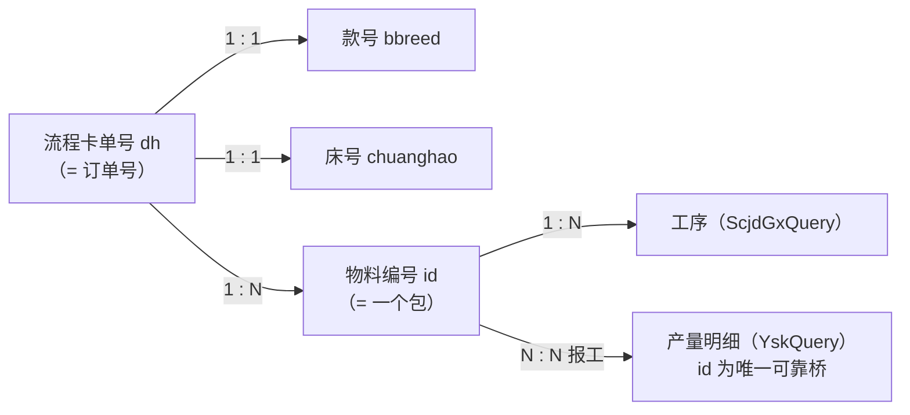
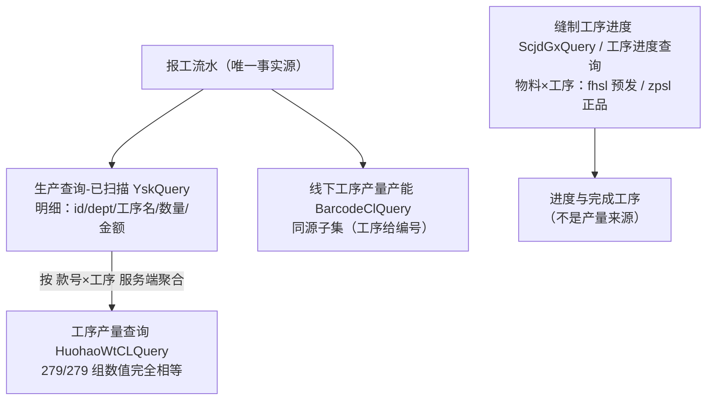
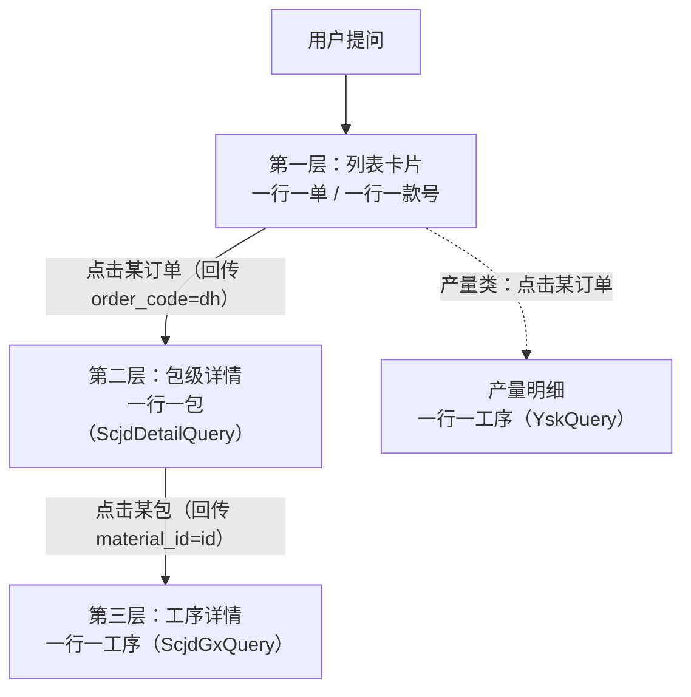

# 进度与产量：功能口径、取数链与输出字段（重梳版）

**日期**：2026-09-15　**状态**：**口径已拍板**（本文为方案，未改代码/配置）
**范围**：订单进度、款号进度、订单产量、款号产量、小组/车间产量、产量对比（含老板全量视角）
**地位**：本文是进度与产量口径的**唯一现行依据**。同日早前产出的两份中间稿（《产量与进度口径对照》
《订单进度与订单产量计算方案》）已删除，其口径结论已全部并入本文与 `docs/product/需求及方案整理.md`，
不保留独立副本；需要复核实测结论时，按 §附 的缓存文件与口径重新跑数即可。

**2026-09-15 拍板记录（Louis）**

| # | 决策 | 结论 |
|---|---|---|
| 1 | 产量主源 | **用「生产查询-已扫描」（`YskQuery`）**；`BarcodeClQuery` 退为可选对账来源 |
| 2 | 进度主列 | **用「包完工率」（`wcl`）**，不用数量口径完工率 |
| 3 | 生产计划接口 | **弃用**；交期、交期预警、距交期、客户名称等无源列**全部删除**，等客户给出新字段再议 |

**证据层级**（引用时不要混用）：

- **[实测]** = 客户真实响应缓存 `/Users/louis/proj/弘兆/cache/`，本轮重新跑数所得，附具体数值。
- **[客户文档]** = `docs/product/AI问答对外接口-整理.md` 的契约字段表（客户书面口径）。
- **[我方实现]** = `configs/knowledge/recipes/*.yaml`（当前实现的取数）。
- **[待确认]** = 需 Louis 或客户拍板的点。

---

## 0. 一页结论：本版相对旧口径的变更

| # | 事项 | 旧口径 | 本版口径 | 依据 |
|---|---|---|---|---|
| 1 | 生产计划接口 | FR-005/009/010 用它取「订单数量/计划量」 | **弃用**。订单数量改取 `缝制生产进度.zsl`（= 该单裁剪数量） | 拍板 3 + [实测] Σzsl 与 Σ制单 `fhsl` 527/527 逐单相等 |
| 2 | 「订单号」是什么 | `Plan.jhdh` / `khddh`（计划单号/客户订单号） | **`dh`（生产制单/流程卡单号）**；`id` 是**物料编号（一包一行）** | Louis 指示 + [客户文档]§6.1/§12.1 |
| 3 | 进度主列是什么 | `WorktypeProgressQuery` 返回行里 `uid` 非空的工序数 ÷ 总工序数（口径存疑） | **`ScjdQuery.wcl`（包完工率 = 完工包数 ÷ 包数）** 作为唯一主进度列 | 拍板 2 + [实测] `wcl ≡ 完工包数 ÷ zbs`（527/527 行反推为整数） |
| 4 | 数量口径完工率 / 完工数量 | `SclzdGridPageList.sssl`（制单实收）当作完工量 | **不进主报表**。制单 `sssl` 实测 **98.8% 等于 `fhsl`**，是**投产量**不是完工量；数量口径（`wgzsl`）如需另说，不占列位 | 拍板 2 + [实测] 制单 15,888/16,076 行 `sssl == fhsl`；Σsssl 531,006 ≈ Σfhsl 531,308 |
| 5 | 进度用哪几个接口 | Plan → Sclzd → SclzdWorktype → WorktypeProgress，四接口 | **三个必需 + 一个可选**：`ScjdQuery`（列表）→ `ScjdDetailQuery`（包级）→ `ScjdGxQuery`（工序级）；`ScjdFzHzQuery` 列为**可选**（只有要数量口径完工数量时才调） | Louis 指示 + 拍板 2 + [实测] 链路全部走通 |
| 6 | 产量用哪几个接口 | 订单产量用 `HuohaoWtCLQuery` + `BarcodeClQuery`；车间对比用 `BarcodeClQuery` 单源 | **主源 = 已扫描（`YskQuery`）**；`HuohaoWtCLQuery` 作款号×工序聚合（同源）；`BarcodeClQuery` 实测是 `YskQuery` 的**子集**，降为**可选对账**，两者**不得相加** | **拍板 1** + [实测] 见 §4.1，三条硬证据 |
| 7 | 达成率 / 计划量 | 曾用 `Plan.zsl` 做分母 | **全部移除**（客户明确无数据源）；`Plan` 弃用后也再无分母 | 拍板 3 + [客户文档] 追加确认 2026-09-15 第 3 条 |
| 8 | 交期 / 客户 / 交期预警 | FR-009 用 `Plan.finish_date` / `Plan.khname` / `zhdate` | **整族删除**：交期、距交期、交期预警、客户名称、客户订单号、计划号。制单 `khname`/`khid`/`dddh` 与 `ScjdQuery.dddh` 实测**全为空**，无替代来源；**等客户给出新字段再议** | **拍板 3** + [实测] 制单 16,076 行 `khname` 非空 **0** 行 |
| 9 | 部门产量字段 | 车间/小组、款号、计划数量、完工数量 | 见 §5.1 的修改清单（计划数量列删除，改报工产量 + 参与人数 + 人均） | 本文 §5 |
| 10 | 款号进度与订单进度 | 混在一个能力里、口径不清 | 明确为**同一能力的两条视图**：订单视图按 `dh` 展开包级；款号视图按 `bbreed` 聚合多单 | Louis 指示 5 |

---

## 1. 数据基线

### 1.1 接口清单

**进度族：3 个必需 + 1 个可选**

主进度列确定为包完工率 `wcl` 后，`ScjdQuery` 自身就已提供列表页所需的全部进度字段，
`ScjdFzHzQuery` 因此**不必需**（仅当以后要用「数量口径完工数量」时才调）。

| 简称 | `operation_id` | 路径 | 入参 | 拿到什么 |
|---|---|---|---|---|
| 缝制生产进度 | `ScjdQuery` | `/api/NetYf/Sclzd/ScjdQuery` | `dates`/`datee`/`sfwg`/`searchKeyword`/`page`/`size` | **一行一个流程卡 `dh`**：`dh`、`chuanghao`、`rq`、`huohao`(货号)、`bbreed`(款号)、`description`、`zbs`(包数)、`zsl`(裁床数)、`sfwg`(是否完工)、**`wcl`(包完工率)**、`wts`(工序数)、`colors`/`chimas`/`ganghaos`(聚合串)；`detail` 给当页汇总 |
| 缝制生产进度详情 | `ScjdDetailQuery` | `/api/NetYf/Sclzd/ScjdDetailQuery` | `dates`/`datee`/**`dh`** | **一行一个包**：`id`(物料编号)、`baohao`、`color`、`chima`、`ganghao`、`fhsl`(裁剪数量)、`wts`(工序数)、`wcs`(总数/完成数)、`wcl`(完成率) |
| 缝制工序进度 | `ScjdGxQuery` | `/api/NetYf/Sclzd/ScjdGxQuery` | **`userid`**=物料编号、`uid`(选填) | **一行一道已刷卡工序**：`worktype`、`name`、`wsort`(排序)、`fhsl`、`zpsl`(正品数)、`uid`/`uname`、`dept`、`inputtime` |
| 缝制总进度（可选） | `ScjdFzHzQuery` | `/api/NetYf/Sclzd/ScjdFzHzQuery` | `dates`/`datee`/`searchKeyword`/`page`/`size` | **一行一个「货号+床号+日期」**：`huohao`、`huohaoname`(款号)、`description`、`chuanghao`、`rq`、`fzzsl`(缝制总数量)、`wgzsl`(完工总数量)、`wgl`(完工率，整数截断)。**本版不进主报表**，留作以后要做「数量口径完工数量」时的来源 |

**启用（产量族 + 辅助）**

| 简称 | `operation_id` | 路径 | 入参 | 拿到什么 |
|---|---|---|---|---|
| 生产查询-已扫描 | `YskQuery` | `/api/NetYf/Sclzd/YskQuery` | `dates`/`datee`/`page`/`size` | **产量明细主源**：`id`(物料编号)、`uid`/`uname`、`dept`、`chuanghao`/`baohao`、`huohao`(款号)、`color`/`chima`、`worktype`(工序**名称**)、`fhsl`、`sl`、`price`、`je`、`inputtime` |
| 工序产量查询 | `HuohaoWtCLQuery` | `/api/NetYf/Sclzd/HuohaoWtCLQuery` | `dates`/`datee`/`scheme`/`queryFooter`/**`huohao`**(款号)/**`worktype`**(工序名)/`page`/`size` | **款号×工序 聚合**：`huohao`、`worktype`、`sssl`；服务端可按款号/工序名过滤 |
| 线下工序产量产能（可选对账） | `BarcodeClQuery` | `/api/NetYf/Sclzd/BarcodeClQuery` | `dates`/`datee`/`page`/`size` | 产量明细（**`worktype`=工序编号**，另有 `wtname`）：`id`、`dept`/`deptname`、`huohao`(货号)/`bbreed`(款号)、`sssl`、`price`、`je`。**实测是 `YskQuery` 的子集，不进主链、不与主源相加**，仅作对账/回退 |
| 生产查询-未扫描 | `WskQuery` | `/api/NetYf/Sclzd/WskQuery` | 无业务过滤参数 | **在制**：`id`、`chuanghao`/`baohao`、`huohao`(款号)、`color`/`chima`、`worktype`(工序名)、`sl`；`footer.sl_total` |
| 生产制单 | `SclzdGridPageList` | `/api/NetYf/Sclzd/GridPageList` | `dates`/`datee`/`page`/`size` | **`id → dh` 映射**（产量挂订单的唯一桥），以及 `fhsl` |
| 部门信息 | `DeptQuery` | `/api/NetYf/Baseinfo/DeptQuery` | 仅认证 | `dept` → 名称 |
| 生产工序 | `RfidWorktypeQuery` | `/api/NetYf/Baseinfo/RfidWorktypeQuery` | 仅认证 | 工序**编号 ↔ 名称**字典（`BarcodeClQuery` 只给编号，必须过这层） |
| 生产制单工序（可选） | `SclzdWorktypeQuery` | `/api/NetYf/Sclzd/SclzdWorktypeQuery` | **`dh`** | 该单**工序全集**（`wt`/`wtname`/`sort`/`zhgx`）——仅当客户要求列出「未做的工序名」时才需要，见 §3.2 决策点 |
| 缝制详细进度（可选） | `ScjdFzMxQuery` | `/api/NetYf/Sclzd/ScjdFzMxQuery` | `dddh`/`huohao`/`chuanghao`/`rq` | 颜色尺码层完工率（从**缝制总进度**那一行下钻时有意义，因为总进度不带 `dh`） |
| 缝制工序总体进度（可选） | `ScjdFzHzWorktypeQuery` | `/api/NetYf/Sclzd/ScjdFzHzWorktypeQuery` | `dddh`/`huohao`/`chuanghao`/`rq` | 工序层：`wtname`/`sort`/`sssl`/`sksl`(完成)/`wsksl`(未完成)，另给平行数组供图表 |

> **接口白名单现状**：`configs/knowledge/apis.yaml` 里**没有任何 `Scjd*`**（26 个 operation_id 中 0 个缝制接口），
> 所以缝制链路目前**完全走不通**——必须先登记，否则参数会被 `_build_body` 静默丢弃。
> 好消息是 `tools/mes_console/catalog.py`（调试台）**已经登记了这 6 个**，可直接沿用它的命名：
> `SclzdScjdQuery` / `SclzdScjdDetailQuery` / `SclzdScjdGxQuery` / `SclzdScjdFzHzQuery` / `SclzdScjdFzMxQuery` / `SclzdScjdFzHzWorktypeQuery`。

**弃用**

| 接口 | 影响 |
|---|---|
| 生产计划 `PlanGridPageList` | 原 FR-005/009/010 的「订单数量/计划量」与 FR-009 的「客户」「交期」「交期预警」「距交期」全部失去来源（§8） |

### 1.2 主键与关联链（[实测]，本月窗口 527 单 / 16,076 包）



| 关系 | 实测结果 | 结论 |
|---|---|---|
| `dh` → `huohao`(货号) / `huohaoname`(款号) / `chuanghao`(床号) | 多值行数 **0 / 527，0 / 527，0 / 527** | **一单一款号一床号**（Louis 的 5 号判断成立） |
| `huohao`(货号) ↔ `huohaoname`(款号) | 双向多值 **0 / 75** | 一一对应 |
| 款号 → `dh` | 平均 **7.03 单/款号**，最大 **35 单**；43/75 款号有多单 | 款号级 = 多单聚合，规模可控 |
| `ScjdQuery.dh` ↔ `ScjdFzHzQuery`（货号+床号+日期） | 两集合**完全相同**（527 = 527），无一对多 | 两张表是同一批床的两个视角，可按键对齐 |
| `SclzdGridPageList.id` ↔ `ScjdDetailQuery.id` | 同一 `dh` 下 id 集合**完全一致** | `ScjdDetailQuery` = 制单包级明细 + 进度，**进度链不需要制单接口** |
| `YskQuery.id` ⊆ `Sclzd.id` | 100% 命中（11554/11554、1,000%） | `id` 是产量挂订单的**唯一可靠键** |

`dh` 的构成（Louis 的 3 号）：一个 `dh` = **一张床号** × **N 个包**，`baohao` 递增；`id` 是包级主键。实测 `dh=202607310013`：床号 `1121`、50 包（`baohao` 1~50）、`color` 全空、`chima` 全 `M`——**颜色/尺码在包级才可能细分**。

### 1.3 字段名同形不同义（**最容易出错的地方**，务必对照）

**（a）`huohao`：有的接口给货号、有的给款号**

| 接口 | `huohao` 实际含义 | 实测证据 |
|---|---|---|
| 生产制单 `SclzdGridPageList` | **货号 `bh`**（另给 `huohaoname` = 款号） | `huohao='00063'` / `huohaoname='G2601'` |
| 缝制生产进度 `ScjdQuery` | **货号 `bh`**（另给 `bbreed` = 款号） | `huohao='00063'` / `bbreed='G2601'` |
| 缝制总进度 `ScjdFzHzQuery` | **货号 `bh`**（另给 `huohaoname` = 款号） | `huohao='00033'` / `huohaoname='5401罗纹前袋唇'` |
| 线下工序产量产能 `BarcodeClQuery` | **货号 `bh`**（另给 `bbreed` = 款号） | 命中制单 `huohao` 51 个 / 命中款号 **0** |
| 未扫描 `WskQuery` | **款号** | `'26007前袋唇'`、`'G2601'`；命中款号 35 / 命中货号 0 |
| 已扫描 `YskQuery` | **款号** | `'87B'`；命中款号 43 / 命中货号 0 |
| 工序产量查询 `HuohaoWtCLQuery` | **款号**（**且服务端过滤也按款号取值**） | 命中款号 43 / 命中货号 0 |
| 缝制工序进度 `ScjdGxQuery` | **款号** | `huohao='G2601'`，而该包在制单里 `huohao='00063'` |

> 口诀：**`Sclzd`/`ScjdQuery`/`ScjdFzHz`/`BarcodeCl` 的 `huohao` = 货号；`Ysk`/`Wsk`/`HuohaoWtCL`/`ScjdGx` 的 `huohao` = 款号。** 传值前必须确认接口。

**（b）`worktype`：有的接口给编号、有的给名称**

| 接口 | `worktype` | 配套字段 |
|---|---|---|
| 线下工序产量产能 `BarcodeClQuery` | **工序编号**（`'0796'`） | 另有 `wtname='拷腰片'` |
| 已扫描 `YskQuery` | **工序名称**（`'贴侧骨'`） | 无编号字段 |
| 未扫描 `WskQuery` | **工序名称** | — |
| 工序产量查询 `HuohaoWtCLQuery` | **工序名称**（过滤参数也按名称） | — |
| 缝制工序进度 `ScjdGxQuery` | **工序编号** | 另有 `name='折袖口'` |

> 实测坑：`BarcodeCl` 与 `Ysk` 用 `(id, worktype)` 直接比对 **交集为 0**，必须过 `wtname` 对齐后才是同一批记录。

**（c）进度率：三个 `*cl`/`*gl` 口径不同**

| 字段 | 出自 | 口径 | 实测验证 |
|---|---|---|---|
| `ScjdDetailQuery.wcl` | 包级 | **完成数 ÷ 总数**，其中 `总数 = fhsl × wts`（件·工序），`完成数 = Σzpsl` | 50/50 行 `总数 == fhsl×wts`；`wcl == 完成数/总数×100` |
| `ScjdQuery.wcl` | 单级 | **完工包数 ÷ 总包数（`zbs`）**，2 位小数 | 527/527 行反推为整数且自洽（如 `55/56 = 98.21`） |
| `ScjdFzHzQuery.wgl` | 床级 | **完工数量 ÷ 缝制总数量**，**整数向下取整** | 83/527 行与直算差 < 1，均为 `floor`（`1021/1024=99.7→99`、`298/278=107.2→107`） |

**（d）数量字段**

| 字段 | 接口 | 口径 | 实测 |
|---|---|---|---|
| `fhsl` | 制单 / 详情 | 制单「预发数量」；详情「裁剪数量」（客户口径） | 两者同值 |
| `zsl` | `ScjdQuery` | **裁床数 = 该单裁剪数量合计**（**不是**计划接口里那个「总数量」） | 527/527 单 `zsl == Σ制单fhsl`，`zbs == 包数` |
| `sssl` | 制单 | **实收 = 投产量**（≈`fhsl`），**不是完工量** | 15,888/16,076 行 `sssl == fhsl` |
| `fzzsl` / `wgzsl` | `ScjdFzHzQuery` | 缝制总数量 / **完工总数量** | 全量 Σ 531,308 / 347,773（完工率 65.5%） |
| `sl` / `sssl` | `Ysk` / `BarcodeCl` | 报工数量 | `Ysk` Σsl `2,126,116` ≡ `HuohaoWtCL` Σsssl `2,126,116`（**完全相等**） |
| `wcs` | `ScjdDetailQuery` | **字符串** `"总数/完成数"`（如 `440/55`），**不是数值** | 必须 `split('/')` 后转数 |

### 1.4 关键实测证据（可直接复核）

| 断言 | 证据 |
|---|---|
| 制单 `sssl` 是投产量 | 制单 16,076 行：`sssl==fhsl` 15,888（98.8%）；Σ`fhsl` 531,308 vs Σ`sssl` 531,006 |
| `ScjdQuery.zsl` = 订单裁剪数量 | 527/527 单 `Σ制单fhsl == zsl`；527/527 单 `包数 == zbs` |
| 完工数量要看缝制族 | 已完工 305 单：`Σwgzsl` 318,256 ≈ 裁剪 318,512；未完工单占全量裁剪的 212,796 |
| `ScjdDetailQuery` 就是制单包级 + 进度 | `dh=202607310013`：两边 id 集合完全一致；`wts` 恒 3 = 该单工序道数 |
| 包级完成数 = Σzpsl | `userid=452095` 返回 3 道工序 `zpsl` 各 50 → `Σzpsl=150` = 该包 `wcs` 的完成数 `150/150` |
| 产量明细主源是 `已扫描` | `Ysk` 按款号×工序汇总 279 组，与 `HuohaoWtCL` **279/279 逐组数值完全相等**，合计均 2,126,116 |
| `BarcodeCl` 是 `Ysk` 的子集 | 7 月窗口：`BarcodeCl` 29,696 个 `(id, wtname, uid)` 键 **全部落在** `Ysk` 内，其中 29,496（99.3%）数量完全相等；Σ 1,034,082 vs 2,126,116 |
| 制单没有客户与订单号 | `khname`/`khid`/`dddh` 非空行数 **0 / 16,076**；`ScjdQuery.dddh` 非空 **0 / 527** |
| 在制数量无部门维度 | `WskQuery` 字段仅 `id/chuanghao/baohao/huohao/color/chima/worktype/sl`——**无 `dept`** |

---

## 2. 六个功能与对应提问（总表）

| # | 功能 | 能力 ID | 典型提问 | 必填槽位 | 可选过滤 |
|---|---|---|---|---|---|
| A | **订单进度** | FR-005（订单视图） | 「202607310013 这个单做到哪了？」「这个订单现在什么进度？」 | 时间范围 + 订单号 | 车间/组别 |
| B | **款号进度** | FR-005（款号视图） | 「G2601 这款做到哪了？」「这款还有多少没做完？」 | 时间范围 + 款号 | 车间/组别 |
| C | **订单产量** | FR-006（订单视图） | 「202607310013 这个单做了多少件？」「这个单各工序产量多少？」 | 时间范围 + 订单号 | 工序 |
| D | **款号产量** | FR-006（款号视图） | 「G2601 这款这周做了多少？」「这款各工序产量多少？」 | 时间范围 + 款号 | 工序 |
| E | **小组/车间产量** | FR-010 | 「我们组这个月做了多少件？」「二车间这个月产量多少？」 | 时间范围 | 款号、车间/组别 |
| F | **产量对比** | FR-007 | 「各小组这个月产量对比一下」「哪个组产量最高？」 | 时间范围 | 车间/组别（收窄到 1 个即降级，见 §6.3） |
| G | 老板：全量订单进度 | FR-009 | 「所有订单现在进度怎么样？」 | 时间范围 | 款号 |

**能力拆分建议**：A/B 合并为 FR-005、C/D 合并为 FR-006（与现状一致），**不做能力级拆分**，理由是两者取数链同源、差异只在「聚合键」（`dh` vs `bbreed`）与「是否展开包级」；拆分会让意图选择器多两个高度相似的候选，反而增加误选。功能表按 A~F 分行说明，便于客户对齐。

**意图路由硬规则（建议补一条，与现有 `WORKSHOP_OUTPUT_ROUTING_RULE` 并列）**

```
进度类问法的能力归属：
- 问「做到哪了 / 什么进度 / 还差多少 / 完工了吗」→ 走进度能力（FR-005 / 老板 FR-009）
- 问「做了多少件 / 产量多少」→ 走产量能力（FR-006）
- 两者都问时（如「这个单做了多少、到哪一步了」）→ 以进度能力为主，产量列进同一张报表
```

---

## 3. 进度类：订单进度 / 款号进度

### 3.1 取数链

**A. 订单进度（有具体单号）**

| 步 | 接口 | 入参 | 拿到什么 |
|---|---|---|---|
| ① | `ScjdDetailQuery` | `dates`/`datee`/**`dh`** | 包级明细（含 `wcs`/`wcl`）。**单订单只需这 1 个调用**——订单级汇总（包数 / 裁剪数量 / 完工包数 / 包完工率 / 状态）全部由包级聚合得出 |
| ② | `ScjdGxQuery` | `userid` = 某个包的 `id` | 工序级刷卡记录。**只有第三层下钻时才调**，按包 fan-out |

> 单订单为什么不用 `ScjdQuery`：包级聚合与单级字段**数值必然一致**（实测 `ScjdQuery.wcl ≡ 完工包数 ÷ zbs`，527/527 行），
> 而包级数据本来就是用户下一步要看的东西 → 一次调用同时喂两层，省一次分页拉取。

**B. 款号进度（有款号）**

| 步 | 接口 | 入参 | 拿到什么 |
|---|---|---|---|
| ① | `ScjdQuery` | `dates`/`datee`，分页取全量 | 该款号范围内**所有 `dh`**（本地按 `bbreed` 过滤）→ 订单级一行一单 |
| ② | 本地聚合 | — | 款号级：订单数 / 包数 / 裁剪数量 / 完工包数 / 包完工率（按包数加权） |
| ③ | `ScjdDetailQuery` | 选中的某个 `dh` | 用户点开某单时才调，展开包级 |

> `ScjdQuery` **没有款号入参**（只有 `searchKeyword`，语义未实测），所以款号必须先按日期区间拉全量、再本地按 `bbreed` 过滤。
> 一个月 527 行 / 11 页，可接受；见 §9 第 3 条。

**C. 老板全量订单进度（FR-009）**

| 步 | 接口 | 入参 | 拿到什么 |
|---|---|---|---|
| ① | `ScjdQuery` | `dates`/`datee`，分页取全量 | 全厂订单列表，一行一单，**已含 `wcl`/`zbs`/`zsl`/`wts`/`sfwg`** |

> **关键设计决定**：列表层**绝不逐单调 `ScjdDetailQuery`**（实测一个月 527 单 → 527 次调用）。
> 确定「主进度列 = 包完工率 `wcl`」之后，**`ScjdQuery` 一次分页拉取就已提供列表页全部进度字段**，
> 不需要 `ScjdFzHzQuery` 配合。逐单展开只发生在用户点击下钻时。

### 3.2 本地计算（列定义与公式）

**列表层（一行一单，来自 `ScjdQuery`）**

```text
订单号        = ScjdQuery.dh
款号          = ScjdQuery.bbreed
品名          = ScjdQuery.description
床号          = ScjdQuery.chuanghao
裁剪日期      = ScjdQuery.rq
包数          = ScjdQuery.zbs
裁剪数量      = ScjdQuery.zsl                       -- = Σ制单fhsl（527/527 实测）
工序数        = ScjdQuery.wts                        -- 该单工序道数（0 表示未开工）
完工包数      = round(wcl / 100 × zbs)               -- 由 wcl 反推，单位「包」
进度（主列）  = ScjdQuery.wcl                        -- 【主列】包完工率 = 完工包数 ÷ zbs，直接取接口值，不自算
状态          = ScjdQuery.sfwg（0 未完工 / 1 已完工）
```

**单订单视图（来自包级聚合，与上行数值一致）**

```text
包数      = COUNT(ScjdDetailQuery.list)
裁剪数量  = Σ fhsl
完工包数  = COUNT(wcl == 100)
进度（主列）= 完工包数 ÷ 包数               -- 实测与 ScjdQuery.wcl 逐单相等，两条路可互为校验
```

**款号视图（多单聚合，按包数加权）**

```text
订单数    = COUNT(DISTINCT dh)
包数      = Σ zbs
裁剪数量  = Σ zsl
完工包数  = Σ round(wcl / 100 × zbs)
进度（主列）= 完工包数 ÷ 包数               -- 按「包数」加权；**不要**取各单 wcl 的简单平均
工序数    = 各单 wts 的最大值（多单工序道数可能不同，表头附注说明）
状态      = 全部 sfwg = 1 才算「已完工」，否则「未完工」
```

> **进度只有一个口径，就是包完工率**（拍板 2）。数量口径的 `wgzsl ÷ fzzsl`（缝制总进度）**不进主报表**；
> 若以后客户要「按件数的完工率」，再启用可选的 `ScjdFzHzQuery`（接口清单里已留位），不改主链。

**包级层（一行一包，`ScjdDetailQuery`）**

```text
物料编号  = id
包号      = baohao
颜色/尺码/缸号 = color / chima / ganghao
裁剪数量  = fhsl
工序数    = wts
总数      = wcs.split('/')[0]        -- 字符串！= fhsl × wts（件·工序口径）
完成数    = wcs.split('/')[1]
完成率    = wcl
```

**工序级层（一行一工序，`ScjdGxQuery`）**

```text
工序名称/编号 = name / worktype
工序顺序      = wsort
预发数量      = fhsl
正品数量      = zpsl
操作人/部门   = uname / dept
刷卡时间      = inputtime
完成判定      = uid 非空（有刷卡记录即视为该工序已完成）
当前工序      = 已刷卡工序中 wsort 最大者的下一道（wsort 最大 = wts 时视为已完工）
已完成工序数  = COUNT(DISTINCT worktype)
工序总数      = 包级 wts（或单级 wts）
```

> **决策点（仍待拍板）**：`ScjdGxQuery` **只返回已刷卡的工序**，因此包级看「已完成 2/3 道」时**拿不到第 3 道叫什么名字**。
> - **方案 1（推荐）**：工序总数取 `wts`，未做的工序统一显示「待做 N 道」，不列名字。零额外成本、口径自洽。
> - **方案 2**：加调 `SclzdWorktypeQuery(dh)` 拿工序全集（`sort`/`zhgx`），可列出全部工序名与顺序。代价：每单多 1 次调用（可缓存 90 天）。

### 3.3 输出字段（三层，对应前端的「列表 → 详情 → 工序」下钻）

**第一层 订单/款号进度列表**（卡片 `kind=table`，`preview_max_rows` 建议 10）

| 列名（展示） | 列标识 | 类型 | 单订单查询 | 款号/全量查询 |
|---|---|---|---|---|
| 订单号 | `order_code` | 文本 | ✓ | ✓ |
| 款号 | `style_code` | 文本 | ✓ | ✓ |
| 品名 | `product_name` | 文本 | ✓ | ✓ |
| 床号 | `bed_code` | 文本 | ✓ | ✓ |
| 裁剪日期 | `cut_date` | 日期 | ✓ | ✓ |
| 订单数 | `order_count` | 数量 | — | ✓（款号视图） |
| 包数 | `package_count` | 数量（包） | ✓ | ✓ |
| 裁剪数量 | `cut_qty` | 数量（件） | ✓ | ✓ |
| 完工包数 | `finished_packages` | 数量（包） | ✓ | ✓ |
| **进度** | `progress_ratio` | 百分比 | ✓ | ✓ |
| 工序数 | `worktype_count` | 数量 | ✓ | ✓（多单取最大） |
| 状态 | `finish_state` | 文本（未完工/已完工） | ✓ | ✓ |

**「进度」列 = 包完工率 `wcl`**（拍板 2）：含义是「已做完整包的包数占比」。
展示建议带单位说明「完工包数/总包数」，例如 `22/23（95.65%）`，并在 `notes` 里写明口径，
避免用户误以为是件数百分比。**已删除的两列**（原方案提过）：`缝制完工数量`、`数量完工率`——
主口径定为包完工率后不再需要，数量口径留作以后可选项（见 §3.2 末注）。

**第二层 包级详情**（点某个订单后，一行一包）

| 列名 | 列标识 | 备注 |
|---|---|---|
| 物料编号 | `material_id` | **下钻工序的键**，前端回传本列触发第三层 |
| 包号 | `package_no` | |
| 颜色 / 尺码 / 缸号 | `color` / `size` / `batch_no` | 空值渲染「—」 |
| 裁剪数量 | `cut_qty` | |
| 工序数 | `worktype_count` | |
| 总数 | `total_units` | `件·工序` 口径 |
| 完成数 | `done_units` | `件·工序` 口径 |
| 完成率 | `progress_ratio` | |

**第三层 工序级详情**（点某个包后，一行一工序）

| 列名 | 列标识 | 备注 |
|---|---|---|
| 工序 | `worktype` | |
| 工序顺序 | `worktype_order` | |
| 已完成 | `is_done` | 是/否 |
| 预发数量 | `issued_qty` | |
| 正品数量 | `done_qty` | |
| 操作人 | `operator` | |
| 部门 | `dept_name` | |
| 刷卡时间 | `input_time` | |

> **口径注记（写进 `notes` 字段）**：包级「总数/完成数」是**件·工序**口径（`总数 = 裁剪数量 × 工序数`），
> 不是件数；「完成率」因此比「做了多少件」更保守。前端不要把它当作件数展示。

### 3.4 提问样例（供意图选择器回归用）

| 用户话术 | 期望能力 | 期望槽位 | 期望第一层输出 |
|---|---|---|---|
| 「202607310013 这个单做到哪了？」 | FR-005 | 订单号=202607310013 + 时间 | 该单一行 |
| 「G2601 这款现在什么进度？」 | FR-005 | 款号=G2601 + 时间 | 该款号 7 行（多单） |
| 「这款还有多少没做完？」 | FR-005 | 款号 + 时间 | 该款号汇总（突出未完工部分） |
| 「所有订单进度怎么样？」 | FR-009（老板） | 时间 | 全厂订单列表 |
| 「我们组哪些单还没做完？」 | FR-005 / FR-010 | 时间 + 组别 | 未完工单列表 |

---

## 4. 产量类：订单产量 / 款号产量

### 4.1 三个产量接口的真实关系（[实测] 结论，**这条会改变原方案**）

你说的三者「线下工序产量产能 + 工序产量查询 + 工序进度查询」实测下来**不是三个并列的产量来源**，而是：



| 关系 | 证据 |
|---|---|
| `HuohaoWtCLQuery` = `YskQuery` 的**聚合视图** | `Ysk` 按款号×工序汇总 **279/279 组数值完全相等**；Σ 均为 **2,126,116** |
| `BarcodeClQuery` 是 `YskQuery` 的**子集** | 7 月窗口 29,696 个键**全部包含于** `Ysk`；其中 29,496（99.3%）数量相等；Σ 1,034,082 < 2,126,116 |
| `ScjdGxQuery` / `WorktypeProgressQuery` = **进度**来源 | 字段是 `fhsl`(预发)/`zpsl`(正品)/`wsort`，语义是「做到哪道工序」，**不是产量汇总** |

**结论（建议采纳）**

| 用途 | 用哪个接口 | 为什么 |
|---|---|---|
| 产量**明细**（要切订单、切部门、切工序、算人数/金额） | **`YskQuery`（已扫描）** | 唯一同时带 `id`(挂订单) + `dept`(切部门) + 工序名 + 数量 + `je`(金额) 的接口 |
| 产量**按款号×工序 聚合**（尤其单款号查询） | **`HuohaoWtCLQuery`** | 服务端已聚合，且 `huohao`(款号)/`worktype`(工序名) **服务端过滤实测有效**，单款号时最省 |
| 工序**完成情况/参与人** | `ScjdGxQuery`（或 `WorktypeProgressQuery`） | 只有它给 `zpsl`/`uid` |
| `BarcodeClQuery` | **不单独用、不与上面相加** | 实测是 `Ysk` 子集，并列相加会重复计数 |

> **已拍板（拍板 1）**：采用 `YskQuery`（生产查询-已扫描）作产量主源。
> 若改用 `BarcodeClQuery` 作主源，产量会**系统性偏低约 51%**（1,034,082 vs 2,126,116），
> 且需要额外 `RfidWorktypeQuery` 把工序编号转名称。`BarcodeClQuery` 保留为**可选对账来源**
> （若以后客户强调「线下口径」要单独出数，可加回退开关），**任何时候都不与主源相加**。

### 4.2 取数链

**C. 订单产量（有 `dh`）**

| 步 | 接口 | 入参 | 拿到什么 |
|---|---|---|---|
| ① | `SclzdGridPageList` | `dates`/`datee`，分页全量 | 该区间 `id → dh` 映射（**产量挂订单的唯一桥**） |
| ② | `YskQuery` | `dates`/`datee`，分页全量 | 产量明细 |
| ③ | 本地 | — | 按 `dh`（经 `id`）+ 工序 聚合 |
| ④（对账） | `HuohaoWtCLQuery` | `huohao`=该单款号 | 款号×工序 合计，与 ③ 交叉校验 |

**D. 款号产量（有款号）**

| 步 | 接口 | 入参 | 拿到什么 |
|---|---|---|---|
| ① | `HuohaoWtCLQuery` | `dates`/`datee`/`scheme=货号工序`/**`huohao`**=款号 | 款号×工序 产量（服务端过滤，最快） |
| ② | `YskQuery` | 同区间，分页全量 | 参与人数（`COUNT(DISTINCT uid)`）、金额、部门拆分 |
| ③ | `SclzdGridPageList` | 同区间 | 该款号下的 `dh` 列表（要展示「覆盖 N 个订单」时） |

**E/F（部门类）见 §5。**

### 4.3 本地计算

```text
-- 按工序展开（表体）
工序产量   = Σ Ysk.sl        GROUP BY (订单号, 款号, 工序名)
参与人数   = COUNT(DISTINCT Ysk.uid)  GROUP BY (同上)
报工金额   = Σ Ysk.je
工序占比   = 工序产量 ÷ 裁剪数量            -- 用于识别「哪道工序是瓶颈」

-- 订单/款号 汇总（卡片 KPI 区）
裁剪数量     = Σ ScjdQuery.zsl（款号） / Σ ScjdDetailQuery.fhsl（单订单）   -- 投产口径
包完工率     = ScjdQuery.wcl（款号按包数加权）                              -- 与进度类同口径
报工产量合计 = Σ Ysk.sl                                                    -- 件·工序口径，**不等于完工件数**
```

> ⚠ **必须写进 `notes` 的一条口径**：订单/款号「总产量」**不能**把各工序产量相加——同一件衣服做 3 道工序就有 3 条报工，
> 相加会按工序数放大（实测 `dh=202607310013`：50 件 × 3 工序 = 150 条工时量）。
> 因此报表分两块：**KPI 区给投产与进度口径**（裁剪数量 / 包完工率），**表体给工序口径**（各工序报工产量），
> 卡片底部给「报工产量合计（件·工序）」并注明它不是件数。
> **不出现「缝制完工数量 / 数量完工率」**（拍板 2 的连带结果）——产量能力与进度能力口径保持一致。

### 4.4 输出字段

**第一层 产量表（一行一工序；订单视图与款号视图同结构）**

| 列名 | 列标识 | 订单视图 | 款号视图 |
|---|---|---|---|
| 订单号 | `order_code` | ✓ | 多单时仅作分组依据（可不出列） |
| 款号 | `style_code` | ✓ | ✓ |
| 品名 | `product_name` | ✓ | ✓ |
| 工序 | `worktype` | ✓ | ✓ |
| 产量 | `output_qty` | ✓ | ✓ |
| 参与人数 | `participant_count` | ✓ | ✓ |
| 报工金额 | `output_amount` | 可选 | 可选 |
| 工序占比 | `output_share` | ✓（对裁剪数量） | ✓ |

**卡片 KPI 区**：裁剪数量 / 包完工率 / 报工产量合计（件·工序）
（**无「缝制完工数量」「数量完工率」** —— 拍板 2 的连带结果）

**第二层（可选下钻）工序明细**：一行一条报工记录 —— 日期、员工、部门、包号、颜色尺码、工序、数量、工价、金额。
（数据量大，建议只导出、卡片不预览；或按前 10 行预览。）

### 4.5 提问样例

| 用户话术 | 期望能力 | 期望槽位 |
|---|---|---|
| 「202607310013 这个单做了多少件？」 | FR-006 | 订单号 + 时间 |
| 「这个单各工序产量多少？」 | FR-006 | 订单号 + 时间 |
| 「G2601 这款这周做了多少？」 | FR-006 | 款号 + 时间 |
| 「这款哪道工序做得最多？」 | FR-006 | 款号 + 时间（表体按产量降序） |
| 「这个月总共做了多少件？」 | FR-006 / FR-010 | 时间（范围由角色决定） |

---

## 5. 部门产量类：小组/车间产量、产量对比

### 5.1 结合现状的输出字段修改清单

**FR-010 小组/车间产量（现字段：车间/小组、款号、计划数量、完工数量）**

| 现字段 | 处置 | 新字段 | 理由 |
|---|---|---|---|
| 车间/小组 | **保留** | 车间/小组 | `Ysk.dept`（部门编号）关联 `DeptQuery.id → name` 得到名称；`YskQuery` 响应里**没有** `deptname` |
| 款号 | **保留** | 款号 | `Ysk.huohao`（**注意该接口此字段是款号**） |
| 计划数量 | **删除** | — | 生产计划接口弃用；且客户明确达成率无数据源 |
| （新） | 新增 | **报工产量** `Σ Ysk.sl` | 真正的「做了多少件」 |
| （新） | 新增 | **参与人数** `COUNT(DISTINCT uid)` | 人均与效率的基础 |
| （新） | 新增 | **人均产量** | `报工产量 ÷ 参与人数`（0 人输出「暂无数据源」，**不伪造 0**） |
| 完工数量 | **删除** | — | 车间级完工数量无来源（`Scjd*` 无 `dept`，见下）；款号级如需进度，另在进度能力里给（口径 = 包完工率） |

> ⚠ **车间维度拿不到「裁剪/计划数量」**：`ScjdQuery`/`ScjdFzHzQuery` **都没有 `dept` 字段**，
> 只有 `Ysk`/`BarcodeCl`/`DeptQuery` 有部门。所以「车间 × 款号 × 计划量」这个组合**无来源**。
> 结论：车间视图只给**报工产量 / 参与人数 / 人均产量**（口径唯一、可切部门）；裁剪数量与进度只在
> **款号级 / 全厂视图**（`ScjdQuery`）里给。

**FR-007 小组/车间产量对比（现字段：车间/小组、产量、有产出人数、人均产量、名次）**

| 现字段 | 处置 | 说明 |
|---|---|---|
| 车间/小组 | 保留 | |
| 产量 | 保留，**换源** | 由 `BarcodeClQuery.sssl` 改为 `YskQuery.sl`（**拍板 1**：`BarcodeCl` 是 `Ysk` 子集，偏低约 51%） |
| 有产出人数 | 保留（建议改名为「参与人数」） | `COUNT(DISTINCT uid)` |
| 人均产量 | 保留 | 产量 ÷ 人数；人数 0 → 输出不可用标记 |
| 名次 | 保留，**附条件** | 可见部门数 **≥2 时才输出**；=1 时该列整体不下发（§6.3） |
| 达成率 | **保持移除** | 客户明确无数据源 |

### 5.2 取数链

| 步 | 接口 | 入参 | 拿到什么 |
|---|---|---|---|
| ① | `YskQuery` | `dates`/`datee`，分页全量 | 产量明细（带 `dept`、款号、工序、uid） |
| ② | `DeptQuery` | 仅认证 | `dept` → 部门/小组名（7 个部门，全为叶子，`pid` 均为 `01`） |
| ③ | 本地聚合 | — | 按 `dept`（+款号/工序）汇总产量、人数、人均、名次 |
| ④（可选） | `ScjdQuery` | 同区间 | 款号级裁剪数量与包完工率（要做「部门 × 款号」对照列时才调） |

**业务过滤**：`dept_names` → 本地按 `dept` 收窄（只收窄不放宽，与 `DataScope` 求交）。
数据范围仍由 MES 按角色行级过滤（组长=本组、管理=绑定部门、老板=全厂），我方不二次切分。

### 5.3 输出字段与多部门展示

**决策规则（后端算，前端消费）**

```text
可见部门数 N = 聚合结果的行数
N == 0  → 空结果，不下发 card，按「该时间范围内没有产量记录」处理
N == 1  → 单部门形态：不输出名次；卡片改用「产量明细」形态（按款号或工序展开）并附说明
N >= 2  → 对比形态：输出名次 + 人均，按产量降序
用户指定了 dept_names 且解析为 1 个 → 同 N==1 处理
```

**FR-010 单部门/自范围视图（`kind=table`）**

| 列名 | 列标识 | 说明 |
|---|---|---|
| 车间/小组 | `dept_name` | |
| 款号 | `style_code` | |
| 报工产量 | `output_qty` | |
| 参与人数 | `participant_count` | |
| 人均产量 | `per_capita` | |
| 工序（可选） | `worktype` | 用户问「哪个工序做得多」时按工序展开 |

**FR-007 多部门对比视图（`kind=ranking`）**

| 列名 | 列标识 | 说明 |
|---|---|---|
| 名次 | `rank_position` | N=1 时不下发该列 |
| 车间/小组 | `dept_name` | |
| 报工产量 | `output_qty` | |
| 参与人数 | `participant_count` | |
| 人均产量 | `per_capita` | |

**多部门 + 分页**

| 场景 | 建议 |
|---|---|
| 部门数 ≤ 20 | 单页全展示（本厂 7 个部门，无需分页） |
| 部门数 > 20 | 服务端分页，卡片按「分组卡」呈现：`group_by` 用款号或工序，`groups[]` 给每组的 `row_count`/`total_rows`，前端 tab 切换（沿用现有 `table.group_by/groups/groups_total` 契约，无需改协议） |
| 明细行数大（款号×工序 × 部门） | 卡片只预览前 10 行 + `truncated` 提示，完整数据走导出 xlsx |

### 5.4 提问样例

| 用户话术 | 角色 | 期望能力 | 期望输出形态 |
|---|---|---|---|
| 「我们组这个月做了多少件？」 | 组长 | FR-010 | 单部门（本组），**无对比**，按款号展开 |
| 「二车间这个月产量多少？」 | 管理/老板 | FR-010 | 指定部门 → 单部门形态 |
| 「各小组这个月产量对比一下」 | 管理/老板 | FR-007 | 多部门对比 + 名次 |
| 「哪个组产量最高？」 | 管理/老板 | FR-007 | 多部门对比，按产量降序 |
| 「各车间人均产量谁高？」 | 老板 | FR-007 | 对比 + 人均列优先 |

---

## 6. 角色差异表（组长 / 管理 / 老板）

### 6.1 订单进度 & 款号进度

| 角色 | 能看到什么（MES 行级过滤） | 问「订单进度」时怎么查 | 输出什么 |
|---|---|---|---|
| **组长 01** | 本人数据 + 所绑定小组的生产数据（**1 个部门**） | 有具体单号 → `ScjdDetailQuery(dh)` **1 次调用**（订单级汇总由包级聚合得出）；无单号 → `ScjdQuery` 取本组范围（`dept_names` 收窄）列列表 | 列表：订单号 / 款号 / 品名 / 床号 / 裁剪日期 / 包数 / 裁剪数量 / **完工包数** / **进度** / 工序数 / 状态。**不排名次**。点进某单 → 包级 → 工序级 |
| **管理 02** | 本人数据 + 绑定的部门/车间（**可能多个，可跨车间**） | 同上，但范围含 N 个部门；**支持指定某一个部门**（`dept_names`） | 同上。默认列全部可见订单；指定部门时只列该部门订单。**不排名次**（横向对比属 FR-007） |
| **老板 99** | 全厂 | `ScjdQuery` 分页取全量（FR-009），**无需再调 `ScjdFzHzQuery`** | 列表字段与上表**完全一致**（同一套列定义）。**客户名称 / 交期 / 交期预警等列已按拍板 3 整族删除**（§8） |

**款号进度（B/D 视图）**

| 角色 | 怎么查 | 输出什么 |
|---|---|---|
| 组长 | `ScjdQuery` 本地按 `bbreed` 过滤本组范围 | 该款号在本组的：订单数 / Σ包数 / Σ裁剪数量 / Σ完工包数 / 进度（按包数加权） + 订单明细行 |
| 管理 | 同上，多部门合并 + 支持按部门收窄 | 同上，可加「部门」列区分 |
| 老板 | 同上，全厂 | 同上，`order_count` 通常最大（实测平均 7 单/款号，最多 35 单） |

### 6.2 产量（订单/款号）

| 角色 | 怎么查 | 输出什么 |
|---|---|---|
| 组长 | `SclzdGridPageList`(本组 id→dh) + `YskQuery`(本组明细) 本地按 `id` 挂 `dh` | 一行一工序：工序 / 产量 / 参与人数 / 占比；KPI：裁剪数量 / 包完工率 / 报工产量合计 |
| 管理 | 同上，范围 = 绑定部门；可加「部门」列 | 同上；多部门时表体加 `dept_name` 列 |
| 老板 | 同上，全厂；款号维度可直接用 `HuohaoWtCLQuery(huohao=款号)` 服务端过滤 | 同上；单款号查询走 `HuohaoWtCLQuery` 最快（与主源同口径） |

### 6.3 部门产量与对比（**Louis 明确要的三档差异**）

| 角色 | 可见部门数 | 会不会有对比 | 怎么查 | 输出什么 |
|---|---|---|---|---|
| **组长 01** | **恒为 1**（本组） | **不对比**（默认） | `YskQuery` 本组明细 + `DeptQuery` 解析名称 + 本地按款号/工序聚合 | **单部门形态**：车间/小组 + 款号 + 报工产量 + 参与人数 + 人均产量；**不输出名次列**；卡片附一句「您只管辖 1 个小组，无对比对象，以下为本组产量明细」。若用户明确问「对比」，同样返回本组数据 + 该说明（不报错） |
| **管理 02** | **可能多个**（绑定部门，可跨车间） | **有对比**；**也支持只看某一个部门** | 默认全范围聚合 → 多部门排名；用户点名某部门（`dept_names`）→ 收窄为 1 个 → 自动降级为单部门形态 | 默认：**对比形态**（名次/车间小组/报工产量/参与人数/人均产量）；指定部门：单部门形态（按款号或工序展开） |
| **老板 99** | 全厂（7 个部门） | **看对比** | 全范围聚合，按产量降序 | **对比形态**，全厂部门排名；也可点名某车间 → 降级为单部门形态 |

> **降级逻辑只做一件事**：`可见部门数 == 1 → 不输出名次列 + 卡片切明细形态 + 附说明`。
> 这样 FR-007 与 FR-010 在组长场景下自然合流，不需要为组长单独维护一条代码路径。

---

## 7. 卡片、下钻与分页

### 7.1 下钻链（前端交互契约）



- **一次问答只调一层**：下钻是**新的用户提问**（例如用户点某订单后前端发送「这个订单的包级明细」），走同一套 SSE 契约；**不是**在同一次 SSE 里塞三层数据。
- **建议的槽位扩展**：前端点击下钻时把 `order_code`（= `dh`）或 `material_id`（= `id`）作为**业务过滤条件**放进新提问。
  现状 `ALLOWED_SLOT_NAMES` 里已有 `order_codes`（可直接承载 `dh`），但**没有物料编号槽位**，
  需要新增 `material_ids` 才能承接包级→工序级的下钻。→ [待确认]，见 §9 第 4 条。
- **卡片层数**：`L1` 用 `kind=table`；`L3`（工序层）行数 = 包的工序数（≤ 10 左右），可全展示；`L2` 行数 = 包数（实测最大 94），建议预览 10 行 + 导出。

### 7.2 分页与体量（[实测] 一个月窗口的真实规模）

| 数据 | 实测规模 | 分页策略 |
|---|---|---|
| `ScjdQuery` 流程卡月量 | **527 行**（size=50 → 11 页） | 服务端分页取全量后本地过滤；卡片预览 10 行 |
| 单订单包数 `zbs` | 典型 23~56，最大 **94** | `ScjdDetailQuery` 一次拉全（自带 `total`）；> 200 行截断并提示 |
| 单包工序数 `wts` | 典型 3~11 | 一次拉全 |
| `YskQuery` 产量明细月量 | **64,499 行** | 必须服务端分页 + **只取需要的列**；建议按 `dept`/`huohao` 先收窄 |
| `HuohaoWtCLQuery` 款号×工序 | 全厂 **279 组**（57 个款号） | 单款号时服务端过滤（`total=7` 量级）；全量可控 |
| `BarcodeClQuery` | 49,507 行 | 同上 |
| `WskQuery` 未扫描 | 10,079 行 | 一次拉全后本地按 `id`/款号过滤 |

**并发预算**：`ScjdDetailQuery` 是按 `dh` 串行/扇出的接口，禁止在列表层 fan-out（527 次）。产量链里
`YskQuery` 与 `HuohaoWtCLQuery` 是分页接口，按 `max_api_calls` 预算控制页数，超预算输出
`call_budget_exhausted` 并说明已覆盖范围（沿用现有机制）。

---

## 8. 弃用生产计划接口：影响面与处置（**拍板 3：全部删除，等客户给新字段**）

| 受影响输出 | 旧来源 | 处置 |
|---|---|---|
| 计划数量 / 订单数量 | `Plan.ddsl` | 改用 **`ScjdQuery.zsl`（裁剪数量）**；列名从「计划数量」改为 **「裁剪数量」** |
| 达成率 / 计划达成率 | `Plan.ddsl` 等 | 维持移除（客户明确无数据源） |
| 客户名称 | `Plan.khname` | **删除该列**（制单 `khname`/`khid` 实测全空，无替代来源） |
| 交期 `finish_date` | `Plan.finish_date` | **删除该列**（缝制族与制单均无交期字段） |
| 交期预警 `delivery_warning` / 距交期 `days_remaining` | `Plan.finish_date` − `zhdate` | **删除这两列 + FR-009 的 `alert_marker`**（「异常数据自动高亮」在订单进度上暂时无源） |
| 客户订单号 / 计划号 | `Plan.khddh` / `jhdh` | **删除**（制单 `dddh`、`ScjdQuery.dddh`、`ScjdFzHzQuery.dddh` 实测全空，不能作键） |
| 订单级关联键 | 制单 ↔ 计划 | ✅ 不再需要 —— 旧文档的「无关联键」阻塞项随弃用**自动消除** |
| FR-010 车间维度 | `Plan.dept`（客户一直未补齐） | ✅ 不再需要 —— 车间维度改由 `YskQuery.dept` 提供（响应无 `deptname`，名称关联 `DeptQuery`），**不再等客户补字段** |

> **正面影响**：弃用生产计划同时消掉两个历史阻塞项——「制单与计划无订单级关联键」和「Plan 缺 `dept` 字段」。
> **代价（已接受）**：客户名称、交期、交期预警三族字段彻底消失；**等客户给出制单侧或其它来源的字段后再议**，
> 在此之前功能表与前端卡片都不出现这些列。

---

## 9. 待确认清单（已拍板的三条已移出）

| # | 问题 | 我的建议 | 影响面 |
|---|---|---|---|
| 1 | 工序全集是否要列出「未做的工序名」？ | 先用 `wts` + 「待做 N 道」；若客户要求列名，再加调 `SclzdWorktypeQuery(dh)` | 第三层工序详情 |
| 2 | 组长问「对比」时返回本组数据 + 说明，是否可接受？ | 可接受（不报错、不空白）；如客户要求必须有对比，则需放开跨组只读 | FR-007 组长场景 |
| 3 | `ScjdGxQuery` 与 `WorktypeProgressQuery` 字段逐字段一致，用哪个？ | 用 `ScjdGxQuery`（入参不带 `page`/`size`，更简单）；**任选其一，不要都用** | 第三层工序详情 |
| 4 | 下钻需要新增槽位承接物料编号吗？ | **需要**：新增 `material_ids`（订单号可用现有 `order_codes`）；且必须校验该 `id` 属于调用者可见范围 | 前端契约 + 意图解析 + 越权防护 |
| 5 | 车间级「裁剪/计划数量」无来源（`Scjd*` 无 `dept`），是否接受？ | 接受：车间视图只给报工产量/人数/人均；裁剪数量与进度只在款号/全厂视图给 | FR-010 字段 |
| 6 | `ScjdQuery` 的 `searchKeyword` 能否按款号/单号过滤（未实测）？ | 不能确定；**默认按日期区间全量拉取后本地过滤**，等客户环境实测后再决定是否启用 | 调用量 |
| 7 | 包级 `wcs` 是字符串 `"总数/完成数"`，且总数是 `件·工序` 口径——是否照客户原样展示？ | 展示，但**必须加口径注记**（§3.3 末尾），避免用户误读为件数 | 前端文案 |
| 8 | 取数链里 `ScjdQuery` 一次要拉全区间（一月 527 行 / 11 页），是否需要带宽/预算保护？ | 沿用现有 `max_api_calls` 预算 + `call_budget_exhausted` 机制，超预算时说明已覆盖范围 | 调用量 |

---

## 10. 落地改动清单（口径已定，待排期执行）

| 优先级 | 改动 | 位置 | 说明 |
|---|---|---|---|
| P0 | 注册缝制接口到白名单 | `configs/knowledge/apis.yaml` | 当前 `apis.yaml` **完全没有** `Scjd*`（0/26）；漏登记会被 `_build_body` 静默丢弃参数。命名可直接抄 `tools/mes_console/catalog.py` |
| P0 | 重写 FR-005 / FR-009 取数链 | `configs/knowledge/recipes/progress.yaml` | 列表 = `ScjdQuery` 单次分页；单订单 = `ScjdDetailQuery`；进度列 = `wcl`；**`ScjdFzHzQuery` 不进主链** |
| P0 | FR-010 换源 + 字段改造 | `recipes/workshop.yaml` | 删 `Plan`/`Sclzd`，改用 `YskQuery` + `DeptQuery`；删计划数量列与完工数量列 |
| P0 | FR-007 换源 | `recipes/workshop.yaml` | `BarcodeClQuery` → `YskQuery`；加「可见部门数 = 1 不输出名次」规则 |
| P0 | 删除 `Plan` 相关取数 | `recipes/progress.yaml`、`recipes/workshop.yaml` | 拍板 3：整族移除；同步删 `finish_date`/`khname`/`delivery_warning`/`days_remaining` 列定义 |
| P1 | FR-006 换源 | `recipes/order-output.yaml` | 主源改 `YskQuery`，`HuohaoWtCLQuery` 作同源对账；`BarcodeClQuery` 移出主链 |
| P1 | 新增进度下钻能力 | 新 recipe（或 FR-005 的二级形态） | 包级 + 工序级 |
| P1 | 新增槽位 | `application/intent.py` `ALLOWED_SLOT_NAMES` | `material_ids`；`order_codes` 复用 |
| P1 | 卡片契约更新 | `docs/api/AI助手前端对接API文档.md` §5.3 | 三层卡形态与列映射；**删 FR-009 的交期预警字段说明与 `alert_marker`** |
| P2 | 删除 `Plan` 的字段模型残留 | `data_api/schemas.py`、`field-dictionary.yaml` | `PlanGridPageList` 相关字段 |
| P2 | 更新能力标题与描述 | `application/capability_map.py` `FR_INFO` | FR-005/006/007/010 的一行描述按本文改写 |
| P2 | 意图路由硬规则 | `application/intent.py` | 补「进度 vs 产量」归属规则（§2） |
| — | 回归 | `tests/` | 生效后**需真实 LLM / 客户环境复测**（无自动回归网） |

---

## 附：本文用到的实测脚本口径

数据来源 `/Users/louis/proj/弘兆/cache/`：`缝制生产进度.json`、`缝制生产进度详情-202607310013.json`、
`缝制工序进度-452095.json`、`缝制总进度.json`、`生产制单.json`、`生产查询-已扫描.json`、
`生产查询-未扫描.json`、`线下工序产量产能.json`、`工序产量查询.json`、`生产计划.json`。

窗口：2026-07-01 ~ 2026-07-31（`BarcodeCl` 缓存跨至 2026-09-04，比对时已裁到 7 月）。
所有比对均为**逐行/逐键**核验，结论中的分数（如 527/527、29,496/29,696）即命中行数与总行数之比。
