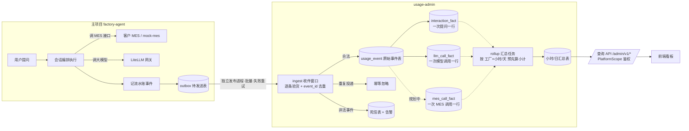

# usage-admin 后台：产品需求、口径与实现设计

- 日期：2026-08-29（v4，按当日三轮评审决议）
- 来源：`usage-admin.html`（产品初版界面设计稿）+ 当日评审决议
- 范围：**仅后端接口**。前端由其他团队负责，本文档定义要交付给前端的接口清单；
  前端对接文档见 [`usage-admin/API.md`](../../usage-admin/API.md)。
- 本文是需求与实现设计的依据，不是 Story 清单；实施仍按 `.github/story/` 顺序执行。

## 0. 评审决议

### 第一轮（D1~D4）

| # | 议题 | 决议 |
|---|---|---|
| D1 | 统计口径 | 统计对象是**客户 MES API 的调用次数，按 API 业务分类**。一次用户提问 = 一次完整智能体回答，内含 N 次 MES API 调用 + 多次大模型请求。需对 27 个 MES API 做分类归档。 |
| D2 | AppKey 存储 | **必须存**。因按工厂收费，本地 PG 必须保存每个工厂对应的 AppKey。AppKey 即租户标识（一厂一 Key）。（主键设计后经 D12 修正为直接以 AppKey 为主键。） |
| D3 | 租户主数据归属 | **由 usage-admin 负责**。usage-admin 将工厂名称、AppKey 写入约定好的表，factory-agent 从该表读取 AppKey 用于调用 MES。双方同在 PGA。 |
| D4 | 前端 | **不归属本团队**。只交付后端接口。 |

### 第二轮（D5~D10）

| # | 议题 | 决议 |
|---|---|---|
| D5 | 未归类 API | 认证 3 + 基础数据 9 + 吊挂 3 共 15 个，**全部归入「其他」**。 |
| D6 | 统计单位 | 按**请求次数**统计（非分页页数）。 |
| D7 | 失败调用 | **也统计，作为独立接口**提供。 |
| D8 | Tab1「状态」列 | 是**账户状态**（复用租户注册表 `status`），不是数据新鲜度。 |
| D9 | AppKey 存储 | **不加密**存储；账户列表展示时脱敏（**前 6 位 + `***`**）。 |
| D10 | 删除工厂账户 | **只停用，不做物理删除**；历史用量全部保留。 |

### 第三轮（D11~D13）

| # | 议题 | 决议 |
|---|---|---|
| D11 | 「其他」类展示 | **在前端展示**，饼图中与产量 / 工资 / 订单并列对比（四块）。 |
| D12 | 主键设计 | `tenant_registry` **不设独立 `tenant_id` 字段，直接以 `app_key` 为主键**。AppKey 唯一且本身即租户标识（M4「一厂一 Key」）；事件流中 `tenant_id` 继续等于 AppKey，与现有实现一致，零迁移。 |
| D13 | 停用即拒绝 | 账户停用后，factory-agent 在发起 MES 调用前校验账户状态，**停用即拒绝调用**。 |

### 第四轮（D14~D16）

| # | 议题 | 决议 |
|---|---|---|
| D14 | 角色模型 | 平台运营角色扩为三档：`viewer` / `analyst` / `admin`；工厂账户 CRUD 仅 `admin`（原 Story 9 的 RBAC 由 analyst 收紧为 admin）。 |
| D15 | 账号体系 | usage-admin **自建注册登录**（`platform_principal` 表 + 注册/登录接口），**本期不引入 OIDC**。账号仅供平台内部运营使用，与工厂 MES 用户体系完全隔离。 |
| D16 | 前端调用方式 | **给前端暴露 API token**（Bearer 认证），前端配置后直接调用；**前端不做注册登录**。注册登录能力本期只对平台内部开放。 |

补充原则：**产品给的接口必须实现**；此外，实现代价不大且有必要的接口，可顺带实现。

## 1. 产品需求拆解

### 1.1 Tab 一：用量统计看板

| 编号 | 功能点 |
|---|---|
| F1.1 | 统计日期范围筛选（起止日期） |
| F1.2 | 按「工厂名称 / 工厂唯一 ID」筛选 |
| F1.3 | 按「API-Key」筛选 |
| F1.4 | 查询统计按钮 |
| F1.5 | 导出报表按钮 |
| F1.6 | 指标卡：总 Token 消耗 |
| F1.7 | 指标卡：智能体总查询次数 |
| F1.8 | 指标卡：产量查询接口调用 |
| F1.9 | 指标卡：工资查询接口调用 |
| F1.10 | 指标卡：订单进度接口调用 |
| F1.11 | 图表：每日 Token 消耗趋势（折线） |
| F1.12 | 图表：各类型接口调用分布（饼图） |
| F1.13 | 工厂明细表格：工厂 ID / 工厂名称 / 绑定 API-Key / Token 总消耗 / 总查询次数 / 产量接口 / 工资接口 / 订单进度接口 / 状态 / 最后统计时间 |
| F1.14 | 工厂明细表格分页 |

### 1.2 Tab 二：工厂账户配置

| 编号 | 功能点 |
|---|---|
| F2.1 | 新增工厂账户（工厂名称、API-Key、状态启用/停用） |
| F2.2 | 工厂账户列表（工厂 ID、名称、API-Key、状态、创建时间） |
| F2.3 | 编辑工厂账户 |
| F2.4 | 删除工厂账户 → **按 D10 实为停用** |
| F2.5 | API-Key 供前端悬浮助手部署绑定 |
| F2.6 | 账户状态：启用 / 停用 |

## 2. MES API 分类方案（对应 F1.8~F1.10、F1.12）

### 2.1 分类结果（按 D5）

`configs/knowledge/apis.yaml` 现有 6 个注释分组，映射到产品口径后为 **4 类**：

| 统计分类 | 来源分组 | 数量 | operation_id |
|---|---|---|---|
| 产量查询 | 产量与进度 | 6 | BarcodeClQuery、HuohaoWtCLQuery、PinFengGridPageList、WorktypeProgressQuery、YskQuery、WskQuery |
| 工资查询 | 工资与排名 | 2 | GongziMxQuery、GongziJeOrderQuery |
| 订单进度 | 生产计划与制单 | 4 | PlanGridPageList、SclzdGridPageList、SclzdWorktypeQuery、SclzdBarcodeQuery |
| **其他** | 认证与凭证 + 基础数据 + 吊挂 | **15** | SystemToken、QuerySign、TestPermissions；UserInfoQuery、MoveMenuQuery、HuohaoQuery、HuohaoFormQuery、ScTypeQuery、RfidWorktypeQuery、HuohaoWorktypeQuery、EmployeeQuery、DeptQuery；DgGridPageList、DgZuGridPageList、DgClQuery |

四类产品加总等于总调用量，设计稿的三个指标卡与饼图在此基础上呈现；**「其他」类在前端展示**（D11），饼图为产量 / 工资 / 订单 / 其他四块并列对比。

### 2.2 关键陷阱：能力分类 ≠ API 分类，不可互相替代

实例：`configs/knowledge/recipes/output.yaml` 中，能力 `fr001_personal_output`（**个人产量统计**）调用的 operation 是 **`GongziMxQuery`**（工资明细查询，属「工资查询」类）。

同一次查询：

- 按**能力**统计 → 记为 1 次「产量」；
- 按 **MES API 分类**统计 → 记为 1 次「工资」API 调用。

两者数字必然不一致。口径已确定为 MES API 分类（D1），因此**不能用现有 `dimensions=capability` 顶替**，必须新建 MES 调用统计链路。

### 2.3 技术设计：分类映射放在消费侧

建议**不把分类写进事件**，而是在 usage-admin 侧维护映射：

1. 在 `apis.yaml` 为每个 operation 增加结构化字段（如 `usage_category`，值域 `output` / `payroll` / `order` / `other`），使分类可评审、可版本化；
2. usage-admin 新建 `mes_operation_category` 映射表（`operation_id` → `category`，带生效版本）；
3. 事件只带 `operation_id`（`mes.schema.json` 已有字段，**契约无需改动**），聚合时 JOIN 映射表得到分类。

理由：分类属**运营/计费口径**，会随业务调整。映射放消费侧，调口径无需重发历史事件，也便于按当时口径与当前口径分别回溯。

### 2.4 统计口径（按 D6、D7）

- **统计单位：请求次数**。分页调用的 `page_count` 作为辅助指标单独记录，不重复计入调用次数。
- **失败调用单独统计**：`mes.schema.json` 已有 `status`（completed / failed），成功与失败分别聚合，失败统计通过**独立接口**提供（见 6.2）。

## 3. 租户主数据与 AppKey（对应 D2、D3、D9、D10）

### 3.1 两条边界

「凭证禁止进入事件」与「数据库必须存 AppKey」约束的是不同位置，二者不矛盾：

| 位置 | AppKey | 原因 |
|---|---|---|
| usage 事件（传输、原始事件表、报表、导出） | **禁止** | 会流向日志与导出文件，是隐私红线（ADR-0003 §5） |
| 租户主数据表（PGA，受控访问） | **必须存** | 计费与 MES 调用必需 |

事件流继续只携带 `tenant_id`，AppKey 只存在于主数据表。

### 3.2 主键设计：直接用 AppKey，不引入独立 tenant_id（D12）

`src/factory_agent/data_api/credentials.py:44-47`：

```python
@property
def tenant_id(self) -> TenantId:
    """AppKey is the tenant ID (M4); no other source may define it."""
    return TenantId(self.app_key)
```

即当前 `tenant_id` 与 `app_key` 就是同一个值。曾考虑过拆成两个字段（独立 `tenant_id` + AppKey，1:1 对应），**已否决**，直接沿用现状：

- AppKey 由客户 MES 分配、全局唯一，「一厂一 Key」（M4）本身就是客户契约确认的租户标识，再引入一个 ID 字段没有新增信息；
- 不拆分则**零迁移**：现有事件流里的 `tenant_id` 就是 AppKey，主数据表、事件、统计三者天然对齐，不需要任何映射或回填；
- 自增整数 ID 的主要收益是「AppKey 轮换不影响历史统计」，但 AppKey 是客户 MES 的接入凭证，轮换意味着所有前端部署的绑定同步更换，本身是低频大动作；真发生时再加映射即可（YAGNI）；
- 排查与对账时，AppKey 直接可读可对照，数字 ID 反而要多一次查询。

### 3.3 表结构

```sql
CREATE TABLE tenant_registry (
    app_key     TEXT        PRIMARY KEY,   -- 客户 MES AppKey，即租户标识（一厂一 Key，M4；D9：不加密存储）
    tenant_name TEXT        NOT NULL,      -- 工厂名称
    status      TEXT        NOT NULL,      -- active | disabled（D10：停用而非删除；D13：停用即拒绝调用）
    created_at  TIMESTAMPTZ NOT NULL,
    updated_at  TIMESTAMPTZ NOT NULL
);
```

设计要点：

1. `app_key` 即主键，唯一性由主键约束保证，杜绝一厂多 Key；
2. 事件与统计继续使用 `tenant_id`（其值就是 AppKey），与本表主键直接对应，无需换算；
3. AppKey **不加密存储**（D9），但接口出参一律脱敏为 **前 6 位 + `***`**；
4. `status` 支撑 F2.6，同时作为 F1.13「状态」列数据源（D8），并作为 factory-agent 的调用前置校验（D13）；
5. **停用而非物理删除**（D10）：删除操作置 `status='disabled'`，历史用量与事件全部保留，保证计费可对账。

### 3.4 F1.3「按 API-Key 筛选」的实现

前端传 AppKey → usage-admin 以 `app_key`（即 `tenant_id`）过滤统计；配合工厂名称/ID 筛选时，先在 `tenant_registry` 中按名称模糊匹配出 AppKey 集合再过滤。

AppKey 仅作为查询入口参数，不进入统计明细链路，既满足产品需求又不触碰隐私红线。

## 4. factory-agent 何时使用 AppKey（对应 D3 的关键澄清）

### 4.1 三个使用时机（已核实到代码行）

| 时机 | 说明 | 代码位置 |
|---|---|---|
| **① 凭证包刷新** | 凭证过期时调客户 `/api/system/token` 重新换取凭证包，请求需携带 app_key | `data_api/hongzhao.py:267-271` `_refresh_bundle()` → `_refresher.refresh()` |
| **② 每个 MES 业务请求** | `_build_body` 按 `parameter_sources` 从 bundle 取 `app_key` / `timestamp` / `sign` 注入请求体 | `data_api/hongzhao.py:312-313` |
| **③ 租户身份解析** | `tenant_id` 直接由 `app_key` 派生（M4），二者同值 | `data_api/credentials.py:44-47` |

另外，按 **D13**，factory-agent 在发起 MES 调用前需校验 `tenant_registry.status`：账户停用即拒绝调用（校验点建议放在凭证建链/刷新与业务请求前的统一入口处）。

### 4.2 对共享表依赖的影响（重要）

- 时机 ②③ 使用的是**已在内存 bundle 中**的 app_key，**不依赖** `tenant_registry`；
- 时机 ① 建链 / 凭证轮换、新租户首次接入，以及 **D13 的停用状态校验**，需要查询 `tenant_registry`。

因此共享表不可用时的实际影响面，比「factory-agent 完全依赖该表」要小：已建立连接且凭证在有效期内的租户不受影响，仅新租户接入与轮换会失败。这是后续做降级方案时的关键前提。

### 4.3 服务职责与架构影响

按 D3，`tenant_registry` 由 **usage-admin 写入和维护**，factory-agent **读取**。相关架构文档
已按本决策写定：

| 文档 | 相关内容 |
|---|---|
| `ADR-0002`（存储基线） | Decision/Consequences：usage-admin 独立库 + 唯一共享表 `tenant_registry`；该表由 usage-admin 拥有、factory-agent 只读、schema 变更需两服务同步评审 |
| `ADR-0003`（计量服务） | §4.3「租户主数据与 AppKey」：表设计、职责划分、AppKey 三个使用时机、**涉及代码文件清单**；§5 MES 统计口径；§7 存储模型含 `tenant_registry` / `mes_call_fact` / `mes_operation_category`；§8.2 账户管理与统计接口；§10 AppKey 存储安全条款；§13 待确认项 |
| `ARCHITECTURE.md` | 「Repository Shape」含唯一共享表例外 |
| `AGENTS.md` | 「communicate only through HTTP/event contracts」含 `tenant_registry` 例外 |

**残留约束**：

1. `tenant_registry` 的 schema 变更纳入强评审，两服务同步发版；
2. **降级方案本轮不做**，列为后续优化项（见第 7 节），依据见 4.2——影响面有限，可后置。

### 4.4 表归属与数据库迁移（breaking change）

两服务共用一个 PostgreSQL（PGA）。核心原则：**一张表只能由一个服务拥有**——拥有者同时负责
该表的 DDL（Alembic 迁移）与 CRUD，另一方只做查询。

> 本节是 breaking change 的权威定义，优先于现有代码实现；实施按
> [`#9.md`](../../.github/story/#9.md)（usage-admin 侧）与
> [`#11.md`](../../.github/story/#11.md)（factory-agent 侧）推进。

#### 4.4.1 表归属总表

| 归属方 | 表 | 另一方的使用方式 |
|---|---|---|
| **usage-admin** | `tenant_registry`、`admin_audit`、`platform_principal`、`usage_export` | factory-agent 对 `tenant_registry` **只读**：解析 MES 调用的 AppKey、校验账户停用状态（D13）；其余三张表不触碰 |
| **factory-agent** | 业务表：`agent_interaction`、`agent_message`、`agent_interaction_event`、`agent_artifact`、`agent_favorite`、`agent_query_history`、`agent_user_mapping` | usage-admin 不使用 |
| **factory-agent** | 计量表：`usage_event`（按月分区）、`interaction_fact`、`llm_call_fact`、`mes_call_fact`、`mes_operation_category`、`tenant_usage_hourly`、`tenant_usage_daily` | usage-admin **只读查询**：看板、导出、明细与分类统计 |

即：**由写入方拥有**——usage-admin 只拥有它自己写入的 `tenant_registry`、`admin_audit`、
`platform_principal` 与 `usage_export`（导出任务记录）；其余全部（业务表与计量表）归
factory-agent。

方案二额外移除的表：`usage_event_outbox`、`usage_event_receipt`、`usage_event_dead_letter`
（见 §4.4.3）。

#### 4.4.2 Migration 怎么做

两个服务**都需要跑迁移**（usage-admin 要建 `tenant_registry`），且共库，因此必须隔离：

1. **各自的 Alembic 版本表**（已完成）：
   - factory-agent → 默认 `alembic_version`（Story 11 已回退其一次性独立版本表）
   - usage-admin → `alembic_version_usage_admin`

   原因：Alembic 默认共用 `alembic_version` 表，而两组 revision 链互不相关，先跑一方再跑
   另一方会报 `Can't locate revision identified by ...`。**这是必然冲突，不是偶发。**
2. **迁移目录按归属严格划分**：
   - `usage-admin/migrations/versions/` 只放 `tenant_registry`、`admin_audit`、
     `platform_principal`、`usage_export` 的建表与变更迁移；
   - `migrations/versions/`（factory-agent）放其余所有表的迁移。
3. **同一张表不得同时出现在两边的迁移中**，否则后跑的一方建表失败。
4. **执行顺序**：两边迁移互不依赖，可任意顺序执行；Compose 启动时两个迁移都要跑。
5. **存量环境**：开发环境直接重建库覆盖，不适用；上线前在部署文档中核对默认
   `alembic_version` 上无历史错位 stamp。
6. **评审规则**：`tenant_registry` 是唯一被对方读取的表，其 schema 变更需两服务同步评审。

#### 4.4.3 写入链路：采用方案二「同库直写」（已确认）

原 ADR-0003 的计量链路是「factory-agent 写 outbox → 独立 publisher 通过 HTTP 发事件 →
usage-admin ingest 落库」。按 4.4.1 的新归属，计量表由 factory-agent 拥有并写入，该间接层
即为纯开销，因此**采用方案二**：

| 方案 | 做法 | 结论 |
|---|---|---|
| 一：保留 HTTP ingest | usage-admin 仍通过 HTTP 接收事件，但写入 factory-agent 拥有的表 | 未采用。写入方不是 schema 拥有者，改字段需跨服务协调，链路冗余 |
| 二：同库直写 | factory-agent 同库直写计量表（业务提交后的独立事务，失败仅告警），移除 outbox + HTTP ingest，usage-admin 退化为「纯查询服务 + `tenant_registry` 管理方」 | **已采用** |

**方案二的具体变化**

- **移除**：`usage_event_outbox` 表与迁移、`UsageOutboxPublisher` 进程与
  `factory-agent-publish` 命令、HTTP sink、usage-admin 的
  `POST /internal/v1/usage-events:batch` 接口与 ingest 服务，以及 `usage_event_receipt`、
  `usage_event_dead_letter` 两张表（分别为 HTTP 重传与死信设计，直写后不再需要）。
- **删除**：`contracts/usage-events/v1` 目录（含 `contracts/AGENTS.md` 中相关描述、
  各 docstring 中的契约引用与 `CONTRACT_VERSION` 常量）；存档 payload 的格式由
  factory-agent 本地维护（`SCHEMA_VERSION`），校验在写入前完成。
- **幂等改为库级**：`usage_event` 以 `event_id` 为主键，写入用 `ON CONFLICT DO NOTHING`。
- **死信改为告警**：非法计量数据不再入表，写入前校验失败即告警。
- **rollup 归 factory-agent**，usage-admin 只读汇总结果。

**必须守住的底线**：计量写入失败**不得阻塞用户提问**。原 outbox 天然提供了这层保护，直写后
必须在代码里显式隔离——捕获异常、记录告警、不回滚业务，并由专门的失败隔离测试守住
（Story 11 步骤 6.3）。

**代价**：两服务在数据库层强耦合；未来若要拆库、独立扩容或把计量迁到分析型存储，需重新引入
传输层。当前以「共库是既定部署形态」为前提接受该耦合。

该变更与 ADR-0003 §2/§3.1「独立存储 + HTTP 契约」相悖，需同步修订 ADR-0003。

## 5. 实现现状与缺口

### 5.1 数据链路现状（已核实到代码行）

> 本节描述的是**改造前的现状**，用于说明每个环节在做什么；改造后的表归属与链路以 §4.4
> 为准（usage-admin 只拥有 `tenant_registry`，其余表及其写入归 factory-agent）。

先说清楚这条链路上每个环节是什么。可以把整个统计链路想象成**记账**：主项目是「记账的人」，usage-admin 是「管账本的人」，看板是「翻账本的人」。

| 环节 | 通俗解释 | 现状 | 代码位置 |
|---|---|---|---|
| **① 事件（event）** | 主项目在干活过程中顺手记下的一条条「流水账」：谁在几点提了一个问题、调了一次大模型（花了多少 Token）、调了一次 MES 接口（调的是哪个接口、成功还是失败）。每条流水账只带统计必需的最小信息，**不含问题原文、回答内容、任何密码** | **仅 3 类**：`interaction_started`（开始提问）/ `interaction_completed`（提问结束，带耗时和结果行数）/ `llm_call_completed`（一次大模型调用完成，带 Token 数）；**MES 调用流水账还没记** | `src/factory_agent/application/usage.py:90,106,129`；调用点 `application/session.py:186,557,572,874` |
| **② outbox（发件箱）** | 流水账先写进主项目自己数据库的一张「待发送」表，和业务数据在同一个事务里落库；再由一个**独立的小进程**批量搬到 usage-admin。发送失败就重试（退避加大间隔），重试耗尽进死信。**好处：统计服务挂了完全不影响用户提问** | 已实现 | `src/factory_agent/usage/publisher.py` |
| **③ ingest（收件窗口）** | usage-admin 的接收接口，逐条「验货」：字段齐不齐、类型对不对、是不是认得的事件类型；并按 `event_id` **去重**——同一份流水账发两遍只记一遍（幂等）。验不过的进死信表并告警 | 已实现；但**只认** interaction 和 LLM 两类，MES 事件即使送来也不会入库成正式账目 | `usage-admin/src/usage_admin/ingest.py:156-159` |
| **④ 原始事件表（usage_event）** | 验货通过后的流水账原样存档（按月分表），是统计的「原始凭证」，可随时重算 | 已实现 | `usage-admin/migrations/versions/20260827_0001_usage.py` |
| **⑤ fact 表（事实表）** | 把流水账按类型整理成「一行一条记录」的规范台账，方便用 SQL 查：`interaction_fact` 一行 = 一次提问；`llm_call_fact` 一行 = 一次大模型调用。**规划中的 `mes_call_fact` 一行 = 一次 MES 接口调用** | interaction / llm 两张已有；**mes 缺失** | 同上迁移文件 |
| **⑥ rollup（预先汇总）** | 定时小任务把台账按「工厂 × 小时 / 天」预先算好小计（如某厂某天总 Token、总提问数、各类接口调用次数）。看板查的是这些**预先算好的小计**，而不是每次都去扫全部明细——快，且给前端的数字稳定 | 已实现，但只算 interaction 和 LLM 的指标，**没有 MES 分类指标** | `usage-admin/src/usage_admin/rollup.py:29-45` |
| **⑦ 查询 API** | 前端调用的 `/admin/v1/*` 接口，从汇总表和事实表取数；每个请求都带 `PlatformScope` 权限（由网关注入三个 header），只能看到获准租户的数据 | 已实现 8 个接口，缺 MES 分类、按工厂明细、账户管理 | `usage-admin/src/usage_admin/api/ops.py`、`platform.py:63-65` |



实线为已实现的链路；虚线（`mes_call_fact` 及其汇总）是本设计要补的部分。

| 环节 | 现状速览 | 代码位置 |
|---|---|---|
| 主项目实际发出的事件 | **仅 3 类**（见上表①），MES 调用事件未发出 | `src/factory_agent/application/usage.py:90,106,129` |
| ingest 转 fact | 仅 interaction_* 与 llm_call_completed 落 fact 表，其余只存原始事件 | `usage-admin/src/usage_admin/ingest.py:156-159` |
| 数据表 | `usage_event`(分区)、`usage_event_receipt`、`interaction_fact`、`llm_call_fact`、`usage_event_dead_letter`、`tenant_usage_hourly`、`tenant_usage_daily`、`usage_export`、`admin_audit` | `usage-admin/migrations/versions/20260827_0001_usage.py` |
| rollup 指标 | 仅 interaction 与 LLM 指标，**无 MES 指标** | `usage-admin/src/usage_admin/rollup.py:29-45` |
| 可用维度 | capability / status / entrypoint / role_category / error_category；model_alias / actual_model / stage / fallback_reason | `usage-admin/src/usage_admin/ops.py:64-79` |
| 鉴权 | `PlatformScope`，可信网关注入 `X-Platform-Principal` / `X-Platform-Role`(viewer\|analyst) / `X-Platform-Tenants` | `usage-admin/src/usage_admin/platform.py:63-65` |

### 5.2 已有能力（链路贯通，可直接供前端）

| 功能点 | 支撑能力 |
|---|---|
| F1.1 日期范围 | 所有查询 API 带 `start`/`end`，跨度上限 366 天（`ops.py:366`） |
| F1.4 查询统计 | 各查询接口 |
| F1.5 导出报表 | `POST /admin/v1/exports`（csv / xlsx）+ 签名短时下载链接 |
| F1.6 总 Token 消耗 | `summary.tokens` = `{prompt, completion, cached, reasoning}`，前端求和 |
| F1.7 智能体总查询次数 | `summary.questions` / `valid_questions` |
| F1.11 每日 Token 趋势 | `GET /usage/timeseries?granularity=day&metrics=prompt_tokens,...` |
| F1.13 部分列：Token 总消耗、总查询次数、最后统计时间 | `summary.tokens` / `questions` / `freshness` |
| F1.14 分页 | `/usage/users` 支持 `limit`≤200 / `offset` |

### 5.3 缺口

| 缺口 | 涉及功能点 | 说明 |
|---|---|---|
| G1 MES 调用统计全链路缺失 | F1.8~F1.10、F1.12、F1.13 三列 | 详见第 6 节 |
| G2 租户主数据缺失 | F1.2、F1.3、F1.13（名称/API-Key/状态）、F2.1~F2.6 | 详见第 3 节 |
| G3 缺少按租户分组的统计列表接口 | F1.13、F1.14 | 现有 `summary` 是对租户集合一次性聚合，不是多行分页的工厂明细 |
| G4 工厂账户管理接口缺失 | F2.1~F2.6 | 需新增租户注册表增删改查（删除实为停用） |

## 6. 缺口一详解：MES 调用统计链路

### 6.1 五步改造

| 步骤 | 内容 | 涉及位置 |
|---|---|---|
| 1 | 给 27 个 API 定分类（按 2.1 四类），在 `apis.yaml` 增加结构化 `usage_category` 字段 | `configs/knowledge/apis.yaml` |
| 2 | 主项目新增 `mes_call_completed` 事件构造与发送。契约 `mes.schema.json` 已定义 `operation_id` / `page_count` / `row_count_bucket` / `duration_ms` / `status`，**无需改契约**；`row_count_bucket()` 工具已存在 | `src/factory_agent/application/usage.py`、`application/session.py`（`application/usage.py:51`） |
| 3 | usage-admin 新增 `mes_call_fact` 表 + `mes_operation_category` 映射表 + 迁移 | `usage-admin/migrations/` |
| 4 | ingest 增加 `mes_call_completed` 分支落库 | `usage-admin/src/usage_admin/ingest.py:156` |
| 5 | rollup 增加 MES 分类指标（成功/失败分别聚合）；ops 增加按分类查询能力 | `rollup.py`、`ops.py`、`api/ops.py` |

### 6.2 失败调用统计（D7）

失败调用与成功调用**分开聚合**，通过独立接口提供，不混入主分类统计：

```text
GET /admin/v1/usage/mes-categories            # 成功调用，按分类（产量/工资/订单/其他）
GET /admin/v1/usage/mes-failures               # 失败调用，按分类 + 错误类别（独立接口，D7）
```

## 7. 后续优化项（本轮不做）

| 项 | 说明 | 依据 |
|---|---|---|
| 共享表降级方案 | factory-agent 查不到 `tenant_registry` 时的降级（本地缓存 + 启动时预热 + 失败告警） | 按 D3 本轮不做。依据 4.2：仅新建链与凭证轮换受影响，凭证有效期内不依赖该表，风险可控 |
| AppKey 加密存储 | 当前按 D9 明文存储；后续如有安全评审要求再引入加密与密钥管理 | D9 |
| 客户自助用量门户 | 租户查看自身用量 | ADR-0003 §13 待确认项，本轮不涉及 |

## 8. 交付给前端的接口清单

> 前端对接以 [`usage-admin/API.md`](../../usage-admin/API.md) 为准（含鉴权、通用约定、
> 逐接口参数与响应示例、功能点对照）。本节是接口的清单级摘要。

### 8.1 现有可用（8 个）

```text
GET  /admin/v1/tenants                    # 租户 ID 列表
GET  /admin/v1/usage/summary              # 总览：用户数、提问数、Token、耗时分位、freshness
GET  /admin/v1/usage/timeseries           # 时间序列（hour/day）
GET  /admin/v1/usage/dimensions           # 维度分布
GET  /admin/v1/usage/users                # 用户级活跃（分页）
POST /admin/v1/exports                    # 创建导出
GET  /admin/v1/exports/{id}               # 导出状态
GET  /admin/v1/exports/{id}/download      # 下载
```

### 8.2 产品要求，必须实现（7 个）

```text
# 工厂账户管理（F2.1~F2.6；路径参数为 app_key）
GET    /admin/v1/tenants/registry                 # 账户列表（名称、脱敏 AppKey、状态、创建时间）
POST   /admin/v1/tenants/registry                 # 新增账户
PATCH  /admin/v1/tenants/registry/{app_key}       # 编辑（名称、状态）
DELETE /admin/v1/tenants/registry/{app_key}       # 停用（D10：非物理删除）
POST   /admin/v1/tenants/registry/{app_key}/enable    # 重新启用

# 用量看板（F1.8~F1.10、F1.12、F1.13、F1.14）
GET    /admin/v1/usage/by-tenant                  # 按工厂分组的用量明细 + 分页
GET    /admin/v1/usage/mes-categories             # 成功调用，按产量/工资/订单/其他四类统计
GET    /admin/v1/usage/mes-failures               # 失败调用统计（D7 独立接口）
```

### 8.3 建议顺带实现（代价小、有价值）

均基于已有 `dimensions` 能力封装，实现成本低：

```text
GET /admin/v1/usage/models                        # 按实际模型统计 Token 与调用（成本归属）
GET /admin/v1/usage/capabilities                  # 按智能体能力分布（与 MES 分类互为补充）
GET /admin/v1/usage/errors                        # 按错误类别分布（排障）
GET /admin/v1/usage/mes-operations                # 按具体 operation_id 的调用明细（比分类更细）
GET /admin/v1/tenants/registry/{app_key}          # 单个工厂账户详情
```

### 8.4 调用约定

- 所有查询接口需携带 ISO 格式的 `start` / `end`；
- 所有接口需可信网关注入 `X-Platform-Principal` / `X-Platform-Role`(viewer\|analyst) / `X-Platform-Tenants`；
- AppKey 出参一律脱敏为**前 6 位 + `***`**（D9）；
- 所有响应携带 `metric_version`、`timezone`、`incomplete`（受限时）等元字段，前端不得把受限结果当作完整结果展示。

## 9. 待确认事项

全部已决（见第三轮决议 D11~D13），无剩余待确认项。

## 10. Story 9 实施记录与安全评审（2026-08-29）

### 10.1 交付状态

- `tenant_registry` / `platform_principal` 建表（`alembic_version_usage_admin` 版本表隔离）；
- 工厂账户管理六接口、平台账号注册/登录、Bearer token 与 `USAGE_ADMIN_API_TOKEN` 双通道；
- 用量接口 `/usage/mes-categories`、`/usage/mes-failures`、`/usage/by-tenant`、
  `/usage/models`、`/usage/capabilities`、`/usage/errors`、`/usage/mes-operations`；
- 导出支持 MES 分类指标（`mes_output` / `mes_payroll` / `mes_order` / `mes_other`）；
- 前端对接文档 [`usage-admin/API.md`](../../usage-admin/API.md) 状态已更新为可用。
- **已知限制**：MES 分类统计读取的 `mes_call_fact` / `mes_operation_category` 由 factory-agent
  在 Story 11 建表并写入；Story 9 交付后接口以默认分类映射（`configs/knowledge/apis.yaml`
  口径，见 §2.1）工作，真实计量数据的端到端验证在 Story 11 完成后进行。

### 10.2 AppKey 明文存储访问控制评审（对应 D9 / Story 9 步骤 6.2）

AppKey 按 D9 明文存储于 `tenant_registry`。评审结论：

| 访问面 | 结论 |
|---|---|
| 可读该表的服务账号 | 仅 PGA 数据库部署账号与 factory-agent 的只读连接账号（其仅在建链/凭证轮换/停用校验时查询）；其余服务账号不可读 |
| 备份快照 | 快照含 AppKey 明文，其访问控制与数据库本身同等级（备份加密、快照存储 ACL 与数据库一致）；不落入应用侧任何日志 |
| 应用日志 / trace / 错误 | 禁止：所有出参经 `mask_app_key`（前 6 位 + `***`）统一脱敏，代码评审禁止各处自行截取；AppKey 不进入 usage 事件、导出文件与测试快照（安全测试 7.4 覆盖） |
| 前端 | 仅新增账户响应返回一次明文（前端提示保存），其余一律脱敏 |

后续若引入加密存储或密钥管理（§7 优化项），按安全评审要求再变更。