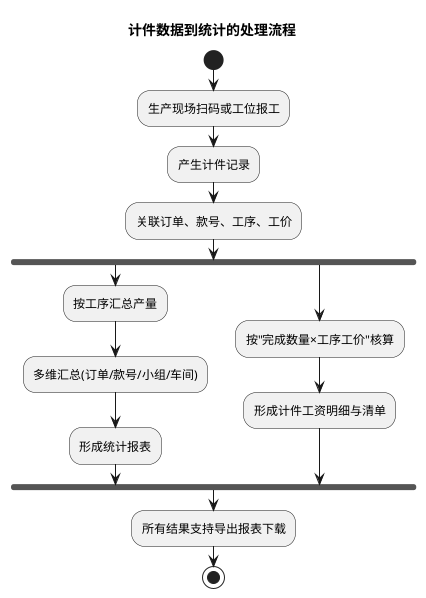
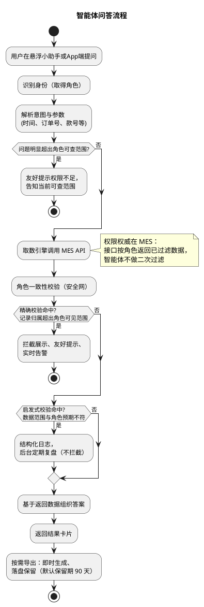

# 弘兆工厂查询智能体

## 背景
工厂MES系统已积累大量计件报工数据，但员工查产量工资、管理查订单进度、老板看全厂经营情况都需要进入多层菜单筛选，效率低且学习成本高。同时数据权限分散在各业务模块。

## 需求
- 通过自然语言智能体，让四类角色（员工/组长/管理/老板）一句话查到自己权限范围内的产量、工资、进度与排名数据。
- 统一四级数据权限收口，所有查询必经数据权限校验。
- 查询结果可一键导出Excel。
- 以悬浮小助手+App端双入口形式接入，不改变系统主流程。

## MES 核心业务流程

### 计件数据到统计的处理流程

## 功能

### 智能体问答流程

注：下文三角色「取数方式」表均省略公共步骤（认证、身份与角色识别、组织名称解析），见「API接口对应功能」章节；接口均为 POST + JSON，且须同时携带 Bearer 与请求体认证参数，见《AI问答对外接口-整理.md》。

### 员工

| 功能 | 示例提问 | 输入参数 | 输出报表字段 | 数据范围 |
|---|---|---|---|---|
| 个人产量统计 | 我今天/这个月做了多少件 | 时间（当日/当月/自定义）、本人ID | 日期、款号、工序、产量（实收，即合格数量） | 仅本人 |
| 个人工资（当日/当月） | 我这个月工资多少钱 | 时间、本人ID | 统计区间、计件工资合计、计件件数、日均工资 | 仅本人 |
| 个人工资明细 | 我这个月工资是怎么算的 | 时间、本人ID | 日期、款号、工价单价、完成数量、小计金额 | 仅本人 |

**取数方式**

| 功能 | 取数接口 | 关键请求参数 | 取数与字段对应 |
|---|---|---|---|
| 个人产量统计 | `/api/NetYf/Sclzd/GongziMxQuery`（明细模式） | `Uid`=本人工号；`dates`/`datee`=查询日期；`Type`="0,1,2"；`Flag`="0"；`scheme`=""；`queryFooter`=true | 每行一条产出记录：`rq`→日期、`huohao`→款号、`worktype`→工序、`sl`→产量（实收，即合格数量，次品不计）、`je`→金额；`footer.sl_total` 为总件数；一个接口覆盖扫码/吊挂/手工账三来源 |
| 个人工资（当日/当月） | `/api/NetYf/Sclzd/GongziMxQuery`（明细模式） | 同“个人产量统计”，`scheme`="" | 统一按明细取数后本地合计：`SUM(je)`→计件工资合计、`SUM(sl)`→计件件数；日均工资=合计÷区间天数（智能体计算）；`footer.je_total` 对账仅记录日志、不影响结果。 |
| 个人工资明细 | `/api/NetYf/Sclzd/GongziMxQuery`（明细模式） | 同"个人工资"，`scheme`="" | `rq`→日期、`huohao`→款号、`price`→工价单价、`sl`→完成数量、`je`→小计金额 |

### 管理

| 功能 | 示例提问 | 输入参数 | 输出报表字段 | 数据范围 |
|---|---|---|---|---|
| 订单进度查询 | 这个订单现在做到哪道工序了，进度如何 | 时间、订单号（生产制单 `dh`） | 订单号、款号、品名、床号、裁剪日期、包数、裁剪数量、完工包数、进度、工序数、状态 | 管辖车间/小组 |
| 款号进度查询 | 这个款做到哪了，还有多少没做完 | 时间、款号 | 订单号、款号、品名、床号、裁剪日期、包数、裁剪数量、完工包数、进度、工序数、状态 | 管辖车间/小组 |
| 订单产量查询 | 这个订单做了多少件，各工序产量多少 | 时间、订单号 | 订单号、款号、品名、工序、产量、参与人数、工序占比；汇总区：裁剪数量、进度、报工产量合计 | 管辖车间/小组 |
| 款号产量查询 | 这个款这周做了多少产量 | 时间、款号 | 款号、品名、工序、产量、参与人数、工序占比；汇总区：裁剪数量、进度、报工产量合计 | 管辖车间/小组 |
| 小组/车间产量 | 我们组这个月做了多少件 | 时间、款号（可选） | 车间/小组、款号、报工产量、参与人数、人均产量 | 管辖小组/车间 |
| 小组/车间产量对比 | 各小组这个月产量对比一下 | 时间、小组或车间清单 | 车间/小组总产量、参与人数、人均产量、名次（**可见部门数 ≥2 时才输出名次**） | 管辖小组/车间 |
| 员工工资清单 | 这个月我们组每人工资清单 | 时间、小组或车间 | 员工、所属小组、计件件数、工资合计 | 管辖范围内员工 |
| 收入排名（组内名次） | 我在小组里排第几 | 时间、本人ID、所在小组 | 本人排名、本人金额、组内总人数、组内排名 | 本人所在小组 |

**取数方式**

| 功能 | 取数接口 | 关键请求参数 | 取数与字段对应 |
|---|---|---|---|
| 订单进度查询 | ①`/api/NetYf/Sclzd/ScjdDetailQuery` → ②`/api/NetYf/Sclzd/ScjdGxQuery` | ①`dates`/`datee`、`dh`=订单号；②`userid`=①中的 `id`（物料编号，逐包下钻） | 按订单号（`dh`）查包级进度：`id`→物料编号、`baohao`→包号、`color`/`chima`/`ganghao`→颜色/尺码/缸号、`fhsl`→裁剪数量、`wts`→工序数、`wcs`→「总数/完成数」（**字符串，总数为 `件·工序` 口径**）、`wcl`→完成率。订单级汇总由包级聚合：包数=行数、裁剪数量=`SUM(fhsl)`、完工包数=`COUNT(wcl=100)`、进度=完工包数÷包数。下钻工序经 ②：`name`→工序、`wsort`→顺序、`zpsl`→正品数量、`uname`→操作人、`dept`→部门、`inputtime`→刷卡时间 |
| 款号进度查询 | ①`/api/NetYf/Sclzd/ScjdQuery` → ②`/api/NetYf/Sclzd/ScjdDetailQuery` | ①`dates`/`datee`、`sfwg`、`searchKeyword`、`page`/`size`（全量分页后本地按款号过滤）；②`dh`=①中选中的单号 | ①一行一个流程卡：`dh`→订单号、`bbreed`→款号、`description`→品名、`chuanghao`→床号、`rq`→裁剪日期、`zbs`→包数、`zsl`→裁剪数量（=该单 `SUM(fhsl)`）、`wcl`→**进度（包完工率 = 完工包数÷包数）**、`wts`→工序数、`sfwg`→状态。款号级按 `bbreed` 聚合并**按包数加权**算进度。②展开包级同「订单进度查询」 |
| 订单产量查询 | ①`/api/NetYf/Sclzd/GridPageList` → ②`/api/NetYf/Sclzd/YskQuery` → ③`/api/NetYf/Sclzd/HuohaoWtCLQuery` | ①②`dates`/`datee`，分页取全量；③`dates`/`datee`、`scheme`="货号工序"、`huohao`=该单款号 | ①取 `id`→`dh` 映射（产量挂订单的唯一桥）；②产量明细按 `id` 挂到订单、再按工序汇总：`sl`→产量、`uid` 去重→参与人数、`je`→报工金额；③作款号×工序合计的交叉对账（与②同源，实测逐组相等）；**各工序产量不得相加当订单总产量**（同一件做 N 道工序就有 N 条报工），汇总区的「报工产量合计」须标注为 `件·工序` 口径 |
| 款号产量查询 | ①`/api/NetYf/Sclzd/HuohaoWtCLQuery` → ②`/api/NetYf/Sclzd/YskQuery` | ①`dates`/`datee`、`scheme`="货号工序"、`huohao`=款号（**取值是款号 `bbreed`，不是货号 `bh`**）、`queryFooter`=true；②同「订单产量查询」 | ①按款号服务端过滤得各工序产量 `sssl`；②补参与人数与部门拆分（`uid` 去重、`dept`）；款号级裁剪数量与进度取 `/api/NetYf/Sclzd/ScjdQuery`（按 `bbreed` 聚合） |
| 小组/车间产量 | ①`/api/NetYf/Sclzd/YskQuery` → ②`/api/NetYf/Baseinfo/DeptQuery` | ①`dates`/`datee`，分页取全量；②仅认证参数 | ①产量明细按 `dept`×款号（或×工序）汇总：`sl` 求和→报工产量、`uid` 去重→参与人数，人均产量=报工产量÷参与人数；②解析 `dept`→小组/车间名称。**车间维度无裁剪/计划量来源**（缝制进度接口不含 `dept`），故本表不出裁剪数量与进度 |
| 小组/车间产量对比 | ①`/api/NetYf/Sclzd/YskQuery` → ②`/api/NetYf/Baseinfo/DeptQuery` | 同「小组/车间产量」 | 同源按 `dept` 汇总后按产量降序：**名次仅当可见部门数 ≥2 时输出**；可见部门数 =1（组长场景）时不输出名次列，改为单部门明细形态并附说明 |
| 员工工资清单 | `/api/NetYf/Sclzd/GongziJeOrderQuery`（名称解析辅调 `/api/NetYf/Baseinfo/DeptQuery`） | `dates`/`datee`、`queryFooter`=true | 接口按管辖范围返回排名列表：`uname`→员工、`dept`→所属小组、`bs`→计件件数（与 `GongziMxQuery` 的 `footer.sl_total` 同口径）、`je`→工资合计、`footer.je_total`→合计 |
| 收入排名（组内名次） | `/api/NetYf/Sclzd/GongziJeOrderQuery` | `dates`/`datee`=查询日期；`queryFooter`=true | 接口按调用者权限返回可见的排名列表（`uid`/`uname`/`dept`/`bs`/`je`）；按本人工号定位得到名次与金额；按 `dept`=本人所在小组过滤得组内名次与组内总人数；仅展示本人结果。员工角色（00）无此功能：该接口对员工返回 `code=-403`（无权限查看工资排名） |

### 老板

| 功能 | 示例提问 | 输入参数 | 输出报表字段 | 数据范围 |
|---|---|---|---|---|
| 各订单进度 | 所有订单现在进度怎么样 | 时间 | 订单号、款号、品名、床号、裁剪日期、包数、裁剪数量、完工包数、进度、工序数、状态 | 全厂 |
| 车间产量总览 | 整个车间这个月产量情况 | 时间、款式（可选） | 车间/小组、款号、报工产量、参与人数、人均产量 | 全厂 |
| 全厂工资 | 这个月整个厂工资发多少 | 时间 | 车间/小组、本月工资应发合计、在册人数、人均工资 | 全厂 |
| 员工工资查询（当日/当月/明细） | 某某这个月工资和明细 | 时间、员工 | 员工、工资合计、计件件数；明细：日期、款号、工序、单价、数量、小计 | 全厂任一员工 |

**取数方式**

| 功能 | 取数接口 | 关键请求参数 | 取数与字段对应 |
|---|---|---|---|
| 各订单进度 | `/api/NetYf/Sclzd/ScjdQuery`（+ 单订单下钻 `/api/NetYf/Sclzd/ScjdDetailQuery`） | `dates`/`datee`、`sfwg`、`searchKeyword`、`page`/`size`，分页取全量；下钻传 `dh` | 老板角色返回全厂数据。一行一个流程卡：`dh`→订单号、`bbreed`→款号、`description`→品名、`chuanghao`→床号、`rq`→裁剪日期、`zbs`→包数、`zsl`→裁剪数量、`wcl`→进度（包完工率）、`wts`→工序数、`sfwg`→状态。`colors`/`chimas`/`ganghaos` 为该订单全部颜色/尺码/缸号的聚合串，可作展示辅助。**客户名称、交期、交期预警与距离交期无数据源，不输出** |
| 车间产量总览 | ①`/api/NetYf/Sclzd/YskQuery`；②`/api/NetYf/Baseinfo/DeptQuery` | ①`dates`/`datee`，分页取全量；②仅认证参数 | ①产量明细按 `dept`×款号汇总：`sl` 求和→报工产量、`uid` 去重→参与人数；②解析 `dept`→名称。**弃用生产计划接口后，计划量与达成率均不输出**；车间维度无裁剪数量来源 |
| 全厂工资 | ①`/api/NetYf/Sclzd/GongziJeOrderQuery`；②`/api/NetYf/Baseinfo/EmployeeQuery`；③`/api/NetYf/Baseinfo/DeptQuery` | ①`dates`/`datee`、`queryFooter`=true；②③仅认证参数 | ①老板角色返回全厂人均工资：`je` 按 `dept` 汇总得各车间/小组应发合计，`footer.je_total` 为全厂合计；②在册人员按 `dept` 汇总得在册人数；③解析 `dept`→名称；人均工资=应发合计÷在册人数 |
| 员工工资查询（当日/当月/明细） | ①`/api/NetYf/Baseinfo/EmployeeQuery`；②`/api/NetYf/Sclzd/GongziMxQuery` | ①`uid`=目标员工工号；②`Uid`=目标员工工号、`dates`/`datee`、`Type`="0,1,2"、`Flag`="0"、`scheme`="" | ①解析员工姓名与部门；②统一按明细（`scheme`=""）取数：汇总列=本地 `SUM(je)`/`SUM(sl)`，明细列=`rq`→日期、`huohao`→款号、`worktype`→工序、`price`→单价、`sl`→数量、`je`→小计。|

### 通用

| 功能 | 说明 |
|---|---|
| 报表下载导出 | 每类问答结果对应一份结构化报表，一键导出 Excel；文件按"角色_功能_时间范围_生成时间"命名；本期只做导出，不做图表可视化 |
| PC 端悬浮小助手 | 右下角可拖拽浮标，展开对话面板；顶部显示当前角色；结果卡片含关键数字与"导出报表"按钮；默认最小化不遮挡主操作区 |
| App 端小助手 | 移动端适配：语音输入、结果卡片单列展示、报表下载后保存到本地；登录体系同 PC 端 |
| 角色化快捷问题 | 按员工/管理/老板动态展示 3–4 个常用问法按钮 |
| 追问式补全参数 | 缺时间/款号/小组等条件时，按角色主动追问，引导式完成查询 |
| 多轮上下文记忆 | 支持"换成上个月的""看二车间的"这类指代追问 |
| 闲聊应答 | 问候/寒暄/与工厂业务无关的常识问答（"你好""介绍一下鲁迅"）直接应答；不查询 MES/工厂数据、不经过能力-角色矩阵（四角色均可用）、不进历史/收藏/推送偏好、不占追问轮次；实时类信息（天气、行情等）如实说明无法获取 |
| 异常数据自动高亮 | 交期近、产量不达标自动标红 |
| 历史记录 + 收藏查询 | 高频查询支持收藏，一键复问 |
| 权限不足友好提示 | 越权不直接报错，提示权限不足并告知当前用户可查范围 |
| 大字模式 | 适配年长员工 |
| 每日早报推送 | 系统默认推送，早 8 点自动推昨日产量/工资摘要，内容按角色数据范围展示，不在偏好设置中配置 |
| 推送偏好设置 | 用户可自行配置月度/周度推送的日期、时间与内容项（工资明细推送、订单进度汇总、货号产量排名、完工进度总览、生产完工进度、本周产量汇总等）；推送项按角色数据范围展示 |

### API接口对应功能

本节为三角色取数表的公共取数前提与约定，各角色取数表在此基础上编写。

**1. 认证与身份识别**

1. 所有查询先调 `/api/system/token` 获取认证信息：`accessToken` / `appkey` / `sign` / `timestamp`；后续业务请求须同时携带 Header `Authorization: Bearer {accessToken}` 与请求体三参数 `app_key` / `timestamp` / `sign`（注意接口返回字段名为 `appkey`，请求参数名为 `app_key`）。
2. 该接口返回同时给出当前用户身份，可直接用于身份识别与角色路由：`user`（员工工号，即后续接口的 `uid`）、`uname`（姓名）、`dept`（部门编号）、`roles`（00 员工 / 01 组长 / 02 管理 / 99 老板），其中 01 组长、02 管理适用「管理」功能表；管理者绑定的车间/部门亦由本接口返回（客户确认），管理权限以绑定的部门/车间为准。
3. 认证信息在 `accessToken` 有效期内可复用；报"请求已过期"时重新调用本接口获取最新认证信息。

**2. 用户基本信息、角色与管辖范围**

- UserInfoQuery（`/api/NetYf/Baseinfo/UserInfoQuery`，传 `USERNAME`）：用户基本信息与账号状态——`code` / `username` / `realname` / `companyName` / `roles`；
- EmployeeQuery（`/api/NetYf/Baseinfo/EmployeeQuery`，传 `uid`，可不传查全员）：`uid` / `uname` / `dept` / `deptname` / `roles` 等；
- DeptQuery（`/api/NetYf/Baseinfo/DeptQuery`）：部门字典，解析 `dept`→部门/车间/小组名称。

角色与组织字段来源于 sys_employee 的 move_admin_role（角色）、company（公司）、dept（部门）。业务接口的数据范围由 MES 按角色过滤：特定角色（如 move_admin_role="00" 员工）接口仅返回本人数据，部门/车间/小组维度统一通过 `dept` 字段过滤，智能体不做二次过滤。四角色数据范围（客户确认）：员工查本人、组长查所属绑定组、管理查绑定的部门/车间、老板查全部。注意：基础数据接口（员工、部门等查询）不按权限过滤，返回全部数据。

**3. 实体对应关系（取数主线）**

- 生产制单（`/api/NetYf/Sclzd/GridPageList`）→ 制单明细：明细上挂货号（`huohao`）、床号（`chuanghao`）、包号（`baohao`），物料编号为 `id`（**一行 = 一个包**）；**订单号 = 制单/流程卡单号 `dh`**，一个 `dh` 对应一个款号（`huohaoname`）与一个床号（客户确认 2026-09-15）；
- 生产计划接口（`/api/NetYf/Plan/GridPageList`）**弃用**（客户确认 2026-09-15）：计划量、达成率、客户名称、交期均无可用来源，相关输出列全部取消；
- 缝制进度主线（客户确认 2026-09-15）：
  - 缝制生产进度（`/api/NetYf/Sclzd/ScjdQuery`，传 `dates`/`datee`，分页）→ 一行一个流程卡 `dh`，取 `zbs` 包数、`zsl` 裁剪数量（=该单 `SUM(fhsl)`）、`wcl` 进度（包完工率）、`wts` 工序数、`sfwg` 是否完工、`bbreed` 款号；
  - 缝制生产进度详情（`/api/NetYf/Sclzd/ScjdDetailQuery`，传 `dh`）→ 一行一个包，取 `id`、`baohao`、`color`/`chima`/`ganghao`、`fhsl` 裁剪数量、`wts` 工序数、`wcs`「总数/完成数」（字符串，`件·工序` 口径）、`wcl` 完成率；
  - 缝制工序进度（`/api/NetYf/Sclzd/ScjdGxQuery`，传 `userid`=物料编号）→ 一行一道已刷卡工序，取 `name` 工序名、`wsort` 顺序、`zpsl` 正品数量、`uid`/`uname`、`dept`、`inputtime`；
  - 缝制总进度（`/api/NetYf/Sclzd/ScjdFzHzQuery`，传 `dates`/`datee`）→ 一行一个「货号+床号+日期」，取 `fzzsl` 缝制总数量、`wgzsl` 完工总数量、`wgl` 完工率（整数截断）。**本版不进主报表**，仅当需要数量口径完工数量时启用；
- 员工通过 `uid` 与产量、工资关联；
- 产量 = 实际报工数量（扫码/吊挂/手工账）；工资 = 数量 × 单价（`sl` × `price`）；
- 产量明细主源 = `/api/NetYf/Sclzd/YskQuery`（生产查询-已扫描，客户确认 2026-09-15）：带 `id`（挂订单）、`dept`（切部门）、`worktype`（工序**名称**）、`sl`（数量）、`je`（金额）；按款号×工序的聚合视图为 `/api/NetYf/Sclzd/HuohaoWtCLQuery`（两者实测逐组数值相等，同源）。

**4. 公共参数约定**

- 时间范围：统一为 `dates` / `datee`（开始/结束日期），上限为近一年（客户确认），超范围请求由智能体友好提示并终止；工资接口另有 `Flag` 区分口径——0 按扫描日期 / 1 按审核日期；
- 工资三来源：`Type` 0 扫码产量 / 1 吊挂产量 / 2 手工账产量，全覆盖查询传 "0,1,2"；
- 工资明细接口 `Uid` 为选填（客户确认 2026-09-06）：传员工工号则按该员工查询；不传则由 MES 按当前角色返回——00 员工仅本人，01 组长 / 02 管理 / 99 老板返回其管辖范围（组/部门/全厂）内人员明细；
- 分页：`page` / `size`，`total` 为总条数；`queryFooter`=true 时返回 `footer` 合计。
- **字段名同形不同义（实测，传值前必须确认接口）**：`huohao` 在 `Sclzd`/`ScjdQuery`/`ScjdFzHzQuery`/`BarcodeClQuery` 里是**货号 `bh`**，在 `YskQuery`/`WskQuery`/`HuohaoWtCLQuery`/`ScjdGxQuery` 里是**款号 `bbreed`**；`worktype` 在 `BarcodeClQuery`/`ScjdGxQuery` 里是**工序编号**，在 `YskQuery`/`WskQuery`/`HuohaoWtCLQuery` 里是**工序名称**；`zsl` 在 `PlanGridPageList` 里是总数量、在 `ScjdQuery` 里是裁床数。

**5. 未直接映射到功能的接口**

| 接口 | 说明 |
|---|---|
| `/api/NetYf/Plan/GridPageList` | 生产计划。**已弃用（客户确认 2026-09-15）**，不再用于任何功能 |
| `/api/NetYf/Sclzd/YskQuery` | 生产查询-已扫描。**产量明细主源**（`Uid` 为选填：传工号则查该员工，省略则由 MES 按调用者数据范围返回） |
| `/api/NetYf/Sclzd/WskQuery` | 未扫描物料（在制数量来源；全量范围，无 `Uid` 参数，**无 `dept` 字段**） |
| `/api/NetYf/Sclzd/BarcodeClQuery` | 线下工序产量产能。实测是 `YskQuery` 的**子集**，作可选对账，不与主源相加 |
| `/api/NetYf/Sclzd/ScjdFzMxQuery` / `ScjdFzHzWorktypeQuery` | 缝制详细进度（颜色尺码层）/ 缝制工序总体进度（工序层），按「计划号+货号+床号+日期」下钻 |
| `/api/NetYf/Sclzd/WorktypeProgressQuery` | 工序进度查询。与 `ScjdGxQuery` 字段逐字段一致，两者**择一使用** |
| `/api/NetYf/Sclzd/SclzdWorktypeQuery` | 制单工序全集（`wt`/`wtname`/`sort`/`zhgx`），仅在需要列出「未做的工序名」时调用 |
| `/api/NetYf/PinFeng/GridPageList` | 手工账单据，次品 `cp` 字段仅此处有 |
| `/api/NetYf/Baseinfo/HuohaoFormQuery` | 货号颜色、尺码明细 |
| `/api/NetYf/Baseinfo/RfidWorktypeQuery` / `HuohaoWorktypeQuery` | 工序字典 / 货号工序列表，解析工序名称与顺序 |
| `/api/NetYf/Baseinfo/ScTypeQuery` | 生产类型字典 |
| `/api/NetYf/Baseinfo/MoveMenuQuery` | 移动端菜单 |
| `/api/NetYf/Dg/GridPageList` / `DgZuGridPageList` | 吊挂中间库配置、线别组别映射（配置类） |
| `/api/print/test-permissions` | 验证认证信息是否有效 |

## 技术方案

### 用户角色定义

本系统设置厂长、管理者、组长、员工四类角色，分别对应"工厂 — 车间/部门 — 小组 — 工位"四级组织层级，其中车间与部门为平级关系，车间下存在多个小组（客户确认）。角色权限与数据可见范围按层级配置，生产数据自下而上逐级汇总。

**1. 厂长（决策层）**
- 角色定位：全厂最高管理者，负责整体生产经营决策。
- 核心职责：掌握订单交付达成情况、整体产能利用率与人工成本总量，识别并督导各车间的生产短板。
- 数据范围：全厂级多维汇总数据（按订单 / 款号 / 车间 / 小组等维度）。

**2. 管理者（管理层）**
- 角色定位：中层管理人员，即部门管理者（客户确认），涵盖各车间主任（裁剪、缝制、整烫等）及计划、品质、仓储、人事等职能部门负责人。
- 核心职责：跟踪生产计划执行进度、产品质量与物料/成品库存状况，组织处理生产异常。
- 数据范围：绑定的部门/车间的业务数据。
- 权限确认（客户确认）：管理者可存在多个、权限相同；权限以绑定的部门（车间）为准，可跨车间绑定；管理者不兼任组长，四角色边界清晰。

**3. 组长（执行管理层）**
- 角色定位：一线生产管理者，负责本组（生产线）的现场管理。
- 核心职责：安排组内人员任务与工序分配，跟催组内产量达成与人员出勤，发现并上报现场瓶颈与异常。
- 数据范围：本组实时生产数据。

**4. 员工（执行层）**
- 角色定位：一线作业人员，生产报工数据的源头。
- 核心职责：执行所分配的工序任务并完成报工，查询个人完成产量与计件工资明细。
- 数据范围：仅限个人报工记录与工资数据。

### 角色权限与数据校验策略

智能体定位为 Text-to-API：将用户的自然语言问题转译为对 MES API 的系列调用，并基于返回数据组织答案。

**一、权限规则**

1. MES 系统是数据权限的唯一权威。业务接口按当前用户角色返回已过滤数据，"何种角色可见何种数据"由 MES 保证；基础数据接口（员工、部门等基础数据查询）不按权限过滤，返回全部数据。
2. 各角色数据范围（客户确认）：员工查本人、组长查所属绑定组、管理查绑定的部门/车间（绑定关系登录后由 token 接口返回）、老板查全部。
3. 智能体只消费与组织数据，不执行权限：正常路径下不对返回数据做二次过滤、裁剪或权限判断。

**二、校验机制**

4. 智能体对返回数据做角色一致性校验：依当前角色确定预期数据范围，与实际返回比对。校验只做判定与提示，不修改、不重过滤数据。
5. 校验结论依角色而定，同一数据形态在不同角色下解读不同：
   - 员工查询工资返回 1 条，为正常（预期仅本人）；返回多条，判定为权限异常。
   - 厂长查询工资返回 1 条，判定为业务事实（该厂可能仅一人），非异常。
6. 校验按置信度分为两类：
   - 精确校验：基于员工 ID、组别等归属字段，判定记录归属超出当前角色可见范围，结论确定；
   - 启发式校验：数据数量/范围与角色预期不符，结论仅作提示。
   - 能精确化的检查应尽量精确化，收窄启发式校验的适用范围。

**三、分阶段执行策略**

7. 对接阶段：校验以严格模式运行，不一致直接作为对接问题暴露，与 MES 侧共同解决；同时利用该阶段校准校验规则，上线前消除误报。
8. 生产阶段：主路径默认信任 MES 返回数据，校验作为安全网分两级处置：
   - 精确校验命中：拦截相关数据展示，按异常流程提示用户，并实时告警；
   - 启发式校验命中：不拦截，结构化留日志（用户、角色、接口、预期范围、实际范围），由后台任务定期复盘。
9. 确认的权限不一致均反馈 MES 侧根治，修复后撤除智能体侧相应临时策略；双方就权限异常的反馈渠道与响应时效事先约定。
10. 智能体校验是安全网与发现机制，不替代 MES 的权限体系。

### 报表导出与文件留存策略

报表导出采用"即时生成、落盘保留、按保留期清理"原则：导出文件在服务端保留 90 天，保留期内凭 `artifact_id` 可重复下载，超期后自动清理；回头再取也可通过对话历史重查重导实现。

1. 即时生成、直接下载：PC 端浏览器直接下载（即时生成、流式返回），App 端保存到本地；文件名按现有约定"角色_功能_时间范围_生成时间"。
2. 服务端落盘保留 90 天：导出文件写入服务端存储（对象布局 `exports/{artifact_id}.xlsx` 与同名元数据 sidecar，记录归属、文件名、内容类型与到期时间），保留期内凭 `artifact_id` 可再次下载，服务重启后依然可取；保留期默认 90 天，由 `FACTORY_AGENT_EXPORT_RETENTION_SECONDS` 控制。
3. 清理为惰性清理：过期对象在下次被访问时才删除，不做主动轮询清理。
4. 下载走服务端代理并记审计：先按导出归属校验调用者身份，再写审计事件，审计失败即不返回数据；不签发可直接访问的长期链接。
5. "回头还能找到"由历史记录 + 收藏查询 + 保留期内直接下载共同承接：保留期内直接取文件，超期后一键复问重新生成并导出。

### 租户生命周期（工厂账户）

一个工厂对应一个租户，AppKey 即租户标识（一厂一 AppKey，**客户已确认**）。租户主数据由平台统计面
（`/v1/statistics`）持有并写入，业务侧只读。

> 除「一厂一 AppKey」为客户确认结论外，本节其余各条为**平台侧设计口径**（非客户确认事项），
> 完整决策与实现依据见 `docs/adr/0003-usage-metering-and-admin-service.md`、
> `docs/api/统计与运营接口.md`。

1. **首见自动登记**：客户 MES 凭证交换成功即登记该 AppKey，状态为启用，并生成一个**非密的租户
   句柄 `tenant_ref`** 与占位名（`未命名工厂-<句柄前 6 位>`），由平台运营在管理端改名。登记是幂等
   的，重复见面不产生额外成本；登记失败不影响问答（记告警，不阻塞）。
2. **默认启用**：客户认可的 AppKey 首次出现即可用，不需要人工预先开通；停用的租户一律拒绝。
3. **停用语义**：停用后该租户的**问答请求一律被拒**（不再消耗 LLM，也不发起 MES 调用），而不是
   等到去查业务数据时才失败。停用**不删除**任何数据：历史用量、会话与导出全部保留，可继续查询。
4. **对外寻址用 `tenant_ref`**：AppKey 是密钥，只在创建账户的响应中返回一次明文，其余出参一律
   脱敏（前 6 位 + `***`）。运营的改名 / 停用 / 启用一律按 `tenant_ref` 操作——自动登记的租户
   本来就没有「创建」这一步，运营拿不到它的明文 AppKey。
5. **平台运营与工厂角色彻底分离**：工厂的老板只是本厂内角色，不能查看其他工厂；平台运营通过独立
   的运营账号（Bearer 鉴权）访问统计与租户管理接口。

## 客户确认结论

2026-09-02 客户答复记录。

### 组织与角色权限
1. 车间存在多个小组；车间和部门是平级关系。
2. 管理是部门管理者，可存在多个、权限相同；权限以绑定的部门（车间）为准，可跨车间绑定；登录后 token 接口返回绑定的车间/部门。
3. 管理者不兼任组长，四角色数据范围明确：员工查本人、组长查所属绑定组、管理查绑定的部门/车间、老板查全部。
4. 业务接口已按权限过滤数据；基础数据管理接口不按权限过滤，查询返回全部数据。

### API 压力
1. 时间范围：近一年（员工可查一年内的工资明细）。
2. 查询频率：无限制。

### 接口与字段口径
1. `GongziMxQuery` 的 `Uid` 为选填（客户确认 2026-09-06）：传员工工号查该员工；不传则按角色范围返回——00 员工仅本人，01 组长 / 02 管理 / 99 老板返回其管辖人员明细（旧口径「传空查全部仅限老板、管理传空不允许」已废止）。
2. 个人产量即最终实收数（合格数），次品不考虑。
3. `GongziJeOrderQuery` 返回的列表按调用者权限过滤（如组长得到本组排名）。该接口对 00 员工角色返回 `code=-403`（无权限查看工资排名），因此收入排名（组内名次）只对 01 组长 / 02 管理 / 99 老板 开放，员工角色由能力-角色矩阵先行拒绝、不产生任何取数调用。

### 追加确认（2026-09-05）

1. **闲聊能力**：智能体承接对问候/寒暄/与工厂业务无关的常识问答（如"你好""介绍一下鲁迅"）
   的闲聊应答。能力边界确认如下：
   - 由意图选择器内置保留能力 `chitchat` 识别，不查询任何 MES/工厂数据，不经过能力-角色
     权限矩阵（四角色均可用）；
   - 闲聊回复不进个人化查询历史/收藏/推送偏好，不占用追问轮次，照常计入 LLM 调用用量；
   - 涉及实时或无法核实的信息（如今天的天气、实时行情）时，回复如实说明"无法获取实时数据"，
     不接入实时数据源、不编造数值。

### 追加确认（2026-09-06）

1. **工资明细接口 `GongziMxQuery` 的 `Uid` 调整为选填**（废止此前「必填 / 传空仅老板可用」口径）：
   - 填写员工工号 → 按该员工查询；
   - 不填写 → MES 按当前角色返回：`00 员工` 仅本人；`01 组长` / `02 管理` / `99 老板`
     返回其管辖范围（组 / 绑定部门车间 / 全厂）内人员明细。
   - 同步更新 `docs/product/AI问答对外接口-整理.md` §8.1 参数表与取值说明。

### 追加确认（2026-09-15）

1. **车间产量总览（FR-010）的角色范围扩展**：客户同意该能力对 `01 组长` / `02 管理` / `99 老板`
   开放（此前口径仅老板）。返回范围由 MES 按角色行级过滤收窄——组长得本组、管理得绑定的部门/车间、
   老板得全厂；我方不做本地部门切分。老板功能表中的该行只描述老板视角，不构成对管理/组长的排除。
2. **~~生产计划的部门字段待补齐~~【已作废】**：原计划由客户给 `Plan/GridPageList` 补 `dept` 字段。
   该接口已于同日晚些时候弃用（见下节「追加确认（2026-09-15 · 进度与产量口径重梳）」），
   车间维度改由「生产查询-已扫描」的 `deptname` 提供，**不再等待本字段**。
3. **计划达成率无法取数**：客户明确该指标无法从现有接口取数，我方不统计、不输出达成率。
   功能表中「小组/车间产量对比」（FR-007）与「小组/车间产量」（FR-010）本就没有达成率列，
   两个能力的结果列以功能表为准。
4. **产量类问法的能力归属**：只问产量、未提及对比时走「车间产量总览」（FR-010）；
   明确要求对比、排名、名次或人均产量时才走「小组/车间产量对比」（FR-007）。

### 追加确认（2026-09-15 · 进度与产量口径重梳）

本轮由我方在客户真实响应缓存上逐行实测后拍板，明细证据见
`docs/design/进度与产量功能重梳方案.md`。

1. **弃用生产计划接口**（`/api/NetYf/Plan/GridPageList`）：
   - 「计划数量」列取消，订单数量口径改用 `/api/NetYf/Sclzd/ScjdQuery` 的 `zsl`（裁床数，即该单裁剪数量合计），列名定为**「裁剪数量」**；
   - **客户名称、交期、交期预警、距交期、客户订单号、计划号整族取消**（实测制单 `khname`/`khid`/`dddh` 与 `ScjdQuery.dddh` 全为空，无替代来源）；
     「异常数据自动高亮」在订单进度上暂无数据源，**等客户给出新字段后再议**；
   - 正面效果：同时消除「制单与计划无订单级关联键」与「计划接口缺 `dept` 字段」两个历史阻塞项。
2. **订单号与主键**：订单号 = 生产制单/流程卡单号 `dh`；`id` = 物料编号（**一行一个包**，同 `dh` 下 `baohao` 递增）；
   一个 `dh` 唯一对应一个款号与一个床号。款号与订单基本一一对应，款号级查询 = 多单聚合。
3. **进度口径**：进度主列定为**包完工率 `wcl`**（`/api/NetYf/Sclzd/ScjdQuery`，含义 = 完工包数 ÷ 包数）；
   包级完成率取 `/api/NetYf/Sclzd/ScjdDetailQuery` 的 `wcl`（完成数 ÷ 总数，`总数 = 裁剪数量 × 工序数`，**`件·工序` 口径**）；
   数量口径完工率（`wgzsl/fzzsl`）暂不输出。
4. **进度取数链**：列表 = 缝制生产进度（`ScjdQuery`）单次分页拉取；单订单 = 缝制生产进度详情（`ScjdDetailQuery`）；
   工序下钻 = 缝制工序进度（`ScjdGxQuery`）。**列表层不得逐单调详情接口**。
5. **产量主源**：改用**生产查询-已扫描**（`/api/NetYf/Sclzd/YskQuery`）；
   「工序产量查询」（`HuohaoWtCLQuery`）为其按款号×工序的聚合视图，可作服务端过滤与对账；
   「线下工序产量产能」（`BarcodeClQuery`）实测是其子集，**降为可选对账，不与主源相加**。
6. **产量列口径**：各工序产量**不得相加**作为订单/款号总产量（同一件做 N 道工序就有 N 条报工），
   汇总区给「裁剪数量 / 进度 / 报工产量合计（`件·工序` 口径）」，并需在结果说明里注明。
7. **部门产量按角色分档**：组长可见部门恒为 1 → **默认不对比、不输出名次**，展示本组明细并附说明；
   管理可见多个部门 → 默认对比排名，支持收窄到某一个部门（收窄后降级为明细形态）；老板看全厂对比。
   实现规则统一为「**可见部门数 = 1 → 不输出名次列 + 卡片切明细形态 + 附说明**」。
8. **车间维度无裁剪数量**：缝制进度接口不含 `dept`，车间视图只给报工产量 / 参与人数 / 人均产量。
9. **能力名称对齐**：FR-010 由「车间产量总览」改称**「小组/车间产量」**（与 FR-007「小组/车间产量对比」
   成对、且与实际覆盖的角色范围一致）。代码侧 `FR_INFO` 的标题与描述待同步更新（见下方落地清单 P2）。