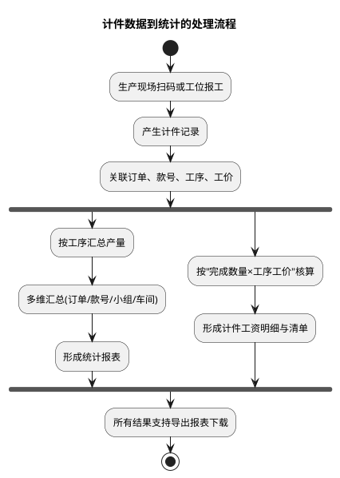
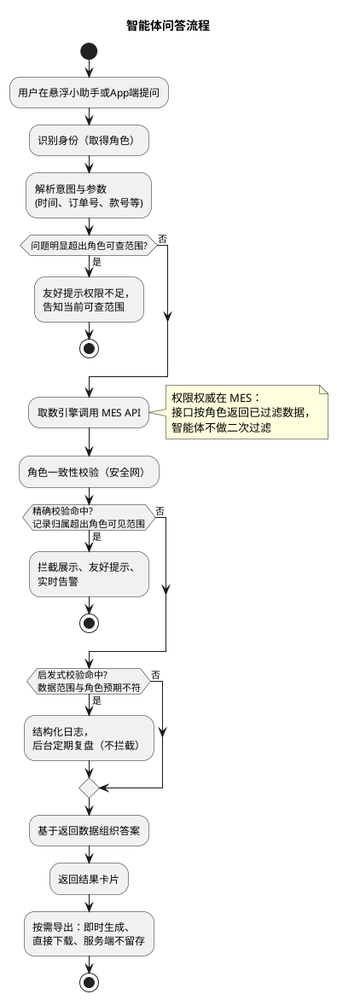

# 弘兆工厂查询智能体

## 背景
工厂MES系统已积累大量计件报工数据，但员工查产量工资、管理查订单进度、老板看全厂经营情况都需要进入多层菜单筛选，效率低且学习成本高。同时数据权限分散在各业务模块。

## 需求
- 通过自然语言智能体，让四类角色（员工/组长/管理/老板）一句话查到自己权限范围内的产量、工资、进度与排名数据。
- 统一四级数据权限收口，所有查询必经数据权限校验。
- 查询结果可一键导出Excel。
- 以悬浮小助手+App端双入口形式接入，不改变系统主流程。

## MES 核心业务流程

### 计件数据到统计的处理流程

## 功能

### 智能体问答流程

注：下文三角色「取数方式」表均省略公共步骤（认证、身份与角色识别、组织名称解析），见「API接口对应功能」章节；接口均为 POST + JSON，且须同时携带 Bearer 与请求体认证参数，见《AI问答对外接口-整理.md》。

### 员工

| 功能 | 示例提问 | 输入参数 | 输出报表字段 | 数据范围 |
|---|---|---|---|---|
| 个人产量统计 | 我今天/这个月做了多少件 | 时间（当日/当月/自定义）、本人ID | 日期、款号、工序、产量（实收，即合格数量） | 仅本人 |
| 个人工资（当日/当月） | 我这个月工资多少钱 | 时间、本人ID | 统计区间、计件工资合计、计件件数、日均工资 | 仅本人 |
| 个人工资明细 | 我这个月工资是怎么算的 | 时间、本人ID | 日期、款号、工价单价、完成数量、小计金额 | 仅本人 |
| 收入排名 | 我在小组里排第几 | 时间、本人ID、所在小组 | 本人排名、本人金额、组内总人数、组内排名 | 仅本人 |

**取数方式**

| 功能 | 取数接口 | 关键请求参数 | 取数与字段对应 |
|---|---|---|---|
| 个人产量统计 | `/api/NetYf/Sclzd/GongziMxQuery`（明细模式） | `Uid`=本人工号；`dates`/`datee`=查询日期；`Type`="0,1,2"；`Flag`="0"；`scheme`=""；`queryFooter`=true | 每行一条产出记录：`rq`→日期、`huohao`→款号、`worktype`→工序、`sl`→产量（实收，即合格数量，次品不计）、`je`→金额；`footer.sl_total` 为总件数；一个接口覆盖扫码/吊挂/手工账三来源 |
| 个人工资（当日/当月） | `/api/NetYf/Sclzd/GongziMxQuery`（汇总模式） | 同上，`scheme`="汇总" | `footer.je_total`→计件工资合计、`footer.sl_total`→计件件数；日均工资=`je_total`÷区间天数（智能体计算）；查"当日"时 `dates`=`datee`=当天 |
| 个人工资明细 | `/api/NetYf/Sclzd/GongziMxQuery`（明细模式） | 同"个人工资"，`scheme`="" | `rq`→日期、`huohao`→款号、`price`→工价单价、`sl`→完成数量、`je`→小计金额 |
| 收入排名 | `/api/NetYf/Sclzd/GongziJeOrderQuery` | `dates`/`datee`=查询日期；`queryFooter`=true | 接口按当前角色返回可见的排名列表（`uid`/`uname`/`dept`/`bs`/`je`）；按本人工号定位得到名次与金额；按 `dept`=所在小组过滤得组内名次与组内总人数；仅展示本人结果 |

### 管理

| 功能 | 示例提问 | 输入参数 | 输出报表字段 | 数据范围 |
|---|---|---|---|---|
| 订单/款号进度查询 | 这个订单现在做到哪道工序了，进度如何 | 时间、订单号或款号 | 订单号、款号、当前工序、已完成工序、订单进度、在制数量、完工数量、进度百分比 | 管辖车间/小组 |
| 订单/款号产量查询 | 这个款这周做了多少产量 | 时间、订单号或款号 | 订单号、款号、各工序产量、合计产量、参与人数 | 管辖车间/小组 |
| 小组/车间产量对比 | 各小组这个月产量对比一下 | 时间、小组或车间清单 | 小组/车间总产量、报工人数、人均产量、在制订单进度、名次 | 管辖车间/小组 |
| 员工工资清单 | 这个月我们组每人工资清单 | 时间、小组或车间 | 员工、所属小组、计件件数、工资合计 | 管辖范围内员工 |

**取数方式**

| 功能 | 取数接口 | 关键请求参数 | 取数与字段对应 |
|---|---|---|---|
| 订单/款号进度查询 | ①`/api/NetYf/Plan/GridPageList` → ②`/api/NetYf/Sclzd/GridPageList` → ③`/api/NetYf/Sclzd/SclzdWorktypeQuery` → ④`/api/NetYf/Sclzd/WorktypeProgressQuery` | ①②`dates`/`datee`；③`dh`=②中制单单号；④`userid`=②中物料编号（`id`） | ①按订单号（`khddh` 客户订单号/`jhdh` 计划单号）或款号（`huohao`）定位，取订单数量 `ddsl`、交货日期 `finish_date`；②按款号/订单单号（`dddh`）定位对应制单，取单号 `dh`、物料编号 `id`、预发数量 `fhsl`、产量 `sssl`（完工量口径）；③取该单全部工序（`sort` 工序顺序、`zhgx` 最后工序），判定已完成工序与当前工序；④各工序正品数量 `zpsl`（与 `fhsl` 对比）得工序进度；进度百分比=完工数量÷订单数量 |
| 订单/款号产量查询 | ①`/api/NetYf/Sclzd/HuohaoWtCLQuery`；输入为订单号时先经 `/api/NetYf/Plan/GridPageList` 定位款号；②`/api/NetYf/Sclzd/SclzdBarcodeQuery` | ①`dates`/`datee`、`scheme`="货号工序"、`queryFooter`=true；②`dh`=单号、`detailId`=物料编号 | ①按款号过滤得各工序产量 `sssl`，`footer.sl_total` 为合计产量；②扫描记录按 `uid` 去重得参与人数（多物料单需按物料逐个调用） |
| 小组/车间产量对比 | ①`/api/NetYf/Sclzd/BarcodeClQuery` + ②`/api/NetYf/Dg/DgClQuery`（如需手工账加 ③`/api/NetYf/PinFeng/GridPageList`）；④`/api/NetYf/Baseinfo/DeptQuery`；⑤`/api/NetYf/Sclzd/WorktypeProgressQuery` | ①②③`dates`/`datee`，分页取全量；④仅认证参数；⑤`userid`=物料编号 | ①②③三来源产量明细按 `dept` 汇总：`sl` 求和得总产量、`uid` 去重得报工人数，人均产量=总产量÷报工人数；④解析 `dept`→小组/车间名称；⑤对该小组/车间在制物料（明细中的 `id`）查各工序完成量，得在制订单进度（多物料分别计算后取均值）；名次按总产量排序 |
| 员工工资清单 | `/api/NetYf/Sclzd/GongziJeOrderQuery`（名称解析辅调 `/api/NetYf/Baseinfo/DeptQuery`） | `dates`/`datee`、`queryFooter`=true | 接口按管辖范围返回排名列表：`uname`→员工、`dept`→所属小组、`bs`→计件件数（与 `GongziMxQuery` 的 `footer.sl_total` 同口径）、`je`→工资合计、`footer.je_total`→合计 |

### 老板

| 功能 | 示例提问 | 输入参数 | 输出报表字段 | 数据范围 |
|---|---|---|---|---|
| 各订单进度 | 所有订单现在进度怎么样 | 时间 | 订单号、款号、客户、下单量、完工量、当前工序、进度百分比、交期预警 | 全厂 |
| 车间产量总览 | 整个车间这个月产量情况 | 时间、款式（可选） | 车间、款号、款式、计划量、完成量 | 全厂 |
| 全厂工资 | 这个月整个厂工资发多少 | 时间 | 车间/小组、本月工资应发合计、在册人数、人均工资 | 全厂 |
| 员工工资查询（当日/当月/明细） | 某某这个月工资和明细 | 时间、员工 | 员工、工资合计、计件件数；明细：日期、款号、工序、单价、数量、小计 | 全厂任一员工 |

**取数方式**

| 功能 | 取数接口 | 关键请求参数 | 取数与字段对应 |
|---|---|---|---|
| 各订单进度 | ①`/api/NetYf/Plan/GridPageList` → ②`/api/NetYf/Sclzd/GridPageList` → ③`/api/NetYf/Sclzd/SclzdWorktypeQuery` → ④`/api/NetYf/Sclzd/WorktypeProgressQuery` | ①②`dates`/`datee`，分页取全量；③`dh`=单号；④`userid`=物料编号 | 老板角色返回全厂数据。①各订单：`khddh`/`jhdh`→订单号、`huohaoname`→款号、`khname`→客户、`ddsl`→下单量、`finish_date`→交期（交期预警=临近交期且未完工）；②`sssl`→完工量；③④当前工序与进度百分比计算同管理"订单/款号进度查询" |
| 车间产量总览 | ①`/api/NetYf/Plan/GridPageList`；②`/api/NetYf/Sclzd/BarcodeClQuery` + ③`/api/NetYf/Dg/DgClQuery`；④`/api/NetYf/Baseinfo/HuohaoQuery` | ①②③`dates`/`datee`，分页取全量；④仅认证参数 | ①计划量 `ddsl` 按款号汇总；②③产量明细按 `dept`×`huohao` 汇总得各车间×款号完成量；④货号类型 `huohaotype`/品名 `description`→款式 |
| 全厂工资 | ①`/api/NetYf/Sclzd/GongziJeOrderQuery`；②`/api/NetYf/Baseinfo/EmployeeQuery`；③`/api/NetYf/Baseinfo/DeptQuery` | ①`dates`/`datee`、`queryFooter`=true；②③仅认证参数 | ①老板角色返回全厂人均工资：`je` 按 `dept` 汇总得各车间/小组应发合计，`footer.je_total` 为全厂合计；②在册人员按 `dept` 汇总得在册人数；③解析 `dept`→名称；人均工资=应发合计÷在册人数 |
| 员工工资查询（当日/当月/明细） | ①`/api/NetYf/Baseinfo/EmployeeQuery`；②`/api/NetYf/Sclzd/GongziMxQuery` | ①`uid`=目标员工工号；②`Uid`=目标员工工号、`dates`/`datee`、`Type`="0,1,2"、`Flag`="0" | ①解析员工姓名与部门；②汇总（`scheme`="汇总"）：`footer.je_total`→工资合计、`footer.sl_total`→计件件数；明细（`scheme`=""）：`rq`→日期、`huohao`→款号、`worktype`→工序、`price`→单价、`sl`→数量、`je`→小计 |

### 通用

| 功能 | 说明 |
|---|---|
| 报表下载导出 | 每类问答结果对应一份结构化报表，一键导出 Excel；文件按"角色_功能_时间范围_生成时间"命名；本期只做导出，不做图表可视化 |
| PC 端悬浮小助手 | 右下角可拖拽浮标，展开对话面板；顶部显示当前角色；结果卡片含关键数字与"导出报表"按钮；默认最小化不遮挡主操作区 |
| App 端小助手 | 移动端适配：语音输入、结果卡片单列展示、报表下载后保存到本地；登录体系同 PC 端 |
| 角色化快捷问题 | 按员工/管理/老板动态展示 4–6 个常用问法按钮 |
| 追问式补全参数 | 缺时间/款号/小组等条件时，按角色主动追问，引导式完成查询 |
| 多轮上下文记忆 | 支持"换成上个月的""看二车间的"这类指代追问 |
| 异常数据自动高亮 | 交期近、产量不达标自动标红 |
| 历史记录 + 收藏查询 | 高频查询支持收藏，一键复问 |
| 权限不足友好提示 | 越权不直接报错，提示权限不足并告知当前用户可查范围 |
| 大字模式 | 适配年长员工 |
| 每日早报推送 | 系统默认推送，早 8 点自动推昨日产量/工资摘要，内容按角色数据范围展示，不在偏好设置中配置 |
| 推送偏好设置 | 用户可自行配置月度/周度推送的日期、时间与内容项（工资明细推送、订单进度汇总、货号产量排名、完工进度总览、生产完工进度、本周产量汇总等）；推送项按角色数据范围展示 |

### API接口对应功能

本节为三角色取数表的公共取数前提与约定，各角色取数表在此基础上编写。

**1. 认证与身份识别**

1. 所有查询先调 `/api/system/token` 获取认证信息：`accessToken` / `appkey` / `sign` / `timestamp`；后续业务请求须同时携带 Header `Authorization: Bearer {accessToken}` 与请求体三参数 `app_key` / `timestamp` / `sign`（注意接口返回字段名为 `appkey`，请求参数名为 `app_key`）。
2. 该接口返回同时给出当前用户身份，可直接用于身份识别与角色路由：`user`（员工工号，即后续接口的 `uid`）、`uname`（姓名）、`dept`（部门编号）、`roles`（00 员工 / 01 组长 / 02 管理 / 99 老板），其中 01 组长、02 管理适用「管理」功能表；管理者绑定的车间/部门亦由本接口返回（客户确认），管理权限以绑定的部门/车间为准。
3. `timestamp` 有有效期（默认 60 秒），报"请求已过期"时重新调用本接口。

**2. 用户基本信息、角色与管辖范围**

- UserInfoQuery（`/api/NetYf/Baseinfo/UserInfoQuery`，传 `USERNAME`）：用户基本信息与账号状态——`code` / `username` / `realname` / `companyName` / `roles`；
- EmployeeQuery（`/api/NetYf/Baseinfo/EmployeeQuery`，传 `uid`，可不传查全员）：`uid` / `uname` / `dept` / `deptname` / `roles` 等；
- DeptQuery（`/api/NetYf/Baseinfo/DeptQuery`）：部门字典，解析 `dept`→部门/车间/小组名称。

角色与组织字段来源于 sys_employee 的 move_admin_role（角色）、company（公司）、dept（部门）。业务接口的数据范围由 MES 按角色过滤：特定角色（如 move_admin_role="00" 员工）接口仅返回本人数据，部门/车间/小组维度统一通过 `dept` 字段过滤，智能体不做二次过滤。四角色数据范围（客户确认）：员工查本人、组长查所属绑定组、管理查绑定的部门/车间、老板查全部。注意：基础数据接口（员工、部门等查询）不按权限过滤，返回全部数据。

**3. 实体对应关系（取数主线）**

- 生产计划（`/api/NetYf/Plan/GridPageList`）→ 生产制单（`/api/NetYf/Sclzd/GridPageList`）→ 制单明细：明细上挂货号（`huohao`）、工序（`wt`/`worktype`）、床号（`chuanghao`），物料编号为 `id`；
- 员工通过 `uid` 与产量、工资关联；
- 产量 = 实际扫描/录入数量（`sl` / `fhsl`）；工资 = 数量 × 单价（`sl` × `price`）；
- 工序进度 = 主单 + 明细 + 工序 + 已扫描条码合并后的完成进度：工序全集经 SclzdWorktypeQuery（传 `dh` 单号），各工序完成量经 WorktypeProgressQuery（传 `userid` 物料编号）或 SclzdBarcodeQuery（传 `dh` + `detailId`）。

**4. 公共参数约定**

- 时间范围：统一为 `dates` / `datee`（开始/结束日期），上限为近一年（客户确认），超范围请求由智能体友好提示并终止；工资接口另有 `Flag` 区分口径——0 按扫描日期 / 1 按审核日期；
- 工资三来源：`Type` 0 扫码产量 / 1 吊挂产量 / 2 手工账产量，全覆盖查询传 "0,1,2"；
- 工资明细接口 `Uid` 标注必填，老板权限下可传空查全部，管理传空不允许（客户确认）；
- 分页：`page` / `size`，`total` 为总条数；`queryFooter`=true 时返回 `footer` 合计。

**5. 未直接映射到功能的接口**

| 接口 | 说明 |
|---|---|
| `/api/NetYf/Sclzd/YskQuery` | 个人已扫描产量明细（传 `Uid`），可作个人产量统计的备选口径 |
| `/api/NetYf/Sclzd/WskQuery` | 未扫描物料（全量范围，无 `Uid` 参数） |
| `/api/NetYf/PinFeng/GridPageList` | 手工账单据，次品 `cp` 字段仅此处有 |
| `/api/NetYf/Baseinfo/HuohaoFormQuery` | 货号颜色、尺码明细 |
| `/api/NetYf/Baseinfo/RfidWorktypeQuery` / `HuohaoWorktypeQuery` | 工序字典 / 货号工序列表，解析工序名称与顺序 |
| `/api/NetYf/Baseinfo/ScTypeQuery` | 生产类型字典 |
| `/api/NetYf/Baseinfo/MoveMenuQuery` | 移动端菜单 |
| `/api/NetYf/Dg/GridPageList` / `DgZuGridPageList` | 吊挂中间库配置、线别组别映射（配置类） |
| `/api/print/test-permissions` | 验证认证信息是否有效 |

## 技术方案

### 用户角色定义

本系统设置厂长、管理者、组长、员工四类角色，分别对应"工厂 — 车间/部门 — 小组 — 工位"四级组织层级，其中车间与部门为平级关系，车间下存在多个小组（客户确认）。角色权限与数据可见范围按层级配置，生产数据自下而上逐级汇总。

**1. 厂长（决策层）**
- 角色定位：全厂最高管理者，负责整体生产经营决策。
- 核心职责：掌握订单交付达成情况、整体产能利用率与人工成本总量，识别并督导各车间的生产短板。
- 数据范围：全厂级多维汇总数据（按订单 / 款号 / 车间 / 小组等维度）。

**2. 管理者（管理层）**
- 角色定位：中层管理人员，即部门管理者（客户确认），涵盖各车间主任（裁剪、缝制、整烫等）及计划、品质、仓储、人事等职能部门负责人。
- 核心职责：跟踪生产计划执行进度、产品质量与物料/成品库存状况，组织处理生产异常。
- 数据范围：绑定的部门/车间的业务数据。
- 权限确认（客户确认）：管理者可存在多个、权限相同；权限以绑定的部门（车间）为准，可跨车间绑定；管理者不兼任组长，四角色边界清晰。

**3. 组长（执行管理层）**
- 角色定位：一线生产管理者，负责本组（生产线）的现场管理。
- 核心职责：安排组内人员任务与工序分配，跟催组内产量达成与人员出勤，发现并上报现场瓶颈与异常。
- 数据范围：本组实时生产数据。

**4. 员工（执行层）**
- 角色定位：一线作业人员，生产报工数据的源头。
- 核心职责：执行所分配的工序任务并完成报工，查询个人完成产量与计件工资明细。
- 数据范围：仅限个人报工记录与工资数据。

### 角色权限与数据校验策略

智能体定位为 Text-to-API：将用户的自然语言问题转译为对 MES API 的系列调用，并基于返回数据组织答案。

**一、权限规则**

1. MES 系统是数据权限的唯一权威。业务接口按当前用户角色返回已过滤数据，"何种角色可见何种数据"由 MES 保证；基础数据接口（员工、部门等基础数据查询）不按权限过滤，返回全部数据。
2. 各角色数据范围（客户确认）：员工查本人、组长查所属绑定组、管理查绑定的部门/车间（绑定关系登录后由 token 接口返回）、老板查全部。
3. 智能体只消费与组织数据，不执行权限：正常路径下不对返回数据做二次过滤、裁剪或权限判断。

**二、校验机制**

4. 智能体对返回数据做角色一致性校验：依当前角色确定预期数据范围，与实际返回比对。校验只做判定与提示，不修改、不重过滤数据。
5. 校验结论依角色而定，同一数据形态在不同角色下解读不同：
   - 员工查询工资返回 1 条，为正常（预期仅本人）；返回多条，判定为权限异常。
   - 厂长查询工资返回 1 条，判定为业务事实（该厂可能仅一人），非异常。
6. 校验按置信度分为两类：
   - 精确校验：基于员工 ID、组别等归属字段，判定记录归属超出当前角色可见范围，结论确定；
   - 启发式校验：数据数量/范围与角色预期不符，结论仅作提示。
   - 能精确化的检查应尽量精确化，收窄启发式校验的适用范围。

**三、分阶段执行策略**

7. 对接阶段：校验以严格模式运行，不一致直接作为对接问题暴露，与 MES 侧共同解决；同时利用该阶段校准校验规则，上线前消除误报。
8. 生产阶段：主路径默认信任 MES 返回数据，校验作为安全网分两级处置：
   - 精确校验命中：拦截相关数据展示，按异常流程提示用户，并实时告警；
   - 启发式校验命中：不拦截，结构化留日志（用户、角色、接口、预期范围、实际范围），由后台任务定期复盘。
9. 确认的权限不一致均反馈 MES 侧根治，修复后撤除智能体侧相应临时策略；双方就权限异常的反馈渠道与响应时效事先约定。
10. 智能体校验是安全网与发现机制，不替代 MES 的权限体系。

### 报表导出与文件留存策略

报表导出采用"即时生成、直接下载、服务端不留存"原则；回头再取通过对话历史重查重导实现。

1. 即时生成、直接下载：PC 端浏览器直接下载（即时生成、流式返回、服务端不落盘），App 端保存到本地；文件名按现有约定"角色_功能_时间范围_生成时间"。
2. 服务端不留存导出文件：报表是"查询参数 + 当时 MES 数据"的可再生成结果；工资属敏感数据，不留存是合规负担最小的姿态。原"保留 3 个月是否足够"问题由此消解——系统保留的是查询记录与审计日志，不是文件。
3. "回头还能找到"的需求由历史记录 + 收藏查询承接：留查询不留文件，一键复问即重新生成并导出报表。
4. 例外场景（需与客户确认，默认不承接）：若导出报表需作为存档快照（如作为发薪依据、数据事后修正时需追溯当时版本），则需留存文件；此时保留期应对齐工资争议/财务存档周期，3 个月大概率不够；且存档权威应为客户 MES 自身数据，而非智能体导出件。

## 客户确认结论

2026-09-02 客户答复记录。

### 组织与角色权限
1. 车间存在多个小组；车间和部门是平级关系。
2. 管理是部门管理者，可存在多个、权限相同；权限以绑定的部门（车间）为准，可跨车间绑定；登录后 token 接口返回绑定的车间/部门。
3. 管理者不兼任组长，四角色数据范围明确：员工查本人、组长查所属绑定组、管理查绑定的部门/车间、老板查全部。
4. 业务接口已按权限过滤数据；基础数据管理接口不按权限过滤，查询返回全部数据。

### API 压力
1. 时间范围：近一年（员工可查一年内的工资明细）。
2. 查询频率：无限制。

### 接口与字段口径
1. `GongziMxQuery` 的 `Uid` 传空查全部仅限老板权限；管理传空不允许。
2. 个人产量即最终实收数（合格数），次品不考虑。
3. `GongziJeOrderQuery` 返回的列表已按角色权限过滤（如组长得到本组排名），收入排名功能用现有接口即可完成，无需 MES 额外提供数据。