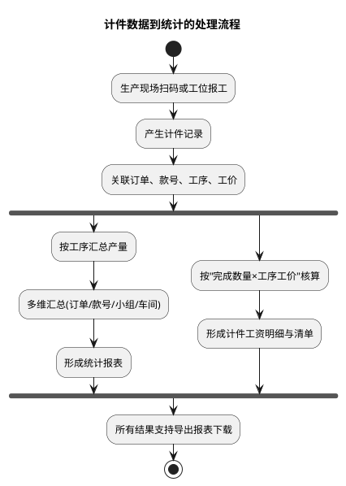
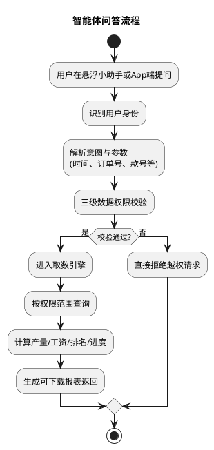

# 工厂智能体（智能体小助手）需求与接口整合文档

> 整合来源：
> - `req.md`（产品需求，含核心流程、功能需求、非功能需求、待确认问题）
> - `api-list-todo.md`（接口列表及问题清单，含已确认问题结论）
> - `工厂智能体功能清单.md`（由「工厂智能体功能清单.xlsx」转换，11 个模块共 46 个功能点）
>
> 编制日期：2026-08-21　|　状态：供内部评审与待确认项对齐使用

---

## 1. 项目概述

### 1.1 背景

工厂 MES 系统已积累大量计件报工数据，但员工查产量工资、管理查订单进度、老板看全厂经营情况都需要进入多层菜单筛选，效率低且学习成本高。同时数据权限分散在各业务模块。

### 1.2 产品目标

1. 通过自然语言智能体，让三类角色（员工/管理/老板）一句话查到自己权限范围内的产量、工资、进度与排名数据。
2. 统一三级数据权限收口，所有查询必经数据权限校验。
3. 查询结果可一键导出 Excel。
4. 以悬浮小助手 + App 端双入口形式接入，不改变系统主流程。

### 1.3 范围说明

基于 MES 系统数据的三级角色智能体问答（订单/款号进度查询、多维产量汇总、工资、员工收入排名）、报表下载导出、三级账户与数据权限体系、数据库表结构设计、智能体接入方式、部署与数据安全。

---

## 2. 用户角色与数据权限

### 2.1 角色定义

| 角色 | 数据范围 | 典型使用场景 |
| :--- | :--- | :--- |
| 员工 | 仅本人 | 查当日/当月/自定义日期范围本人产量、当日/当月收入明细、工资明细、组内收入排名 |
| 管理 | 管辖车间/小组及下级 | 按日期查询订单/款号进度与产量、各小组/车间产量对比、管辖员工工资清单（包括自己的） |
| 老板 | 全厂 | 看所有订单进度、车间产量与量产情况、全厂工资、任一员工工资明细 |

### 2.2 三级数据权限模型

权限校验在智能体取数引擎前统一执行，生成带数据范围条件的 SQL 后再查询：

1. **仅本人（员工）**：当前登录用户
2. **本组织及员工（管理）**：覆盖本人及管辖的车间/小组员工
3. **全厂（老板）**：数据全覆盖查询

配套机制（功能清单「数据权限体系」模块）：

- 智能体取数前统一执行权限校验再查询（权限校验引擎）
- 越权请求直接拒绝并给出友好提示，引导用户查询其权限范围内的数据（越权拦截与提示）
- 智能体只读，不写入任何业务数据；报表生成与下载走独立的报表存储

---

## 3. 核心业务流程

### 3.1 计件数据到统计的处理流程

### 3.2 智能体问答流程

---

## 4. 功能总览（11 个模块 / 46 个功能点）

### 4.1 模块概览

| 功能模块 | 功能点数 | 主要内容 |
| :--- | ---: | :--- |
| 智能体（员工端） | 4 | 个人产量统计、工资查询/明细、收入排名 |
| 智能体（管理端） | 4 | 订单/款号进度与产量查询、小组/车间对比、员工工资清单 |
| 智能体（老板端） | 4 | 订单进度总览、车间产量总览、全厂工资、员工工资查询 |
| 报表下载 | 2 | 报表导出功能、报表命名规则 |
| 数据权限体系 | 3 | 三级权限模型、权限校验引擎、越权拦截与提示 |
| 智能体问答引擎 | 4 | 意图识别与参数解析、追问式参数补全、多轮上下文记忆、结果计算与聚合 |
| PC端悬浮助手 | 11 | 浮标、对话面板、快捷问题、文本/语音输入、结果卡片、导出、历史收藏、大字模式 |
| App端悬浮助手 | 5 | 移动端浮标、对话面板、语音输入、结果卡片、报表保存 |
| 交互增强功能 | 2 | 异常数据自动高亮、权限不足友好提示 |
| 数据安全 | 3 | 数据隔离、敏感数据防护、审计日志 |
| 系统架构与集成 | 4 | 统一 API 网关、智能体服务、MES 系统对接、报表存储 |

### 4.2 功能明细

#### 智能体（员工端）

| 序号 | 功能点 | 功能描述 |
| ---: | :--- | :--- |
| 1 | 个人产量统计 | 支持按当日/当月/自定义日期范围查询本人产量，包含款号、工序、完成数量、合格数量、次品数量等字段 |
| 2 | 个人工资查询 | 按当日/当月统计本人计件工资合计、计件件数、日均工资 |
| 3 | 个人工资明细 | 按日期、款号、工价单价、完成数量、小计金额展示工资计算明细 |
| 4 | 收入排名 | 查询本人在所在小组内的收入排名，包含本人排名、金额、组内总人数 |

#### 智能体（管理端）

| 序号 | 功能点 | 功能描述 |
| ---: | :--- | :--- |
| 5 | 订单/款号进度查询 | 按订单号或款号查询生产进度，包含当前工序、已完成工序、在制数量、完工数量、进度百分比 |
| 6 | 订单/款号产量查询 | 按时间范围查询指定订单/款号各工序产量、合计产量、参与人数 |
| 7 | 小组/车间产量对比 | 多小组/车间产量横向对比，包含总产量、人均产量、达成率、名次 |
| 8 | 员工工资清单 | 按管辖范围导出员工工资清单，包含员工、所属小组、计件件数、工资合计 |

#### 智能体（老板端）

| 序号 | 功能点 | 功能描述 |
| ---: | :--- | :--- |
| 9 | 各订单进度总览 | 全厂所有订单进度汇总，包含订单号、款号、客户、下单量、完工量、当前工序、进度、交期预警 |
| 10 | 车间产量总览 | 全厂各车间产量与量产情况统计，包含车间、款号、款式、计划量、完成量、量产状态 |
| 11 | 全厂工资统计 | 全厂工资汇总，按车间/小组维度展示应发合计、在册人数、人均工资 |
| 12 | 员工工资查询 | 查询全厂任一员工工资合计、计件件数及详细工资明细 |

#### 报表下载

| 序号 | 功能点 | 功能描述 |
| ---: | :--- | :--- |
| 13 | 报表导出功能 | 每类问答结果支持一键导出 Excel 报表，在对话结果卡片中点击导出按钮下载 |
| 14 | 报表命名规则 | 报表文件按「角色_功能_时间范围_生成时间」规则自动命名 |

#### 数据权限体系

| 序号 | 功能点 | 功能描述 |
| ---: | :--- | :--- |
| 15 | 三级数据权限模型 | 员工（仅本人）、管理（管辖范围）、老板（全厂）三级数据范围定义 |
| 16 | 权限校验引擎 | 智能体取数前统一执行权限校验再查询 |
| 17 | 越权拦截与提示 | 越权请求直接拒绝并给出友好提示，引导用户查询其权限范围内的数据 |

#### 智能体问答引擎

| 序号 | 功能点 | 功能描述 |
| ---: | :--- | :--- |
| 18 | 意图识别与参数解析 | 解析用户自然语言中的查询意图及时间、订单号、款号、小组等参数 |
| 19 | 追问式参数补全 | 缺少必要参数时主动追问用户，引导式完成查询条件补全 |
| 20 | 多轮上下文记忆 | 支持上下文指代追问，如「换成上个月的」「看二车间的」 |
| 22 | 结果计算与聚合 | 产量、工资、排名、进度等结果计算与多维度聚合 |

#### PC端悬浮助手

| 序号 | 功能点 | 功能描述 |
| ---: | :--- | :--- |
| 23 | 悬浮浮标 | 右下角可拖拽圆形浮标，默认最小化不遮挡主操作区 |
| 24 | 对话面板 | 点击浮标展开对话面板，支持展开/收起切换 |
| 25 | 角色信息展示 | 面板顶部显示当前登录用户名称角色（员工/管理/老板） |
| 26 | 对话消息区 | 对话历史展示，支持文本消息与结果卡片混排 |
| 27 | 角色化快捷问题 | 按角色动态展示 4-6 个常用问法按钮，一键发起查询 |
| 28 | 文本输入 | 底部输入框支持自然语言文本输入 |
| 29 | 语音输入 | 支持语音转文字输入查询 |
| 30 | 结果卡片展示 | 查询结果以结构化卡片形式呈现，含关键数字与表格 |
| 31 | 导出报表按钮 | 结果卡片内置导出按钮，点击直接下载 Excel |
| 32 | 历史记录与收藏 | 查询历史记录展示，支持高频查询收藏与一键复问 |
| 33 | 大字模式 | 适配年长员工的大字显示模式切换 |

#### App端悬浮助手

| 序号 | 功能点 | 功能描述 |
| ---: | :--- | :--- |
| 34 | 移动端悬浮图标 | App 端悬浮小助手入口图标 |
| 35 | 移动端对话面板 | 移动端适配的对话面板，单列布局 |
| 36 | 移动端语音输入 | 移动端优化的语音输入功能 |
| 37 | 移动端结果卡片 | 移动端单列展示的结果卡片 |
| 38 | 报表下载保存 | 报表下载后可保存到手机本地 |

#### 交互增强功能

| 序号 | 功能点 | 功能描述 |
| ---: | :--- | :--- |
| 39 | 异常数据自动高亮 | 交期临近、产量不达标等异常数据自动标红高亮 |
| 42 | 权限不足友好提示 | 越权查询时不直接报错，说明权限范围并推荐可查询内容 |

#### 数据安全

| 序号 | 功能点 | 功能描述 |
| ---: | :--- | :--- |
| 43 | 数据隔离 | 智能体只读账号仅能访问授权租户数据，多租户数据隔离 |
| 44 | 敏感数据防护 | 工资明细等敏感原始数据不直接传入大模型，仅传聚合结果或字段名 |
| 46 | 审计日志 | 所有查询与报表下载行为记录审计日志，保留不少于 180 天 |

#### 系统架构与集成

| 序号 | 功能点 | 功能描述 |
| ---: | :--- | :--- |
| 47 | 统一 API 网关 | 接入 API 网关，路由分发请求 |
| 48 | 智能体服务 | 独立智能体服务，处理问答逻辑、权限校验、取数计算 |
| 49 | MES 系统对接 | 通过 API 接口对接 MES 系统数据库，读取计件、订单、工资等数据 |
| 50 | 报表存储 | 独立报表存储服务，历史导出文件不丢失 |

> 注：序号 21、41、45 在原表中缺失（原表跳号），已按原样保留，详见 11.3 节 Q19。

---

## 5. 分角色核心问答功能（含示例提问与输出字段）

### 5.1 员工端

| 功能 | 示例提问 | 输入参数 | 输出报表字段（仅供参考） | 数据范围 | 备注 |
| :--- | :--- | :--- | :--- | :--- | :--- |
| 个人产量统计 | 我今天/这个月做了多少件 | 时间（当日/当月/自定义）、本人 ID | 日期、款号、工序、完成数量、合格数量、次品数量 | 仅本人 | ① 字段数据是否可直接从系统获取？获取不到的需提供计算规则；② 不同款号/订单计价方式不同时需给出计算规则 |
| 个人工资（当日/当月） | 我这个月工资多少钱 | 时间、本人 ID | 统计区间、计件工资合计、计件件数、日均工资 | 仅本人 | |
| 个人工资明细 | 我这个月工资是怎么算的 | 时间、本人 ID | 日期、款号、工价单价、完成数量、小计金额 | 仅本人 | |
| 收入排名 | 我在小组里排第几 | 时间、本人 ID、所在小组 | 本人排名、本人金额、组内总人数、组内排名 | 仅本人 | |

### 5.2 管理端

| 功能 | 示例提问 | 输入参数 | 输出报表字段 | 数据范围 | 备注 |
| :--- | :--- | :--- | :--- | :--- | :--- |
| 订单/款号进度查询 | 这个订单现在做到哪道工序了，进度如何 | 时间、订单号或款号 | 订单号、款号、当前工序、已完成工序、订单进度、在制数量、完工数量、进度百分比 | 管辖车间/小组 | ① 订单号和计划单号的关系？进度计算方式？② 达成率等数据能否获取？③ 管理角色数据查看范围确认 |
| 订单/款号产量查询 | 这个款这周做了多少产量 | 时间、订单号或款号 | 订单号、款号、各工序产量、合计产量、参与人数 | 管辖车间/小组 | |
| 小组/车间产量对比 | 各小组这个月产量对比一下 | 时间、小组或车间清单 | 小组/车间总产量、人均产量、达成率、名次 | 管辖车间/小组 | |
| 员工工资清单 | 这个月我们组每人工资清单 | 时间、小组或车间 | 员工、所属小组、计件件数、工资合计表 | 管辖范围内员工 | |

### 5.3 老板端

| 功能 | 示例提问 | 输入参数 | 输出报表字段 | 数据范围 | 备注 |
| :--- | :--- | :--- | :--- | :--- | :--- |
| 各订单进度 | 所有订单现在进度怎么样 | 时间 | 订单号、款号、客户、下单量、完工量、当前工序、进度百分比、交期预警 | 全厂 | 系统有无预警值，晚于计划完成时间多少天后提示预警 |
| 车间产量总览 | 整个车间这个月产量和量产情况 | 时间、款式（可选） | 车间、款号、款式、计划量、完成量、量产状态（试产/量产） | 全厂 | |
| 全厂工资 | 这个月整个厂工资发多少 | 时间 | 车间/小组、本月工资应发合计、在册人数、人均工资 | 全厂 | |
| 员工工资查询 | 某某这个月工资和明细 | 时间、员工 | 员工、工资合计、计件件数；明细：日期、款号、工序、单价、数量、小计 | 全厂任一员工 | 需结合数据库表情况 |

### 5.4 报表下载

- 每一类问答结果都对应一份结构化报表，用户在对话结果卡片上点击「导出」即可下载。
- 报表格式支持 Excel，文件按「角色_功能_时间范围_生成时间」命名。
- 本期只做报表导出，不提供图表可视化。
- 报表存储独立，历史导出文件不丢失；导出文件智能体侧保留 3 个月（已确认足够）。

---

## 6. 数据接口要求

### 6.1 对接方式说明

- 所有接口均为**只读查询接口**，智能体不写入任何数据，查询前统一经过三级数据权限校验。
- 数据由 MES 方**通过接口提供**（已确认，不直接开放数据库）。
- 下表所列输出字段仅作示例，实际获取到的数据以客户提供的数据字段为准。

### 6.2 用户认证与权限接口（4 个）

| 接口 | 用途 | 输入 | 输出字段（示例） | 适用角色 |
| :--- | :--- | :--- | :--- | :--- |
| 获取当前登录用户信息 | 识别用户身份，确定角色与管辖范围 | 无 | 用户 ID、姓名、角色（员工/管理/老板）、所属小组 ID、所属车间 ID、管辖小组 ID 列表、管辖车间 ID 列表 | 全部 |
| 校验用户数据权限 | 判断用户是否有权访问指定数据范围 | 用户 ID、目标数据范围类型（本人/小组/车间/全厂）、目标组织 ID | 可访问的数据过滤条件 | 全部 |
| 获取用户管辖范围 | 获取管理/老板角色可管辖的组织结构 | 用户 ID | 管辖小组 ID 列表、管辖车间 ID 列表、管辖员工 ID 列表 | 管理 / 老板 |
| 获取用户所在组织信息 | 获取员工所在小组/车间 | 用户 ID | 所属小组 ID、小组名称、所属车间 ID、车间名称 | 全部 |

### 6.3 计件产量业务接口（9 个）

| 接口 | 用途 | 输入 | 输出字段（示例） | 适用角色 |
| :--- | :--- | :--- | :--- | :--- |
| 查询个人产量 | 查询当前员工本人产量（日/月/自定义） | 用户 ID、开始日期、结束日期 | 日期、款号、工序名称、完成数量、合格数量、次品数量 | 仅本人 |
| 查询个人按款号汇总产量 | 按款号维度汇总本人产量 | 用户 ID、开始日期、结束日期、款号（可选） | 款号、合计完成数量、合计合格数量、合计次品数量 | 仅本人 |
| 查询订单/款号产量 | 查询指定订单或款号的各工序产量 | 订单号或款号、开始日期、结束日期 | 订单号、款号、工序名称、各工序产量、合计产量、参与人数 | 管理 / 老板 |
| 查询款号产量趋势 | 查询指定款号每日/周产量趋势 | 款号、开始日期、结束日期、统计粒度（日/周） | 日期、当日产量、累计产量、目标产量、达成率 | 管理 / 老板 |
| 查询小组产量对比 | 对比各小组产量及达成情况 | 开始日期、结束日期、车间 ID（可选） | 小组名称、总产量、人均产量、计划产量、达成率、名次 | 管理 / 老板 |
| 查询车间产量对比 | 对比各车间产量及达成情况 | 开始日期、结束日期 | 车间名称、总产量、人均产量、计划产量、达成率、名次 | 管理 / 老板 |
| 查询全厂产量总览 | 全厂各车间产量与量产状态 | 开始日期、结束日期、款式（可选） | 车间名称、款号、计划量、完成量、量产状态（试产/量产）、达成率 | 老板 |
| 查询全厂每日产量趋势 | 全厂及各车间每日产量趋势 | 开始日期、结束日期 | 日期、全厂总产量、各车间产量、环比增长率 | 老板 |
| 查询小组/车间产量明细 | 查询指定组织单元每日产量明细 | 开始日期、结束日期、小组 ID 或车间 ID | 日期、款号、工序、完成数量、合格数量 | 管理 / 老板 |

### 6.4 订单/款号进度接口（6 个）

| 接口 | 用途 | 输入 | 输出字段（示例） | 适用角色 |
| :--- | :--- | :--- | :--- | :--- |
| 查询订单进度 | 查询指定订单的工序进度详情 | 订单号 | 订单号、款号、客户、下单量、当前工序、已完成工序数/总工序数、在制数量、完工数量、进度百分比、计划完成日期 | 管理 / 老板 |
| 查询款号进度 | 查询指定款号关联的订单进度 | 款号 | 款号、关联订单号列表、当前工序、完工数量、进度百分比 | 管理 / 老板 |
| 查询管辖范围内所有订单进度 | 批量查询管辖小组/车间所有订单进度 | 开始日期、结束日期、小组 ID 或车间 ID | 订单号、款号、客户、下单量、完工量、当前工序、进度百分比 | 管理 |
| 查询全厂所有订单进度 | 查看全厂所有订单进度总览 | 开始日期、结束日期 | 订单号、款号、客户、下单量、完工量、当前工序、进度百分比、交期预警状态 | 老板 |
| 查询交期预警订单 | 查询即将延期或已延期的订单 | 预警天数阈值、日期（可选） | 订单号、款号、客户、计划完成日期、当前进度、延期天数、预警等级 | 管理 / 老板 |
| 查询订单进度明细（工序级） | 查询指定订单各工序完成详情 | 订单号 | 工序名称、工序顺序、完成状态、计划完成时间、实际完成时间、负责人 | 管理 / 老板 |

### 6.5 工资查询接口（9 个）

| 接口 | 用途 | 输入 | 输出字段（示例） | 适用角色 |
| :--- | :--- | :--- | :--- | :--- |
| 查询个人工资汇总 | 查询本人工资合计（日/月/自定义） | 用户 ID、开始日期、结束日期 | 统计区间、计件工资合计、计件件数、日均工资 | 仅本人 |
| 查询个人工资明细 | 查询本人工资明细清单 | 用户 ID、开始日期、结束日期 | 日期、款号、工序名称、工价单价、完成数量、小计金额 | 仅本人 |
| 查询个人按工序工资明细 | 按工序维度查询本人工资 | 用户 ID、开始日期、结束日期、工序 ID（可选） | 工序名称、完成数量、工价单价、小计金额 | 仅本人 |
| 查询管辖员工工资清单 | 查询管辖范围内所有员工工资 | 开始日期、结束日期、小组 ID 或车间 ID | 员工姓名、所属小组、计件件数、工资合计 | 管理 |
| 查询管辖员工工资明细 | 查询管辖范围内指定员工工资明细 | 员工 ID、开始日期、结束日期 | 日期、款号、工序、工价单价、完成数量、小计金额 | 管理 |
| 查询管辖范围内工资汇总 | 按小组汇总管辖范围内工资 | 开始日期、结束日期、车间 ID | 小组名称、在册人数、计件总件数、工资合计、人均工资 | 管理 |
| 查询全厂工资汇总 | 按车间/小组维度汇总全厂工资 | 开始日期、结束日期 | 车间/小组名称、工资应发合计、在册人数、人均工资 | 老板 |
| 查询任一员工工资汇总 | 查询指定员工的工资合计 | 员工 ID、开始日期、结束日期 | 员工姓名、所属小组/车间、工资合计、计件件数 | 老板 |
| 查询任一员工工资明细 | 查询指定员工的工资明细 | 员工 ID、开始日期、结束日期 | 日期、款号、工序名称、工价单价、完成数量、小计金额 | 老板 |

### 6.6 收入排名接口（6 个）

| 接口 | 用途 | 输入 | 输出字段（示例） | 适用角色 |
| :--- | :--- | :--- | :--- | :--- |
| 查询个人组内收入排名 | 查询员工在所在小组的收入排名 | 用户 ID、开始日期、结束日期 | 本人排名、本人金额、组内总人数、组内最高/最低/平均金额 | 仅本人 |
| 查询个人组内产量排名 | 查询员工在所在小组的产量排名 | 用户 ID、开始日期、结束日期 | 本人排名、本人产量、组内总人数、组内最高/最低/平均产量 | 仅本人 |
| 查询管辖员工工资排名 | 查询管辖范围内员工按工资排名 | 开始日期、结束日期、小组 ID 或车间 ID | 排名、员工姓名、所属小组、计件件数、工资合计 | 管理 |
| 查询管辖员工产量排名 | 查询管辖范围内员工按产量排名 | 开始日期、结束日期、小组 ID 或车间 ID | 排名、员工姓名、所属小组、完成数量、合格数量 | 管理 |
| 查询全厂员工工资排名 | 查询全厂员工工资排名（Top N） | 开始日期、结束日期、Top N（可选） | 排名、员工姓名、所属小组/车间、工资合计 | 老板 |
| 查询小组/车间排名 | 按总产量或人均产量对组织单元排名 | 开始日期、结束日期、排名指标（总产量/人均产量） | 排名、小组/车间名称、总产量、人均产量、达成率 | （未标注，推测管理/老板，见 Q17） |

**接口汇总：共 5 组 34 个只读接口。**

---

## 7. 交互与界面设计

### 7.1 系统接入位置

整体接入位置在 MES 前端页面层之上，以「悬浮小助手」浮窗形态出现；不直接写业务数据。报表生成与下载走独立的报表存储。

### 7.2 PC 端悬浮小助手

悬浮小助手以右下角可拖拽的圆形浮标形式存在于 MES 各业务页面，点击展开对话面板。面板顶部显示当前登录角色（员工/管理/老板），中部为对话区，支持文本输入与常用快捷问题（如「今日产量」「本月工资」「订单进度」），底部为输入框与语音入口。回答结果以对话框卡片呈现，包含关键数字与「导出报表」按钮，点击直接下载 Excel。浮窗默认最小化，不遮挡系统主操作区。

### 7.3 App 端小助手

移动 App 端以悬浮小助手图标呈现。针对移动端做适配：输入区支持语音输入，结果卡片单列展示，报表下载后可保存到本地。登录体系同 PC 端。

### 7.4 小助手交互增强点

**输入侧：**

1. 角色化快捷问题：按员工/管理/老板动态展示 4-6 个常用问法按钮，点一下即可查询
2. 语音输入：提供语音输入支持
3. 追问式补全参数：只说「查产量」没带时间/款号或小组/车间时，智能体根据用户角色主动问缺失条件，引导式完成查询

**结果侧：**

1. 异常数据自动高亮：交期近、产量不达标的自动标红
2. 历史记录 + 收藏查询：高频查询支持收藏，一键复问
3. 多轮上下文记忆：支持「换成上个月的」「看二车间的」这类同类问题指代追问
4. 每日早报推送：早 8 点自动推昨日产量/工资摘要（注意：未列入功能清单，见 Q09）
5. 当月工资收入：每月出账自动推给员工（注意：未列入功能清单，见 Q09）

**其他：**

1. 权限不足友好提示：越权不直接报错，告诉权限不足，再提示当前用户能查什么
2. 大字模式：适配年长员工
3. 可补充

---

## 8. 非功能需求

### 8.1 数据安全

- **数据隔离**：智能体只读账号仅能访问其授权租户的数据。
- **三级行级权限**：在租户隔离基础上叠加角色级行权限，权限校验在智能体取数引擎前统一执行。
- **传输与访问安全**：对用户问题做敏感词与越权意图检测，不把工资明细等敏感原始数据直接送进大模型，只传聚合结果或结构化字段名。
- **审计与日志**：所有智能体查询与报表下载行为记录审计日志，包含用户、角色、时间、查询意图、数据范围、导出文件标识，保留不少于 180 天，支持事后追溯。

### 8.2 性能要求

1. 常规问答响应时间（指标未量化，见 Q14）
2. 报表导出生成时间（指标未量化，见 Q14）
3. 热点查询结果走 Redis 缓存

### 8.3 可用性

1. 系统整体可用性 ≥ 99.9%
2. 数据库主从切换
3. 报表存储不丢失历史导出文件

---

## 9. 系统架构与集成

| 组成 | 说明 |
| :--- | :--- |
| 统一 API 网关 | 接入 API 网关，路由分发请求 |
| 智能体服务 | 独立智能体服务，处理问答逻辑、权限校验、取数计算 |
| MES 系统对接 | 通过 API 接口对接 MES 系统，读取计件、订单、工资等数据（只读，不直接开放数据库） |
| 报表存储 | 独立报表存储服务，历史导出文件不丢失，保留 3 个月 |

数据链路：生产现场扫码/工位报工 → 计件记录（关联订单、款号、工序、工价）→ 分流：按工序汇总产量 / 多维汇总（订单/款号/小组/车间）→ 统计报表；按「完成数量 × 工序工价」核算 → 计件工资明细与清单 → 所有结果支持导出报表下载。智能体基于上述数据经 MES 只读接口取数问答。

---

## 10. 已确认问题及结论

| # | 问题 | 结论 | 遗留跟进 |
| ---: | :--- | :--- | :--- |
| 1 | 系统是否已分级对应角色，三级用户是否已分好组别，有无一人同属 2 组或跨组权限不同的情况 | 【已有】系统已具备 | 无 |
| 2 | 订单进度是否已通过系统体现 | 【已有】系统已体现 | 无 |
| 3 | 工资/进度/产量数据是否同一数据库来源，是否开放数据库 | 【提供接口】不开放数据库，由 MES 整理库表后通过接口对接 | 需 MES 提供接口文档、字段字典与联调环境（原「数据库表结构」章节即以此替代） |
| 4 | 系统是否有进度结果，无则进度百分比计算逻辑（工序数平均 vs 工价/工时加权、并行工序取值、同款号不同工序流） | 【直接获取】系统有进度数值可直接获取 | 需确认系统进度数值的覆盖范围（跨订单同款号等场景是否均覆盖） |
| 5 | 数据量级多大，自定义日期查询跨度限制（半年内是否可以） | 【百万级】除订单进度外，其他维度可做日期跨度查询限制 | 具体限制值未明确（见 Q16） |
| 6 | 导出文件智能体保留 3 个月是否足够 | 【足够】 | 无 |
| 7 | 数据统计时间以 0 点/自然日/自然月为准是否可以 | 【大部分自然月，也有自定义时间，需支持自定义查询】 | 无 |

---

## 11. 待确认问题与疑问点

### 11.1 功能层面遗留（来源：req.md 功能表备注，尚未在确认清单中闭环）

| 编号 | 疑问点 | 涉及 | 建议 |
| :--- | :--- | :--- | :--- |
| Q01 | 产量统计的字段（如次品数量等）能否全部由系统直接获取？获取不到的字段需 MES 提供计算规则 | 员工端 | 与 MES 逐字段确认，形成「字段来源/计算规则」对照表 |
| Q02 | 不同款号/订单计价方式不同（阶梯价、加成等）时，计件工资的计算与展示规则需给出 | 员工端 | MES 提供计价规则说明或规则接口 |
| Q03 | 订单号与计划单号的关系（一对一/一对多）；自然语言中用户说的是哪个号；进度已确认「直接获取」，但两号口径需在接口层对齐 | 管理端 | MES 给出编号关系说明；意图解析层支持两种号 |
| Q04 | 计划产量/计划量/达成率等字段的数据来源（计划单/排产模块）能否稳定获取 | 管理端/老板端 | 接口输出已含达成率、计划量，需 MES 确认数据源与更新时效 |
| Q05 | 管理角色查看范围最终确认：管辖车间/小组及下级，是否含本人数据（功能清单注明「包括自己的」） | 管理端 | 与业务方书面确认口径 |
| Q06 | 交期预警：系统是否已有预警值？晚于计划完成时间多少天提示预警？「查询交期预警订单」接口的「预警天数阈值」由谁维护（系统配置 or 每次传入） | 老板端/接口 | 明确阈值配置方与默认值 |
| Q07 | 老板端「员工工资查询」原备注「需结合数据库表情况」，现改为接口对接，输出字段需按接口字段逐项核对 | 老板端 | 接口联调时核对 |

### 11.2 需求 ↔ 接口 ↔ 功能清单交叉核对发现的新问题

| 编号 | 疑问点 | 说明 | 建议 |
| :--- | :--- | :--- | :--- |
| Q08 | **报表导出接口缺失** | 接口清单 34 个接口全部是数据查询接口，没有「报表生成/下载」接口；但功能清单要求报表独立存储、自动命名、保留 3 个月，架构上有「报表存储服务」 | 明确方案：前端基于查询结果拼装导出，还是后端报表服务生成并提供下载链接？如是后者需补充接口定义 |
| Q09 | **推送类功能未定义** | 「每日早报推送」（早 8 点推昨日产量/工资摘要）与「当月工资出账推送」在 req.md 交互增强点中，但功能清单未列入，且推送渠道（App 推送/站内信/短信？）、「出账」时间点与数据来源均未定义 | 确认本期是否纳入；如纳入需补功能点、推送渠道接口与出账时点 |
| Q10 | **历史记录与收藏的存储方案** | 「历史记录与收藏」在功能清单中，但未说明存智能体侧（需自有存储）还是依赖 MES；收藏需跨端持久化 | 明确归属与数据结构（建议智能体侧自建） |
| Q11 | **接口认证与协议约定缺失** | 「获取当前登录用户信息」输入为「无」，当前登录身份如何传递（MES 前端透传 token/session？）未说明；接口清单停留在字段级，缺认证方式、错误码、分页/排序、限流等协议细节 | 联调前与 MES 约定接口协议规范 |
| Q12 | **工资数据口径** | 接口均为「计件工资」口径，但老板端「应发合计」通常含非计件项（底薪/津贴/扣款）；「工资应发合计」到底是计件口径还是全工资口径需确认 | 与 MES/财务确认口径；如为全工资口径需接口覆盖完整工资单 |
| Q13 | **租户模型** | 数据安全要求「租户隔离」「授权租户数据」，但所有接口输入均无租户参数；MES 是单租户还是多租户？ | 如多租户，全部接口需带租户上下文 |
| Q14 | **性能指标未量化** | 「常规问答响应时间」「报表导出生成时间」无目标值，无法验收；Redis 缓存策略（命中条件、过期、失效）也未设计 | 给出 SLA 数值（如 P95 ≤ x 秒）并补充缓存设计 |
| Q15 | **数据量级细节** | 已确认「百万级」，但未说明是累计计件明细量还是近 12 个月量，影响查询性能与缓存策略设计 | MES 提供分表/分时间段的量级说明 |
| Q16 | **日期跨度限制规则** | 已确认「除订单进度外可做日期跨度限制」，但具体限制值（半年内？）未落为明确规则，超限时的交互提示话术也未定义 | 明确限制值并写入产品规则 |
| Q17 | **接口清单小问题** | 「查询小组/车间排名」接口未标注适用角色（推测管理/老板） | MES 补充标注 |

### 11.3 文档与评估缺口

| 编号 | 疑问点 | 说明 | 建议 |
| :--- | :--- | :--- | :--- |
| Q18 | 接口文档未提供 | 数据对接方式已确认「提供接口」，但接口文档、字段字典、联调环境均未交付 | 作为对接前置条件向 MES 提出 |
| Q19 | 功能清单序号跳号 | 序号缺失 21、41、45（20→22、40→42、44→46、46→47），疑似删行残留 | 与需求方确认是否有意删除 |
| Q20 | 工时评估空缺 | 功能清单中「产品/UI/前端/后端/测试预计用时」与「备注」列全部为空，工作量尚未评估 | 待第 11.1、11.2 节问题确认后补充排期 |

---

## 12. 附录：源文档

| 文档 | 内容 | 在本整合文档中的对应章节 |
| :--- | :--- | :--- |
| `req.md` | 产品需求：背景、目标、角色权限、流程、分角色功能、非功能需求、待确认问题 | 1、2、3、5、7、8、10、11.1 |
| `api-list-todo.md` | 已确认问题结论 + 5 组 34 个只读接口 | 6、10、11.2 |
| `工厂智能体功能清单.md`（源自 `工厂智能体功能清单.xlsx`） | 11 模块 46 功能点 | 4、9、11.3 |

