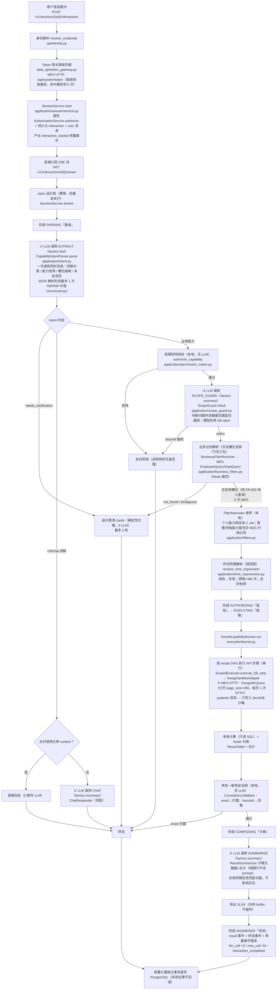

# Factory Agent 链路梳理与优化方案

> 面向对象：研发/联调同学。目的：讲清一条用户 query 从进入到返回的完整链路、各环节调用与耗时、时间参数解析的 LLM 化改造方案，以及代码/配置定位索引。
> 证据约定：所有结论标注代码位置（文件 + 类/函数）；耗时数字除注明「实测来源」外均为量级估算，真实耗时以任务二给出的取数方式查询为准。

---

## 任务一：链路请求流程图

### 1.1 主链路（业务查询，以 FR-003 个人工资明细为例）



> 时序要点：`authorize` 在 `start()` 与 `stream()` 各执行一次（`session/service.py` `start` / `stream`），token 网关按 `(tenant, user)` 缓存凭据包（`token_gateway.py:96` authenticate），缓存命中时除主动续期外不再打 MES。

### 1.2 四种角色的链路差异

四种角色走**同一条**主链路，差异集中在 4 个分支点：

| 分支点 | 位置 | 00 员工 | 01 组长 | 02 管理 | 99 老板 |
|---|---|---|---|---|---|
| 能力选择后：权限矩阵 | `permission_matrix.py` `CAPABILITY_ROLES` | FR-001~004 | FR-001~008 | FR-001~008 | FR-001~012（全量） |
| 矩阵通过后：范围护栏（LLM） | `scope_guard.py` `SCOPE_GUARD_SYSTEM_PROMPT`（role + 可查范围文本进 prompt） | 提问涉及全组/全厂/同事 → beyond 拒绝 | 其他组/部门 → beyond | 非管辖部门 → beyond | 仅全厂范围，全部 within |
| 执行前：过滤绑定 | `session/pipeline.py` `_pipeline`（`is_personal` / `is_any_employee` 分支） | 个人能力强制绑定本人 `employee_ids={self}` | 管理类能力 `employee_ids` 留空，交 MES 行级过滤 | 同左 | FR-012 可经目录解析点名的员工（仍由 MES 裁决可见性） |
| 返回后：一致性安全网 | `consistency.py`，模式由 `FACTORY_AGENT_VALIDATION_MODE` 控制 | expected range = 本人 | 本组 | 本部门 | 全厂 |

角色本身来自 token 响应（客户确认口径），在 `token_gateway.py` `_principal_from_bundle` 落成 `TenantContext.role`，全链路只读该权威值。

---

## 任务二：链路追踪与耗时分析（以「帮我查一下我这个月的工资明细」为例）

### 2.1 LLM 调用次数与职责

正常成功路径：**3 次 LLM 调用**（均经 LiteLLM Router，`llm/router_gateway.py`，当前三别名同一自建 Qwen3.8 端点，`configs/knowledge/models.yaml`）。

| # | stage（ModelStage） | 别名 | 职责 | 代码位置 |
|---|---|---|---|---|
| 1 | `extract` | factory-fast | 意图+参数一次合并：闲聊分类 / 12 能力选择 / 槽位（时间、款号、员工名等）/ 多轮改写 rewrite_query；JSON 输出 | `application/intent.py` `CapabilityIntentParser.parse`；SYSTEM_PROMPT 定义于同文件 |
| 2 | `scope_guard` | factory-summary | 判断问题所求数据范围是否越出角色范围，输出 `{verdict, target}`；失败 fail-open 不阻塞 | `application/scope_guard.py` `ScopeGuard.check` |
| 3 | `summarize` | factory-summary | 用结果元数据 + 合计组织一句中文回答（≤120 字）；失败回退 `fallback_result_answer` | `application/summary.py` `ResultSummarizer.summarize` |

额外/异常路径的 LLM 调用：
- **REPAIR**：第 1 次调用输出不是合法 JSON 时补打 1 次（`application/structured.py` `request_structured_object`，`FACTORY_AGENT_LLM_MAX_REPAIR_ATTEMPTS` 默认 1）。
- **CHAT**：合并调用未返回闲聊 content 时的兜底闲聊回复（`application/chitchat.py`），正常为 0 次。
- 澄清（clarify）路径为**确定性文案**，无 LLM（`intent.py` `clarification_for`）。

### 2.2 MES API 调用次数与用途

| 时机 | 接口 | 用途 | 次数 |
|---|---|---|---|
| 请求入口（身份解析） | `POST /api/system/token` | 加密 app_key 换 accessToken + 角色 + 绑定部门 | 0~1（缓存命中 0 次；token 2h 有效，临过期 5 分钟内主动续）`data_api/token_gateway.py` |
| 槽位含部门/员工名，或 token 未带绑定部门（降级） | `EmployeeQuery` / `DeptQuery` | 名称→ID 解析（全量花名册，Redis 缓存） | 0~2（本例「我这个月」无名称槽位，为 0）`application/business_filters.py`、`data_api/directory.py` |
| 业务取数 | `GongziMxQuery`（params：`scheme=""`、`Type="0,1,2"`、`Flag="0"`、`queryFooter="1"`、`dates/datee`、`Uid=本人`） | 工资明细行 | ⌈总行数/200⌉ 次 HTTP（`execution/kernel.py` KernelSettings.page_size=200；BoundedPager 翻页，`data_api/pagination.py`）+ 可能的 1 次凭据续期重试 |

**典型总数：3 次 LLM + 1~2 次 MES HTTP**（一个月明细行通常 <200，1 页取完；token 冷启动时 +1 次 token 交换）。

### 2.3 各环节耗时（按时间顺序）

> 系统不虚构耗时数字。下表「量级估算」列仅为本地自建 vLLM + 客户 MES 网络下的经验区间；**真实耗时用 2.5 节的 SQL/SSE 方式取实测值**。

| 顺序 | 节点 | 类型 | 量级估算 | 输入 → 输出摘要 |
|---|---|---|---|---|
| 1 | resolve_credential + token 交换 | MES HTTP | 缓存命中 <1ms；冷启动 50~300ms | 加密 app_key → 凭据包(角色/部门) |
| 2 | authorize + interaction 落库 | 本地 + PG | 5~30ms | TrustedCredential → TenantContext/DataScope + interaction 行 |
| 3 | SSE 建流 + claim | 本地 + PG | 5~20ms | CAS 认领运行权 |
| 4 | ① EXTRACT 意图解析 | **LLM** | 0.5~2s（含 history 压缩，最多 8 轮/8k 字符） | 问题+历史+能力目录 → CapabilityIntent(JSON) |
| 5 | 权限矩阵 | 本地 | <1ms | (capability, role) → allow/deny |
| 6 | ② SCOPE_GUARD | **LLM** | 0.3~1.5s（输出仅 1 个小 JSON） | 问题+能力标题+角色范围 → within/beyond |
| 7 | 业务过滤解析 | 本地 + MES | 本例 0；有名称槽位时 +1~2 次 MES（目录有 Redis 缓存） | 名称槽位 → dept/employee ID |
| 8 | 过滤收窄 + 时间解析 | 本地 | <1ms | 规则把「这个月」→ 半开 UTC TimeRange |
| 9 | ④ MES 取数（分页） | **MES HTTP** | 每页 10s 超时预算；内网/真实客户网络差异大，mock 本地典型 10~100ms/页 | dates/datee/Uid/Type… → 校验后的明细行 + footer |
| 10 | 沙箱注册 + 本地 SQL + 对账 | 本地（DuckDB） | <50ms | 明细行 → ResultTable + totals |
| 11 | 一致性校验 | 本地 | <10ms | 结果行 uid/dept 观察 vs expected range |
| 12 | ⑤ SUMMARIZE 组织答案 | **LLM** | 0.5~1.5s（输出 ≤120 字） | 元数据+合计 → 回答文本 |
| 13 | XLSX 导出（内存） | 本地 | <50ms | 结果表 → artifact_id |
| 14 | result/terminal 事件 + 用量落库 | PG | 5~30ms | 事件 + llm_call×3 + mes_call×N + interaction_completed |

**总量级：本地链路约 2~6s，其中 LLM 推理占绝对大头（3 次串行调用）。**

### 2.4 串行/并行与瓶颈

- **整条 pipeline 严格串行**：`SessionService._pipeline` 是单条 async 顺序流；唯一的多轮循环是澄清（每轮都是一次完整重跑）。
- recipe 层保留了 `parallel_group` 声明与 DAG 分组（`execution/dag.py` `_parallel_groups`），但生产 kernel 的 `_fetch_api_steps` 按 recipe 步骤顺序**逐个 await**（`kernel.py` `for step in recipe.steps`），多 API 步骤/多页 fan-out 目前是串行 HTTP。
- **瓶颈排序**：① 3 次串行 LLM 往返（EXTRACT→SCOPE_GUARD→SUMMARIZE，占 70~90%）→ ② MES 分页（行数大时线性增长）→ ③ PG 每阶段事件提交（阶段事件逐条 commit）。
- 明确的优化点（按收益排序）：
  1. **SCOPE_GUARD 合并进 EXTRACT**：两步输入高度重叠（同一个问题 + 角色），一次调用同时输出 `capability/slots/scope_verdict`，可省 0.3~1.5s（方案同任务三的合并思路，注意 guard 失败 fail-open 语义要保留）。
  2. SUMMARIZE 流式输出：SSE 已就绪，把 summarize 改为流式 token 直推前端，用户感知延迟可降 0.5s+。
  3. recipe 的 `parallel_group` 接入 kernel 并发执行（fan-out 场景如 FR-009 每订单一调，收益随订单数线性放大）。
  4. 事件批量提交：`_phase` 每阶段一次 commit，可合并为关键节点提交。

### 2.5 链路追踪能力现状与取数方式

**现状：有「关联 ID + 结构化耗时事件」的追踪，无 OpenTelemetry**（这是 ADR-0004 的明确决策：当前规模不引入 OTel SDK/Collector，保留兼容接入点）。

三个现成取数入口：

1. **usage_event 表（最完整）**——每次交互落库：`interaction_started` / `llm_call_completed`（stage、model_alias、actual_model、attempt、tokens、duration_ms）/ `mes_call_completed`（operation_id、page_count、row_count_bucket、duration_ms）/ `interaction_completed`（总 duration_ms、mes_duration_ms、result_rows_bucket、error_category）。所有事件共享同一 `trace_id`/`interaction_id`（`application/usage.py` UsageContext.envelope）。

   ```sql
   -- 某次交互的完整时间线
   SELECT occurred_at, event_type,
          payload->>'stage'        AS stage,
          payload->>'operation_id' AS operation,
          payload->>'duration_ms'  AS duration_ms,
          payload->>'status'       AS status
   FROM usage_event
   WHERE payload->>'interaction_id' = '<interaction_id>'
   ORDER BY occurred_at;
   ```

2. **SSE 阶段事件**——`agent_interaction_event` 表 / SSE 流中的 `interaction.phase` 事件自带 `stage`（接收/鉴权/取数/计算/完成）与 `duration_ms`（自运行起累计，`session/outcomes.py` `_phase`）。

3. **结构化日志**——loguru JSON 日志带 `request_id` / `interaction_id` / `operation_id` / `duration_ms` / `status`（ADR-0004 必备字段表；敏感字段红线同文档）。

**已知缺口（建议补齐）**：
- `interaction_completed` 的 `llm_duration_ms` / `local_duration_ms` 目前恒写 0（`session/base.py` `_completion_event`），只有 `mes_duration_ms` 来自 result——建议提交前把本交互 `llm_call_completed` 的 duration_ms 求和回填，即可零改造获得三段耗时分布。
- MES 只记录每次 HTTP attempt 的耗时，分页 fan-out 没有单步聚合 span；usage_event 已够按 interaction_id 聚合，暂不需要引 OTel。若后续满足 ADR-0004 列出的触发条件（生产排障需要调用树等），按该 ADR 的属性白名单接入。

---

## 任务三：时间解析参数优化方案（规则 → LLM）

### 3.1 现状：规则层实现位置与覆盖范围

- **实现位置**：`src/factory_agent/application/time_expressions.py`，入口 `resolve_time_expression(expression, now, tz_name)`；由 `intent.py` `_build_slots` 在 LLM 抽出的 `time_expression` 字符串上调用的（intent.py:348-354）。
- **覆盖范围**（穷举）：
  - 固定短语：今天/昨天/前天/本周/上周/本月/上月/本季度/上季度/今年/去年；
  - 正则：`近/最近/过去 N 天`、ISO 日 `2026-09-08`、ISO 月 `2026-08`、中文年月 `2026年8月`、裸月 `7月/7月份/七月`（取最近的过去月份）。
- **边界保障**：时区固定工厂时区（`FACTORY_AGENT_FACTORY_TIMEZONE`，默认 Asia/Shanghai）、半开区间、注入时钟可测；时间缺失→失败，跨度 >366 天→友好拒绝（`session/definitions.py` `DEFAULT_TIME_RANGE_MAX_DAYS`）。
- **失败模式**：不在词表内的表达（「上上个月」「月初到现在」「国庆那几天」「发工资那几天」等）抛 `TimeExpressionError` → 槽位标记 ambiguous → 系统追问一轮（消耗用户回合，最多 3 轮）。规则无法穷尽自然语言，这是结构性风险。

### 3.2 LLM 方案设计

**关键事实：骨架已经存在。** intent 的 JSON schema 已允许模型直接给 `time_range_start` / `time_range_end`（`intent.py` `ALLOWED_SLOT_NAMES`、`_parse_datetime` 已解析 ISO），且 `_build_slots` 的逻辑是「ISO 缺失/无效时才回退规则」。因此改造成本最低的方案是：**让合并后的 EXTRACT 调用直接产出结构化时间，规则层降级为校验器+兜底**。

**prompt 设计**（改 `intent.py` SYSTEM_PROMPT，一次调用同时完成意图+时间，零额外调用）：

```text
时间解析规则（新增到 SYSTEM_PROMPT）：
- 系统会在消息末尾给出「今天是 YYYY-MM-DD 周X（Asia/Shanghai）」，所有相对时间以它为基准；
- 把用户问题中的时间表达解析为 time_range_start / time_range_end（ISO8601 含时区
  "+08:00"，半开区间 [start, end)，end 为结束日的次日零点）；
- 常见映射：本月=当月1日至次月1日；上月=…；近N天=今天次日凌晨往前推N天；
  「上上个月」「X月底到现在」等任何词表外表达也按语义解析，不要留空；
- 问题完全没提时间时，time_range_start/end/time_expression 均留空，由系统追问，
  不得臆造默认时间（保持现有第 5 条规则不变）。
```

注意一个**前置修复**：当前 SYSTEM_PROMPT 的 JSON 示例里 slots 只有 `time_expression` 和几个列表字段，没展示 `time_range_start/end`——需要把这两个键补进示例，否则模型不知道可以填。另外 `intent.py` `_build_slots` 需在 prompt 中注入「今天」（当前 EXTRACT prompt 不含当前日期，模型无法算「本月」）；日期从 `parse()` 已有的 `now` 参数取工厂时区即可。

**输出格式约束**：沿用现有 JSON 对象模式（gateway `json_output=True` + `structured.py` 解析 + 1 次 REPAIR）。新增字段约束：
- `time_range_start` / `time_range_end`：ISO8601 字符串或 null；`_parse_datetime` 现在要求带 tzinfo，建议放宽为「naive 则按工厂时区本地化」，避免模型不带时区导致整段丢弃；
- 校验（保留确定性红线，全部本地）：start < end；跨度 ≤366 天（现有 `_exceeds_time_range_limit`）；start 不得晚于「明天」；违反任一条 → 回退规则层或标记 ambiguous 追问。

**与现有链路的集成方式：替换 + 兜底（推荐级联，不是二选一）**

```
LLM 直接给了合法 ISO 区间 → 直接用（主路径，替换规则）
LLM 给了 expression 但没给/给了非法 ISO → 规则层 resolve_time_expression 兜底（现状路径，零改动）
两者都失败 → ambiguous → 追问（现状路径）
红线校验（366 天/区间倒挂）永远在规则层之后统一执行
```

对 `_build_slots` 的改动只有三处：注入今天日期进 prompt、放宽 `_parse_datetime` 时区要求、把「start>=end 置空」扩展为完整红线校验。

### 3.3 性影响评估

| 维度 | 评估 |
|---|---|
| 调用次数 | **+0 次**。合并进现有 EXTRACT 调用，链路仍是 3 次 LLM |
| 单次延迟 | 输出多 ~30-60 token（两个 ISO 串），自建 Qwen3.8 上 <100ms 量级 |
| token 成本 | system prompt +约 200 token；全部交互摊薄，可忽略 |
| 准确性 | 规则词表内表达两者等价（规则兜底仍在）；词表外表达从「必追问」变为「直接解析」，减少澄清轮次＝减少整条链路重跑，这是净收益最大点 |
| 风险 | 模型算错相对日期（幻觉）——由红线校验 + 规则兜底 + 366 天上限约束；主路径错误仅影响解析精度，不影响越权/数据安全 |

**是否可合并为一次调用：可以，且本方案就是合并方案**（时间解析只是 EXTRACT 已承担的槽位工作的一部分）。不建议单独开第二个 LLM 调用做时间解析——那会把 3 次调用变 4 次，与任务二的瓶颈结论相悖。

### 3.4 迁移路径（平滑过渡）

1. **阶段一 · 影子验证（不改行为）**：`_build_slots` 同时跑 LLM ISO 与规则解析，二者都成功但不一致时只打结构化日志（如 `intent.time_mismatch llm=... rule=...`）。积累 1-2 周真实 query，统计一致率与 LLM 错误模式。
2. **阶段二 · LLM 主路径**：翻转优先级——LLM ISO 合法即用，规则降为兜底与校验（3.2 的级联）。保留影子日志观察残余分歧。
3. **阶段三 · 收敛**：一致率达标后把影子日志降为 debug；规则词表冻结不再扩（只保留兜底 + 红线校验职责）。
4. 回归保障：`tests/` 中现有时间解析用例全部保留跑规则层；新增「LLM payload → interpret」单测（mock payload 直接测 `_build_slots`，不依赖真实模型）；灰度期间用 `FACTORY_AGENT_LLM_MAX_REPAIR_ATTEMPTS` / 现有 clarification 上限兜底失败。

---

## 任务四：代码与配置指南

### 4.1 配置修改

| 文件 | 职责 | 关键位置 |
|---|---|---|
| `src/factory_agent/config.py` | 全部系统配置的 typed 定义（env 前缀 `FACTORY_AGENT_`） | `FactoryAgentSettings`：LLM 参数（`llm_*`：temperature/timeout/max_output_tokens/retries/cooldown/thinking）、MES（`canonical_mes_base_url`、token 续期阈值）、会话（`session_*`：澄清轮数/历史长度/心跳）、`time_range_max_days`、`validation_mode` |
| `.env`（gitignore）/ `.env.example`（入库） | 跨机环境配置 | `FACTORY_AGENT_*` 环境变量；模型 key 走 `FACTORY_AGENT_LLM_API_KEY` / `FACTORY_AGENT_LLM_KEY_DEEPSEEK` |
| `configs/knowledge/models.yaml` | 模型部署注册表：别名→部署列表→fallback 顺序；key 只引 env 名 | 三个别名 `factory-fast` / `factory-reasoning` / `factory-summary`（ADR-0006；当前同一 Qwen3.8 端点 + DeepSeek 备份） |
| `configs/knowledge/apis.yaml` | MES 操作白名单：路径、参数源（credential/filter）、必填参数 | 加载在 `data_api/catalog.py` `load_catalog`；启用/禁用某接口改 `enabled` |
| `configs/knowledge/recipes/*.yaml` | 12 个能力的执行 DAG（API 步骤、参数、本地 SQL、结果列、口径版本、footer 对账） | 如工资 `wage.yaml`（fr002/fr003 共用 GongziMxQuery 不同 scheme）；加载与校验在 `execution/recipes.py` |
| `src/factory_agent/application/permission_matrix.py` | 角色-能力矩阵 + 各角色可查范围文案 | `CAPABILITY_ROLES`、`ROLE_DATA_RANGE` |
| `src/factory_agent/application/capability_map.py` | FR 编号↔recipe id、能力标题/描述、必填槽位 | `RECIPE_BY_FR`、`FR_INFO`、`REQUIRED_SLOTS_BY_FR` |
| `src/factory_agent/bootstrap.py` | 组装根：所有依赖注入与 readiness | `build_container`、`_build_session_service`（parser/chat/guard/summarizer 的别名与上限）、`_build_capability_runner`（page_size 等在 `KernelSettings`） |
| `src/factory_agent/api/server.py` | 路由注册与 request_id 中间件 | `create_app` |
| 角色定义 | 角色枚举与 token 解析 | `domain/identity.py`（Role）；`data_api/token_gateway.py` `_principal_from_bundle` |

### 4.2 链路编排（改流程顺序 / 加中间环节）

| 文件 | 职责 | 关键位置 |
|---|---|---|
| `src/factory_agent/application/session/`（包：`pipeline.py` 主编排、`outcomes.py` 事件产出、`consistency.py` 安全网） | **主状态机**：解析→鉴权→执行→组织→回答的全部分支与事件流 | `SessionService._pipeline`（主流程顺序就在这）；分支：`_parse`/`_clarify`/`_chat`/`_run_scope_guard`/`_compose_result_answer`/`_fail`/`_terminate`；阶段事件 `_phase` |
| `src/factory_agent/execution/kernel.py` | 能力执行编排：API 步骤顺序、fan-out 预算、沙箱注册、本地计算、footer 对账 | `KernelCapabilityRunner.run`、`_fetch_api_steps`（改并行在这里）、`_build_table` |
| `src/factory_agent/execution/recipes.py` | recipe DAG 的 schema/校验/加载（新增步骤类型在这里） | `CapabilityRecipe`、`validate_recipe` |
| `src/factory_agent/execution/dag.py` | DAG 分波/并行分组工具（kernel 尚未用于并发） | `_parallel_groups` |
| `src/factory_agent/bootstrap.py` | 新增中间环节的接线（新组件在此注入 SessionService/容器） | `build_container`、`_build_session_service` |
| `src/factory_agent/observability/audit.py` | 审计事件（越权等） | `AuditSink`、`AuditEvent`；接线点在 `session/consistency.py` `_record_scope_violation` |
| `src/factory_agent/application/consistency.py` + `application/scope_review.py` + `persistence/scope_violation.py` | 角色一致性安全网（拦截/告警/复盘表） | `ConsistencyValidator.validate`；strict/production 两级由 `FACTORY_AGENT_VALIDATION_MODE` 控制 |
| `src/factory_agent/application/usage.py` | 用量/计量事件（新增事件类型在这里） | `llm_call_event`/`mes_call_completed_event`/`interaction_completed_event` |

### 4.3 Prompt 管理

搜索方法：`grep -rn "SYSTEM_PROMPT\|PROMPT" src/factory_agent --include="*.py"`；或按 `ModelStage` 定位调用方。

| Prompt | 文件 | 关键位置 | 触发 stage |
|---|---|---|---|
| 意图+槽位+闲聊+改写（合并） | `application/intent.py` | `SYSTEM_PROMPT`（模块级常量）；消息组装 `build_intent_messages`（能力目录注入） | `extract`（+失败 `repair`） |
| 修复指令 | `application/structured.py` | `REPAIR_INSTRUCTION` | `repair` |
| 权限范围护栏 | `application/scope_guard.py` | `SCOPE_GUARD_SYSTEM_PROMPT`；用户消息拼装在 `ScopeGuard.check` | `scope_guard` |
| 结果回答 | `application/summary.py` | `RESULT_ANSWER_SYSTEM_PROMPT`；用户消息拼装在 `ResultSummarizer.summarize` | `summarize` |
| 闲聊兜底 | `application/chitchat.py` | ChatResponder 内部 prompt | `chat` |
| 权限校验 | — | **无 LLM prompt**：能力-角色校验是纯本地矩阵（`permission_matrix.py` `authorize_capability`）；范围判断才用 LLM（scope_guard） | — |
| 参数解析（时间） | — | **当前无独立 prompt**（规则层 `time_expressions.py`）；LLM 化后并入 intent 的 `SYSTEM_PROMPT`（见任务三） | — |

### 4.4 Text-to-API 实现链路（文件 + 调用关系）

```
api/sessions.py (start_interaction / stream_interaction)
  └─ api/identity.py resolve_credential
       └─ data_api/token_gateway.py TokenCredentialExchange   [MES: /api/system/token]
  └─ application/session/（包） SessionService.start / stream / _pipeline
       ├─ application/authorization.py AuthorizationService    （角色/绑定部门来自 token，目录仅降级）
       ├─ application/intent.py CapabilityIntentParser          [LLM extract]
       │    └─ application/time_expressions.py resolve_time_expression （规则时间）
       ├─ application/permission_matrix.py authorize_capability （本地矩阵）
       ├─ application/scope_guard.py ScopeGuard                 [LLM scope_guard]
       ├─ application/business_filters.py BusinessFilterResolver
       │    └─ data_api/directory.py MesDirectorySource         [MES: EmployeeQuery/DeptQuery]（application/cache.py Redis 缓存）
       ├─ application/filters.py FilterNarrower                 （NarrowedFilters，唯一 scope 出口）
       └─ execution/kernel.py KernelCapabilityRunner
            ├─ configs/knowledge/recipes/*.yaml → execution/recipes.py RecipeRegistry
            ├─ execution/executor.py ScopedExecutor（目录白名单 + 范围校验）
            │    └─ data_api/hongzhao.py HongzhaoMesAdapter.fetch_resource  [MES: GongziMxQuery 等]
            │         ├─ data_api/pagination.py BoundedPager（翻页 + 完整性证明）
            │         └─ data_api/schemas.py（pydantic 行校验，客户字段只在此包内）
            ├─ execution/sandbox.py / sandbox_runtime.py（每交互隔离只读 DuckDB）
            ├─ execution/result_table.py（口径指标注册表 + ResultTable）
            └─ application/consistency.py ConsistencyValidator（结果一致性）
       回答组织：
       ├─ application/summary.py ResultSummarizer               [LLM summarize]
       ├─ export_service.py + export/xlsx.py（内存 XLSX，不留存）
       └─ persistence/session_store.py SqlInteractionStore（业务事件 + metering 落库，
          application/usage.py 事件构造，persistence/metering.py 独立事务直写）
```

| 文件 | 职责 |
|---|---|
| `api/sessions.py` | SSE 交互入口：创建 interaction / 建流 / 取消；请求体不携带任何身份字段 |
| `api/identity.py` | API 边缘身份解析（token 网关优先，降级 header 仅测试用） |
| `application/session/`（包，见 5.1） | 编排状态机（见 4.2） |
| `application/intent.py` | 自然语言 → 类型化 `CapabilityIntent`（能力选择 + 槽位 + 改写） |
| `application/authorization.py` / `application/scope_guard.py` / `application/permission_matrix.py` | 三层权限：身份范围、越权分类、角色-能力矩阵 |
| `application/business_filters.py` / `application/filters.py` | 用户槽位（名称/单号）→ 收窄过滤；scope 只从 `NarrowedFilters` 出 |
| `execution/kernel.py` / `executor.py` | recipe 执行与范围强制的执行入口 |
| `data_api/hongzhao.py` | **唯一**允许出现 MES URL/凭据/客户字段名的地方 |
| `data_api/catalog.py` / `schemas.py` / `pagination.py` | 操作白名单、响应 schema 校验、有界分页 |
| `execution/sandbox*.py` / `result_table.py` | 本地只读聚合（DuckDB）、指标口径与结果表 |
| `application/summary.py` | 结果 → 用户回答（元数据进 prompt，明细不进） |
| `persistence/session_store.py` / `metering.py` / `application/usage.py` | 交互持久化 + 计量直写 |
